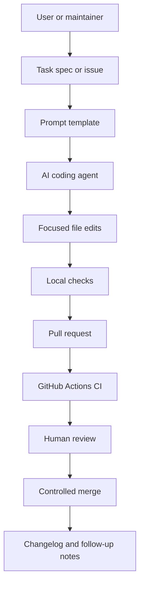
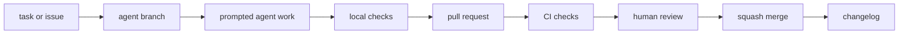

# AI Agent Coding and Prompting Workbench

Professional, student-friendly guidance for using AI coding agents without skipping Git, tests, review, or public-repository safety.

[](https://github.com/Yaked1/ai-lab-codex-workbench/actions/workflows/ci.yml)
[](https://github.com/Yaked1/ai-lab-codex-workbench/actions/workflows/autofix.yml)
[](LICENSE)

## Project Positioning

This repository is a public guide and lightweight workbench for learning practical AI-assisted software work. It began as a Codex-focused GitHub automation lab, but the larger purpose is broader: show a beginner how to turn a vague request into a safe branch, a focused agent prompt, local checks, a pull request, review notes, a merge decision, and a changelog entry.

The repo is deliberately Windows and student laptop friendly. It favors Markdown, PowerShell, Git, standard-library Python, GitHub Actions, browser/IDE/CLI agents, and cloud-hosted work where that reduces local hardware pressure. It does not assume Docker, WSL, a large GPU, a local model server, or a high-end workstation.

Use it as:

- A starter repository for practicing AI coding-agent workflows.
- A public checklist for safe agent-generated pull requests.
- A prompt library for Codex and other agentic coding tools.
- A lightweight teaching repo for GitHub Actions, branch discipline, review, and controlled merge workflows.
- A conservative comparison guide for Codex, Claude Code, Cursor, Antigravity, GitHub Copilot, OpenCode, Kilo Code, Aider, Windsurf, and MCP.

## Audience

| Audience | What this repo helps with | Recommended starting point |
| --- | --- | --- |
| Beginner student | Learn branches, prompts, checks, PRs, and review habits. | [docs/codex/00-start-here.md](docs/codex/00-start-here.md) |
| Self-taught developer | Compare agent tools without over-installing. | [docs/tools/comparison-matrix.md](docs/tools/comparison-matrix.md) |
| Maintainer | Add safe AI-agent contribution rules to a public repo. | [AGENTS.md](AGENTS.md) |
| Instructor | Teach repeatable task intake, validation, and public-safety checks. | [docs/workflows/agent-task-lifecycle.md](docs/workflows/agent-task-lifecycle.md) |
| Advanced user | Build prompt templates, agent rules, and controlled automation. | [prompts/](prompts/) |

## Why This Exists

AI coding agents are useful because they can read code, edit files, run commands, summarize diffs, prepare tests, and explain failures. Those same capabilities create risk when the task is vague, the branch is dirty, the agent has too much permission, or nobody reviews the result.

This repo teaches a safer operating model:

- Git branches isolate experiments.
- `AGENTS.md` gives agents durable local instructions.
- Prompt templates force clear scope, success criteria, safety boundaries, and final reporting.
- Local checks catch basic repository problems before a pull request.
- GitHub Actions repeat the checks in CI.
- Pull requests keep human review in the loop.
- Changelog updates make visible changes easier to audit later.

## Architecture

The repository is intentionally simple. The docs teach the process, the scripts validate the repo, and GitHub Actions provide repeatable automation.



Core pieces:

| Area | Purpose | Key files |
| --- | --- | --- |
| Agent policy | Shared operating rules for Codex and other agents. | [AGENTS.md](AGENTS.md) |
| Tool guides | Conservative comparisons and first-task guidance. | [docs/tools/](docs/tools/) |
| Workflows | Full task lifecycle and public-safety checklists. | [docs/workflows/](docs/workflows/) |
| Codex guides | Codex-specific branch, goal, review, and roadmap docs. | [docs/codex/](docs/codex/) |
| Prompt templates | Reusable prompts with scope, validation, and report formats. | [prompts/](prompts/) |
| Local checks | Standard-library validation scripts. | [scripts/](scripts/) |
| CI | Repository health, formatting check, unit tests, and controlled automation. | [.github/workflows/](.github/workflows/) |

## Safety Model

This repo assumes AI output is useful but untrusted until reviewed. The default safety model is:

1. Keep work inside the repository.
2. Start from a clean or understood Git state.
3. Use a short branch for each task.
4. Ask the agent to inspect files before editing.
5. Give explicit included and excluded scope.
6. Never paste or commit secrets.
7. Avoid broad write tools, destructive commands, and system-wide changes.
8. Run local checks before opening or merging a PR.
9. Review every generated diff.
10. Keep claims about external tools conservative and verify them in official docs.

## Quick Start

From PowerShell in the repository root:

```powershell
git status
python scripts/repo_health_check.py
python scripts/safe_autofix.py --check
python -m unittest discover -s tests
```

For a first safe branch:

```powershell
git switch -c agent/readme-small-edit
```

Then choose a prompt template:

| Task | Template |
| --- | --- |
| Improve one doc page | [prompts/codex/docs-update.goal.md](prompts/codex/docs-update.goal.md) |
| Fix a small bug | [prompts/codex/fix-bug.goal.md](prompts/codex/fix-bug.goal.md) |
| Implement a small feature | [prompts/codex/implement-feature.goal.md](prompts/codex/implement-feature.goal.md) |
| Review a PR | [prompts/codex/review-pr.goal.md](prompts/codex/review-pr.goal.md) |
| Use an IDE agent | [prompts/cursor/agent-task.md](prompts/cursor/agent-task.md) or [prompts/windsurf/agent-task.md](prompts/windsurf/agent-task.md) |
| Use GitHub Copilot coding agent | [prompts/github-copilot/agent-task.md](prompts/github-copilot/agent-task.md) |

## Offline Quick-Start Site And Playbooks

For a browser-friendly overview that works offline, open [docs/site/index.html](docs/site/index.html). The HTML guide site links together the agent lifecycle, prompt patterns, skills and prompt-guide setup, MCP safety notes, Windows PowerShell examples, and public-repository checklists without external scripts, CDNs, analytics, or remote fonts.

Longer Markdown playbooks:

| Guide | Use it for |
| --- | --- |
| [Prompt engineering playbook](docs/guides/prompt-engineering-playbook.md) | Designing scoped prompts with examples, checks, mistakes, and failure modes. |
| [Agentic coding playbook](docs/guides/agentic-coding-playbook.md) | Running safe branch, agent, check, PR, review, merge, and rollback workflows. |
| [Skills and prompt guides](docs/guides/skills-and-prompt-guides.md) | Creating local SKILL.md-style guides, prompt packs, and MCP-aware safety boundaries. |
| [Windows setup commands](docs/guides/windows-setup-commands.md) | Using PowerShell-safe repo commands, folder setup, placeholders, and clone workflows. |
| [Prompt audit checklist](docs/guides/prompt-audit-checklist.md) | Reviewing prompts before sending, publishing, or teaching them. |

## Learning Path

1. Read the local rules in [AGENTS.md](AGENTS.md).
2. Open [docs/site/index.html](docs/site/index.html) for the offline quick-start map.
3. Read [docs/codex/00-start-here.md](docs/codex/00-start-here.md) for the mental model.
4. Run the three local checks.
5. Make one small Markdown change on a branch.
6. Open a PR and compare your local check output with CI.
7. Review the diff as if it came from another contributor.
8. Update [CHANGELOG.md](CHANGELOG.md) when the change is user-visible.
9. Try one non-Codex prompt template after you understand the review workflow.
10. Compare tools using [docs/tools/comparison-matrix.md](docs/tools/comparison-matrix.md).
11. Only then consider adding MCP, hooks, subagents, or stronger automation.

## Main Workflow



Use [docs/workflows/agent-task-lifecycle.md](docs/workflows/agent-task-lifecycle.md) for the full checklist.

## Tool Matrix

Tool behavior, pricing, model access, and platform support change quickly. This table is an orientation guide, not a substitute for official docs.

| Tool | Best fit | Beginner fit | Windows fit | Setup style | Risk level | Best first task |
| --- | --- | --- | --- | --- | --- | --- |
| [OpenAI Codex](docs/tools/codex.md) | Git-first repo edits, checks, Codex goals, PR prep. | Medium | Good | CLI, IDE, web, cloud/hybrid depending on current setup | Medium | Improve one README paragraph and run checks. |
| [Claude Code](docs/tools/claude-code.md) | Codebase explanation, docs review, multi-file agent work. | Medium | Good; verify current install guidance | CLI, IDE, desktop, web, hybrid | Medium | Review docs without editing. |
| [Cursor](docs/tools/cursor.md) | IDE planning, codebase chat, visible diffs, rules, MCP. | High | Good | IDE, CLI, hybrid | Medium | Ask for a plan before edits. |
| [Google Antigravity](docs/tools/antigravity.md) | Agent-first planning and artifact-driven work. | Medium | Verify current support | IDE, cloud, hybrid depending on current product | Medium to high | Create a docs-cleanup plan artifact. |
| [GitHub Copilot](docs/tools/github-copilot.md) | IDE help, GitHub issues, cloud-agent PRs, review loops. | High for suggestions; medium for agent PRs | Good through supported IDEs and GitHub | IDE, cloud, hybrid | Medium | Draft a tiny docs PR and inspect it. |
| [OpenCode](docs/tools/opencode.md) | Open-source agent workflows and provider-flexible experiments. | Medium | Verify current Windows path | CLI, desktop, IDE, hybrid | Medium | Read-only repo overview. |
| [Kilo Code](docs/tools/kilo-code.md) | IDE/CLI agent experiments and mode comparison. | Medium | Good where supported | IDE, CLI, cloud, hybrid | Medium | Plan one small issue. |
| [Aider](docs/tools/aider.md) | Terminal pair programming with explicit files. | Medium | Good with Python and Git | CLI, local/hybrid | Medium | Edit one selected Markdown file. |
| [Windsurf](docs/tools/windsurf.md) | IDE-based code explanation and multi-file edits. | High | Verify current desktop support | IDE, hybrid | Medium | Explain one folder before edits. |
| [MCP](docs/tools/mcp.md) | Connecting agents to controlled tools, data, and prompts. | Low to medium | Good for lightweight local servers | Protocol, local/cloud server, hybrid | High if write-capable or connected to private data | Read-only docs server in a test repo. |

See the full ranking tables in [docs/tools/comparison-matrix.md](docs/tools/comparison-matrix.md).

## Recommended Workflows

| Workflow | When to use it | Guide |
| --- | --- | --- |
| Issue and task intake | Before asking any agent to work. | [docs/workflows/agent-task-lifecycle.md](docs/workflows/agent-task-lifecycle.md#1-issuetask-intake) |
| Branch naming | Before edits begin. | [docs/workflows/agent-task-lifecycle.md](docs/workflows/agent-task-lifecycle.md#2-branch-naming) |
| Goal prompt creation | For any task larger than one quick response. | [docs/codex/01-codex-goal-workflow.md](docs/codex/01-codex-goal-workflow.md) |
| Local checks | After edits and before PR. | [docs/workflows/agent-task-lifecycle.md](docs/workflows/agent-task-lifecycle.md#5-local-checks) |
| CI checks | After PR creation. | [docs/workflows/agent-task-lifecycle.md](docs/workflows/agent-task-lifecycle.md#6-ci-checks) |
| PR review | Before merge. | [docs/codex/04-review-checklist.md](docs/codex/04-review-checklist.md) |
| Squash merge | For focused learning branches. | [docs/codex/02-git-branch-pr-merge-workflow.md](docs/codex/02-git-branch-pr-merge-workflow.md) |
| Rollback | When a bad commit reaches `main`. | [docs/codex/02-git-branch-pr-merge-workflow.md](docs/codex/02-git-branch-pr-merge-workflow.md#rollback) |
| Public repo safety | Before public release or external sharing. | [docs/workflows/public-repo-safety.md](docs/workflows/public-repo-safety.md) |

## Public Repository Checklist

Before publishing the repository, opening a PR from an agent, or teaching from a fork:

- [ ] `git status` shows only expected files.
- [ ] No `.env`, credentials, browser profiles, cookies, private keys, or tokens are tracked.
- [ ] No private links, school portals, private dashboards, or internal repositories appear in docs.
- [ ] No personal account IDs, private machine paths, emails, or screenshots are committed.
- [ ] External tool claims are conservative and marked for official-doc verification where needed.
- [ ] GitHub Actions logs do not print environment variables or secrets.
- [ ] AI-generated diffs were reviewed by a human.
- [ ] Local checks and CI pass.
- [ ] User-visible changes are recorded in [CHANGELOG.md](CHANGELOG.md).

## Repository Structure

```text
ai-lab-codex-workbench/
  README.md                       # Project overview and learning path
  AGENTS.md                       # Agent operating rules
  CONTRIBUTING.md                 # Contribution workflow
  SECURITY.md                     # Secret and automation safety policy
  CHANGELOG.md                    # User-visible changes
  docs/
    codex/                        # Codex-specific guides
    guides/                       # Practical playbooks and checklists
    site/                         # Offline static HTML guide site
    tools/                        # AI coding tool guide pages
    workflows/                    # End-to-end workflow guides
    templates/                    # Human-facing task and merge templates
  prompts/
    aider/
    antigravity/
    claude-code/
    codex/
    cursor/
    github-copilot/
    opencode/
    windsurf/
  scripts/
    repo_health_check.py          # Secret patterns, required files, final newlines
    safe_autofix.py               # Deterministic whitespace cleanup
    local_check.ps1               # PowerShell local validation helper
  tests/                          # Unit tests for local scripts
  .github/workflows/
    ci.yml                        # Read-only validation
    autofix.yml                   # Manual safe-autofix PR
    merge-pr.yml                  # Manual controlled merge workflow
```

## Local Validation

Run these before committing agent-generated work:

```powershell
python scripts/repo_health_check.py
python scripts/safe_autofix.py --check
python -m unittest discover -s tests
```

What they cover:

| Check | What it protects |
| --- | --- |
| `repo_health_check.py` | Required files, simple secret patterns, final newlines, large-file warnings. |
| `safe_autofix.py --check` | Whether deterministic whitespace cleanup would change files. |
| `python -m unittest discover -s tests` | Script behavior covered by unit tests. |

## GitHub Automation

The repo includes conservative automation:

- **CI** runs repository health checks, safe autofix check, and unit tests.
- **Safe Autofix PR** applies deterministic whitespace cleanup and opens a PR only when files change.
- **Controlled Merge PR** is manually triggered and waits for required PR checks before merging.

Workflow YAML is intentionally small. Do not modify it unless the task specifically requires automation changes.

## Windows and Laptop Friendly Defaults

This repo is designed to be usable on a limited Windows laptop:

- Prefer PowerShell examples.
- Prefer Python standard library scripts.
- Prefer browser, cloud, CLI, and IDE workflows over local model hosting.
- Avoid Docker, WSL, GPU-heavy generation, and large dependency trees unless a maintainer explicitly asks.
- Keep agents inside the repo so private user folders are not exposed.

## Limitations

- This repo is a guide and workbench, not a production security scanner.
- It does not store API keys or manage paid tool accounts.
- It does not guarantee third-party pricing, plan limits, model names, platform support, or release timing.
- It does not replace human code review.
- It does not attempt to benchmark agent quality.
- It does not teach unsafe broad automation, force pushes, or unattended merges.

## Roadmap

Near-term:

- Expand prompt-evaluation examples.
- Add issue templates for beginner agent tasks.
- Add a troubleshooting guide for failed local checks.
- Add a small before/after prompt improvement exercise.

Medium-term:

- Add lightweight examples for rules, skills, subagents, and MCP with read-only defaults.
- Add CI log-reading practice material.
- Add a public release checklist for workshops.
- Add a prompt review rubric for comparing agent outputs.

Advanced, only after the basics are stable:

- Add optional prompt evaluation tooling.
- Add changelog validation.
- Add generated documentation review checks.
- Add richer GitHub automation while keeping human approval gates.

See [docs/codex/05-repository-roadmap.md](docs/codex/05-repository-roadmap.md) for a fuller roadmap.

## External Claims and Official Docs

Before using this repo in public material, verify current official docs for tool behavior, pricing, plans, installation commands, platform support, model names, and feature availability:

- OpenAI Codex: <https://developers.openai.com/codex/cli>
- Codex `AGENTS.md`: <https://developers.openai.com/codex/guides/agents-md>
- Claude Code: <https://docs.anthropic.com/en/docs/claude-code/overview>
- Cursor: <https://cursor.com/docs>
- Google Antigravity: <https://antigravity.google/docs>
- GitHub Copilot coding agent: <https://docs.github.com/en/copilot/concepts/agents/cloud-agent/about-cloud-agent>
- OpenCode: <https://opencode.ai/docs/>
- Kilo Code: <https://kilo.ai/docs>
- Aider: <https://aider.chat/docs/>
- MCP: <https://modelcontextprotocol.io/docs/getting-started/intro>
- Windsurf / Devin Desktop Cascade: <https://docs.windsurf.com/windsurf/cascade>

## License

MIT License. Use, modify, and learn from it.
