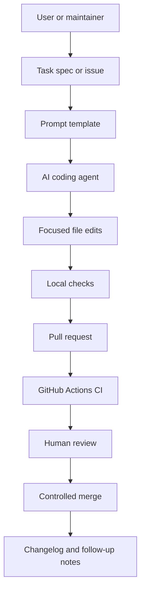
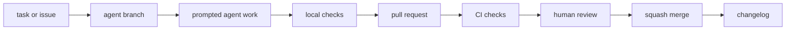

# AI Agent Coding and Prompting Workbench

Professional, public-friendly guidance for using AI coding agents without skipping Git, tests, review, releases, or repository safety.

[](https://github.com/Yaked1/ai-lab-codex-workbench/actions/workflows/ci.yml)
[](https://github.com/Yaked1/ai-lab-codex-workbench/actions/workflows/autofix.yml)
[](https://github.com/Yaked1/ai-lab-codex-workbench/releases)
[](LICENSE)

## For General Users

This repository is for anyone who wants a practical, reusable guide to AI-assisted coding work. You do not need this exact machine, account, folder layout, or maintainer setup to use it.

Use it when you want to:

- Learn a safe branch, prompt, check, pull request, review, merge, and rollback loop.
- Copy public-safe task specs, prompt templates, and review checklists into another repository.
- Teach a workshop or class about AI coding agents and GitHub workflow.
- Compare agent tools without relying on stale pricing, model, or platform claims.
- Download a versioned release bundle that contains the docs, prompts, scripts, tests, and workflows.

Most visitors should start with [docs/site/index.html](docs/site/index.html), [docs/codex/00-start-here.md](docs/codex/00-start-here.md), or the release bundle from [GitHub Releases](https://github.com/Yaked1/ai-lab-codex-workbench/releases).

## Overview

This repository is a public guide and lightweight workbench for learning practical AI-assisted software work. It began as a Codex-focused GitHub automation lab, but the larger purpose is broader: show a beginner how to turn a vague request into a safe branch, a focused agent prompt, local checks, a pull request, review notes, a merge decision, and a changelog entry.

The repo is deliberately Windows and modest-laptop friendly. It favors Markdown, PowerShell, Git, standard-library Python, GitHub Actions, browser/IDE/CLI agents, and cloud-hosted work where that reduces local hardware pressure. It does not assume Docker, WSL, a large GPU, a local model server, or a high-end workstation.

Use it as:

- A starter repository for practicing AI coding-agent workflows.
- A public checklist for safe agent-generated pull requests.
- A prompt library for Codex and other agentic coding tools.
- A lightweight teaching repo for GitHub Actions, branch discipline, review, and controlled merge workflows.
- A conservative comparison guide for Codex, Claude Code, Cursor, Antigravity, GitHub Copilot, OpenCode, Kilo Code, Aider, Windsurf, and MCP.

## Audience

| Audience | What this repo helps with | Recommended starting point |
| --- | --- | --- |
| Beginner student | Learn branches, prompts, checks, PRs, and review habits. | [docs/codex/00-start-here.md](docs/codex/00-start-here.md) |
| Self-taught developer | Compare agent tools without over-installing. | [docs/tools/comparison-matrix.md](docs/tools/comparison-matrix.md) |
| Maintainer | Add safe AI-agent contribution rules to a public repo. | [AGENTS.md](AGENTS.md) |
| Instructor | Teach repeatable task intake, validation, and public-safety checks. | [docs/workflows/agent-task-lifecycle.md](docs/workflows/agent-task-lifecycle.md) |
| Advanced user | Build prompt templates, agent rules, and controlled automation. | [prompts/](prompts/) |

## Why This Exists

AI coding agents are useful because they can read code, edit files, run commands, summarize diffs, prepare tests, and explain failures. Those same capabilities create risk when the task is vague, the branch is dirty, the agent has too much permission, or nobody reviews the result.

This repo teaches a safer operating model:

- Git branches isolate experiments.
- `AGENTS.md` gives agents durable local instructions.
- Prompt templates force clear scope, success criteria, safety boundaries, and final reporting.
- Local checks catch basic repository problems before a pull request.
- GitHub Actions repeat the checks in CI.
- Pull requests keep human review in the loop.
- Changelog updates make visible changes easier to audit later.

## What This Repository Teaches

The repo is organized around a practical operating system for AI-assisted repository work. The goal is not to memorize one tool. The goal is to learn habits that still work when tools, model names, user interfaces, and pricing change.

By working through the guides, templates, and checks, a learner should be able to:

- Convert a vague request into a scoped task with success criteria.
- Create a public-safe branch name and keep one task per branch.
- Write a prompt that tells an agent what to inspect, what to change, what to avoid, and how to report back.
- Decide when a task is too broad for one agent run.
- Run local checks before a pull request.
- Review a generated diff without trusting the agent's summary.
- Identify unsafe automation, private data exposure, and stale third-party tool claims.
- Prepare a merge report and rollback plan.
- Keep documentation useful for beginners without hiding advanced failure modes.

The core lesson is repeatability. If a task cannot be described, checked, reviewed, and rolled back, it is not ready for unattended automation.

## What This Repository Is Not

This project deliberately stays small. It is not trying to become every possible AI engineering setup.

| Not included | Reason |
| --- | --- |
| Production deployment stack | The repo teaches repository workflow, not hosting. |
| Docker or WSL dependency | Beginner Windows users should be able to run the examples without heavy setup. |
| Local model serving | Hardware requirements would distract from Git, review, and safety basics. |
| Enterprise secret scanning | The included checks are lightweight guardrails, not a replacement for professional security tooling. |
| Tool pricing database | Pricing and plan details change quickly and should be verified in official docs. |
| Benchmark leaderboard | The repo focuses on safe process and reviewable work, not model ranking. |
| Unattended merge system | Generated changes should stay reviewable by a human maintainer. |

## Architecture

The repository is intentionally simple. The docs teach the process, the scripts validate the repo, and GitHub Actions provide repeatable automation.



Core pieces:

| Area | Purpose | Key files |
| --- | --- | --- |
| Agent policy | Shared operating rules for Codex and other agents. | [AGENTS.md](AGENTS.md) |
| Tool guides | Conservative comparisons and first-task guidance. | [docs/tools/](docs/tools/) |
| Workflows | Full task lifecycle and public-safety checklists. | [docs/workflows/](docs/workflows/) |
| Codex guides | Codex-specific branch, goal, review, and roadmap docs. | [docs/codex/](docs/codex/) |
| Prompt templates | Reusable prompts with scope, validation, and report formats. | [prompts/](prompts/) |
| Local checks | Standard-library validation scripts. | [scripts/](scripts/) |
| Release and package | Versioned downloadable ZIP bundles for offline use, teaching, and reuse. | [docs/releases/release-process.md](docs/releases/release-process.md) |
| CI | Repository health, formatting check, unit tests, and controlled automation. | [.github/workflows/](.github/workflows/) |

## Operating Contract

Every useful workflow in this repository follows the same contract:

| Contract item | Practical meaning | Evidence |
| --- | --- | --- |
| Scope is explicit | The task says what files, folders, or behavior are in scope. | Task spec, issue, prompt, or PR body. |
| Risk is bounded | The prompt names excluded actions such as dependency installs, workflow edits, deletion, and secrets. | Excluded scope and safety boundaries. |
| Work is inspectable | The agent reads files before editing and produces a normal Git diff. | `git diff`, changed file list, final report. |
| Checks are repeatable | Local commands and CI use the same small validation surface. | Local check output and GitHub Actions logs. |
| Review is human-readable | The PR explains what changed, why, and what remains uncertain. | PR body, review comments, merge report. |
| Rollback is possible | The change is small enough to revert cleanly if it causes problems. | One focused branch and a rollback plan. |

If a proposed task cannot satisfy this contract, split it into smaller tasks before asking an agent to edit files.

## Safety Model

This repo assumes AI output is useful but untrusted until reviewed. The default safety model is:

1. Keep work inside the repository.
2. Start from a clean or understood Git state.
3. Use a short branch for each task.
4. Ask the agent to inspect files before editing.
5. Give explicit included and excluded scope.
6. Never paste or commit secrets.
7. Avoid broad write tools, destructive commands, and system-wide changes.
8. Run local checks before opening or merging a PR.
9. Review every generated diff.
10. Keep claims about external tools conservative and verify them in official docs.

## Decision Guide

Use this table when deciding how to approach a new task.

| Situation | Recommended action | Avoid |
| --- | --- | --- |
| One typo, link, or wording fix | Edit directly or use a tiny docs prompt. | Whole-repo cleanup. |
| One guide needs clearer structure | Use a docs-update goal with exact file scope. | Letting the agent rewrite unrelated pages. |
| A script test fails | Reproduce, inspect the script and test, then make the smallest fix. | Updating tests to hide the failure. |
| A workflow YAML change is requested | Read the workflow and explain the risk before editing. | Changing automation as incidental cleanup. |
| A tool comparison seems stale | Reword conservatively and link to official docs. | Inventing exact support, pricing, or model details. |
| A prompt template is missing details | Add scope, checks, report format, and failure cases. | Adding a long generic prompt with no verification path. |
| A task touches many folders | Split into phases and use a task spec. | One broad branch called `agent/fix-everything`. |

## Quick Start

From PowerShell in the repository root:

```powershell
git status
python scripts/repo_health_check.py
python scripts/safe_autofix.py --check
python -m unittest discover -s tests
```

For a first safe branch:

```powershell
git switch -c agent/readme-small-edit
```

Then choose a prompt template:

| Task | Template |
| --- | --- |
| Improve one doc page | [prompts/codex/docs-update.goal.md](prompts/codex/docs-update.goal.md) |
| Fix a small bug | [prompts/codex/fix-bug.goal.md](prompts/codex/fix-bug.goal.md) |
| Implement a small feature | [prompts/codex/implement-feature.goal.md](prompts/codex/implement-feature.goal.md) |
| Review a PR | [prompts/codex/review-pr.goal.md](prompts/codex/review-pr.goal.md) |
| Use an IDE agent | [prompts/cursor/agent-task.md](prompts/cursor/agent-task.md) or [prompts/windsurf/agent-task.md](prompts/windsurf/agent-task.md) |
| Use GitHub Copilot coding agent | [prompts/github-copilot/agent-task.md](prompts/github-copilot/agent-task.md) |

## Release And Package

This repository now supports versioned release bundles for general users. A release bundle is a downloadable `.zip` package containing the top-level project docs, Markdown guides, offline HTML site, prompt templates, scripts, tests, and GitHub workflow files.

Use a release bundle when you want:

- A stable snapshot for a class, workshop, or team onboarding session.
- An offline copy of the docs and prompt templates.
- A reviewable package artifact that was produced after local validation.
- A way to reuse the workbench without cloning the full Git history.

Build a package locally:

```powershell
python scripts/build_release_package.py --version v0.1.0
```

The package builder writes:

```text
dist/ai-agent-coding-workbench-v0.1.0.zip
dist/package-manifest-v0.1.0.json
```

The manual **Release Package** GitHub Actions workflow runs validation, builds the ZIP and JSON manifest, and creates a GitHub Release with both files attached as assets. It uses the workflow `GITHUB_TOKEN`; it does not require a personal access token and does not publish to npm, PyPI, Docker Hub, or GitHub Packages.

Trigger the first release from PowerShell with GitHub CLI:

```powershell
gh workflow run release.yml -f version=v0.1.0 -f prerelease=false
```

This is a documentation and prompt-template package, not an installable library package. See [docs/releases/release-process.md](docs/releases/release-process.md) and [docs/releases/v0.1.0.md](docs/releases/v0.1.0.md) for release gates, package review guidance, and first-release notes.

## First 30 Minutes

For a new learner, the first session should be small and concrete:

1. Clone or open the repository.
2. Read [AGENTS.md](AGENTS.md) and this README.
3. Run `git status`.
4. Run the three local checks.
5. Create a branch named `agent/first-doc-edit`.
6. Improve one sentence or one short paragraph in a Markdown file.
7. Run the three local checks again.
8. Review `git diff`.
9. Write a short PR-style summary even if you do not open a PR.
10. Decide whether the change is worth keeping.

The point is to practice the loop, not to produce a large diff.

## End-To-End Example

This example shows the intended shape of a small AI-assisted documentation task.

| Step | Command or action | Expected result |
| --- | --- | --- |
| Check state | `git status` | You know whether the tree is clean before edits. |
| Create branch | `git switch -c agent/add-local-check-note` | Work is isolated from `main`. |
| Write prompt | Use `prompts/codex/docs-update.goal.md` | Agent receives scope, checks, and report format. |
| Inspect files | Agent reads `AGENTS.md`, `README.md`, and the target doc. | Edits are based on current content. |
| Edit | Add one focused section. | Diff stays reviewable. |
| Validate | Run the three local checks. | Basic repo rules still hold. |
| Review | `git diff` | Human sees the actual change. |
| Report | PR body or final agent response | Commands, checks, risks, and files are explicit. |
| Merge decision | Approve, request changes, or discard | Human judgment remains in control. |

The same loop scales to larger tasks by splitting them into separate branches and PRs.

## Offline Quick-Start Site And Playbooks

For a browser-friendly overview that works offline, open [docs/site/index.html](docs/site/index.html). The HTML guide site links together the agent lifecycle, prompt patterns, skills and prompt-guide setup, MCP safety notes, Windows PowerShell examples, and public-repository checklists without external scripts, CDNs, analytics, or remote fonts.

Longer Markdown playbooks:

| Guide | Use it for |
| --- | --- |
| [Prompt engineering playbook](docs/guides/prompt-engineering-playbook.md) | Designing scoped prompts with examples, checks, mistakes, and failure modes. |
| [Agentic coding playbook](docs/guides/agentic-coding-playbook.md) | Running safe branch, agent, check, PR, review, merge, and rollback workflows. |
| [Skills and prompt guides](docs/guides/skills-and-prompt-guides.md) | Creating local SKILL.md-style guides, prompt packs, and MCP-aware safety boundaries. |
| [Windows setup commands](docs/guides/windows-setup-commands.md) | Using PowerShell-safe repo commands, folder setup, placeholders, and clone workflows. |
| [Prompt audit checklist](docs/guides/prompt-audit-checklist.md) | Reviewing prompts before sending, publishing, or teaching them. |

## Learning Path

1. Read the local rules in [AGENTS.md](AGENTS.md).
2. Open [docs/site/index.html](docs/site/index.html) for the offline quick-start map.
3. Read [docs/codex/00-start-here.md](docs/codex/00-start-here.md) for the mental model.
4. Run the three local checks.
5. Make one small Markdown change on a branch.
6. Open a PR and compare your local check output with CI.
7. Review the diff as if it came from another contributor.
8. Update [CHANGELOG.md](CHANGELOG.md) when the change is user-visible.
9. Try one non-Codex prompt template after you understand the review workflow.
10. Compare tools using [docs/tools/comparison-matrix.md](docs/tools/comparison-matrix.md).
11. Only then consider adding MCP, hooks, subagents, or stronger automation.

## Scenario Playbooks

Different users should start in different parts of the repo.

| Scenario | Start here | Then use |
| --- | --- | --- |
| "I want to learn Codex safely." | [docs/codex/00-start-here.md](docs/codex/00-start-here.md) | [docs/codex/01-codex-goal-workflow.md](docs/codex/01-codex-goal-workflow.md) |
| "I need a prompt for a real docs task." | [prompts/codex/docs-update.goal.md](prompts/codex/docs-update.goal.md) | [docs/templates/task-spec.md](docs/templates/task-spec.md) |
| "I need to review an AI-generated PR." | [docs/codex/04-review-checklist.md](docs/codex/04-review-checklist.md) | [docs/templates/merge-report.md](docs/templates/merge-report.md) |
| "I am teaching a workshop." | [docs/site/index.html](docs/site/index.html) | [docs/guides/agentic-coding-playbook.md](docs/guides/agentic-coding-playbook.md) |
| "I want to compare tools." | [docs/tools/comparison-matrix.md](docs/tools/comparison-matrix.md) | Individual pages in [docs/tools/](docs/tools/) |
| "I want to connect external tools." | [docs/tools/mcp.md](docs/tools/mcp.md) | [docs/workflows/public-repo-safety.md](docs/workflows/public-repo-safety.md) |

## Main Workflow



Use [docs/workflows/agent-task-lifecycle.md](docs/workflows/agent-task-lifecycle.md) for the full checklist.

## Tool Matrix

Tool behavior, pricing, model access, and platform support change quickly. This table is an orientation guide, not a substitute for official docs.

| Tool | Best fit | Beginner fit | Windows fit | Setup style | Risk level | Best first task |
| --- | --- | --- | --- | --- | --- | --- |
| [OpenAI Codex](docs/tools/codex.md) | Git-first repo edits, checks, Codex goals, PR prep. | Medium | Good | CLI, IDE, web, cloud/hybrid depending on current setup | Medium | Improve one README paragraph and run checks. |
| [Claude Code](docs/tools/claude-code.md) | Codebase explanation, docs review, multi-file agent work. | Medium | Good; verify current install guidance | CLI, IDE, desktop, web, hybrid | Medium | Review docs without editing. |
| [Cursor](docs/tools/cursor.md) | IDE planning, codebase chat, visible diffs, rules, MCP. | High | Good | IDE, CLI, hybrid | Medium | Ask for a plan before edits. |
| [Google Antigravity](docs/tools/antigravity.md) | Agent-first planning and artifact-driven work. | Medium | Verify current support | IDE, cloud, hybrid depending on current product | Medium to high | Create a docs-cleanup plan artifact. |
| [GitHub Copilot](docs/tools/github-copilot.md) | IDE help, GitHub issues, cloud-agent PRs, review loops. | High for suggestions; medium for agent PRs | Good through supported IDEs and GitHub | IDE, cloud, hybrid | Medium | Draft a tiny docs PR and inspect it. |
| [OpenCode](docs/tools/opencode.md) | Open-source agent workflows and provider-flexible experiments. | Medium | Verify current Windows path | CLI, desktop, IDE, hybrid | Medium | Read-only repo overview. |
| [Kilo Code](docs/tools/kilo-code.md) | IDE/CLI agent experiments and mode comparison. | Medium | Good where supported | IDE, CLI, cloud, hybrid | Medium | Plan one small issue. |
| [Aider](docs/tools/aider.md) | Terminal pair programming with explicit files. | Medium | Good with Python and Git | CLI, local/hybrid | Medium | Edit one selected Markdown file. |
| [Windsurf](docs/tools/windsurf.md) | IDE-based code explanation and multi-file edits. | High | Verify current desktop support | IDE, hybrid | Medium | Explain one folder before edits. |
| [MCP](docs/tools/mcp.md) | Connecting agents to controlled tools, data, and prompts. | Low to medium | Good for lightweight local servers | Protocol, local/cloud server, hybrid | High if write-capable or connected to private data | Read-only docs server in a test repo. |

See the full ranking tables in [docs/tools/comparison-matrix.md](docs/tools/comparison-matrix.md).

## Recommended Workflows

| Workflow | When to use it | Guide |
| --- | --- | --- |
| Issue and task intake | Before asking any agent to work. | [docs/workflows/agent-task-lifecycle.md](docs/workflows/agent-task-lifecycle.md#1-issuetask-intake) |
| Branch naming | Before edits begin. | [docs/workflows/agent-task-lifecycle.md](docs/workflows/agent-task-lifecycle.md#2-branch-naming) |
| Goal prompt creation | For any task larger than one quick response. | [docs/codex/01-codex-goal-workflow.md](docs/codex/01-codex-goal-workflow.md) |
| Local checks | After edits and before PR. | [docs/workflows/agent-task-lifecycle.md](docs/workflows/agent-task-lifecycle.md#5-local-checks) |
| CI checks | After PR creation. | [docs/workflows/agent-task-lifecycle.md](docs/workflows/agent-task-lifecycle.md#6-ci-checks) |
| PR review | Before merge. | [docs/codex/04-review-checklist.md](docs/codex/04-review-checklist.md) |
| Squash merge | For focused learning branches. | [docs/codex/02-git-branch-pr-merge-workflow.md](docs/codex/02-git-branch-pr-merge-workflow.md) |
| Rollback | When a bad commit reaches `main`. | [docs/codex/02-git-branch-pr-merge-workflow.md](docs/codex/02-git-branch-pr-merge-workflow.md#rollback) |
| Public repo safety | Before public release or external sharing. | [docs/workflows/public-repo-safety.md](docs/workflows/public-repo-safety.md) |

## Quality Bar

Professional GitHub documentation should help a reader make decisions, not just describe features. For this repo, a high-quality contribution usually has these properties:

| Quality area | Good documentation does this |
| --- | --- |
| Audience | Names who the guidance is for and what they should already know. |
| Scope | States what the guide covers and what it deliberately avoids. |
| Steps | Gives commands and review points in the order a user will need them. |
| Safety | Identifies secrets, permissions, destructive actions, and private-data risks. |
| Verification | Lists checks that prove the change is safe enough to review. |
| Failure modes | Explains what usually goes wrong and how to recover. |
| Maintenance | Avoids brittle claims and points to official docs for fast-changing details. |

Low-quality documentation often looks long but is hard to use. It repeats general advice, hides assumptions, omits commands, or fails to say what success looks like. Prefer shorter precise sections over broad filler.

## Public Repository Checklist

Before publishing the repository, opening a PR from an agent, or teaching from a fork:

- [ ] `git status` shows only expected files.
- [ ] No `.env`, credentials, browser profiles, cookies, private keys, or tokens are tracked.
- [ ] No private links, school portals, private dashboards, or internal repositories appear in docs.
- [ ] No personal account IDs, private machine paths, emails, or screenshots are committed.
- [ ] External tool claims are conservative and marked for official-doc verification where needed.
- [ ] GitHub Actions logs do not print environment variables or secrets.
- [ ] AI-generated diffs were reviewed by a human.
- [ ] Local checks and CI pass.
- [ ] User-visible changes are recorded in [CHANGELOG.md](CHANGELOG.md).

## Repository Structure

```text
ai-lab-codex-workbench/
  README.md                       # Project overview and learning path
  AGENTS.md                       # Agent operating rules
  CONTRIBUTING.md                 # Contribution workflow
  SECURITY.md                     # Secret and automation safety policy
  CHANGELOG.md                    # User-visible changes
  docs/
    releases/
      release-process.md           # Manual release and package guide
      v0.1.0.md                    # First public release notes
    codex/                        # Codex-specific guides
    guides/                       # Practical playbooks and checklists
    site/                         # Offline static HTML guide site
    tools/                        # AI coding tool guide pages
    workflows/                    # End-to-end workflow guides
    templates/                    # Human-facing task and merge templates
  prompts/
    aider/
    antigravity/
    claude-code/
    codex/
    cursor/
    github-copilot/
    opencode/
    windsurf/
  scripts/
    build_release_package.py       # Builds versioned zip bundles for releases
    repo_health_check.py          # Secret patterns, required files, final newlines
    safe_autofix.py               # Deterministic whitespace cleanup
    local_check.ps1               # PowerShell local validation helper
  tests/                          # Unit tests for local scripts
  .github/workflows/
    ci.yml                        # Read-only validation
    autofix.yml                   # Manual safe-autofix PR
    release.yml                   # Manual GitHub Release package workflow
    merge-pr.yml                  # Manual controlled merge workflow
```

## Local Validation

Run these before committing agent-generated work:

```powershell
python scripts/repo_health_check.py
python scripts/safe_autofix.py --check
python -m unittest discover -s tests
```

What they cover:

| Check | What it protects |
| --- | --- |
| `repo_health_check.py` | Required files, simple secret patterns, final newlines, large-file warnings. |
| `safe_autofix.py --check` | Whether deterministic whitespace cleanup would change files. |
| `python -m unittest discover -s tests` | Script behavior covered by unit tests. |

## Troubleshooting Local Checks

Most failures in this repository are intentionally simple to diagnose.

| Symptom | Likely cause | First response |
| --- | --- | --- |
| `repo_health_check.py` reports a missing file | Required repo file was moved or deleted. | Restore the file or update the checker only if the project structure intentionally changed. |
| Secret-like text is reported | A placeholder looks too realistic or a sensitive string was added. | Replace it with a public-safe placeholder such as `YOUR_TOKEN_HERE`. |
| Final newline warning | A text file does not end with a newline. | Run `python scripts/safe_autofix.py --write`, then review the diff. |
| Safe autofix check fails | Whitespace cleanup would change files. | Apply safe autofix, review the changed files, rerun the check. |
| Unit test fails | Script behavior changed or an expected fixture no longer matches. | Read the failing test, inspect the script, and fix the smallest related cause. |
| CI fails but local checks passed | Environment or path difference. | Read the CI log, then reproduce the exact failing command locally when possible. |

Do not hide failures by deleting tests, weakening safety checks, or claiming a command passed when it was not run.

## GitHub Automation

The repo includes conservative automation:

- **CI** runs repository health checks, safe autofix check, and unit tests.
- **Safe Autofix PR** applies deterministic whitespace cleanup and opens a PR only when files change.
- **Controlled Merge PR** is manually triggered and waits for required PR checks before merging.
- **Release Package** is manually triggered, runs validation, builds a versioned ZIP package and JSON manifest, and creates a GitHub Release with both files attached as assets.

Workflow YAML is intentionally small. Do not modify it unless the task specifically requires automation changes.

## Windows and Laptop Friendly Defaults

This repo is designed to be usable on a limited Windows laptop:

- Prefer PowerShell examples.
- Prefer Python standard library scripts.
- Prefer browser, cloud, CLI, and IDE workflows over local model hosting.
- Avoid Docker, WSL, GPU-heavy generation, and large dependency trees unless a maintainer explicitly asks.
- Keep agents inside the repo so private user folders are not exposed.

## Limitations

- This repo is a guide and workbench, not a production security scanner.
- It does not store API keys or manage paid tool accounts.
- It does not guarantee third-party pricing, plan limits, model names, platform support, or release timing.
- It does not publish an npm, PyPI, NuGet, container, or GitHub Packages registry package by default.
- It does not replace human code review.
- It does not attempt to benchmark agent quality.
- It does not teach unsafe broad automation, force pushes, or unattended merges.

## Maintenance Model

The repository should stay useful as AI tools change. Use these rules when maintaining it:

- Keep process guidance durable and tool details conservative.
- Prefer official documentation links over copied setup claims.
- Date or qualify anything that could become stale quickly.
- Update [CHANGELOG.md](CHANGELOG.md) for user-visible guide, template, workflow, or safety changes.
- Keep examples public-safe and free of account-specific data.
- Keep scripts standard-library unless a dependency is explicitly justified and approved.
- Keep static HTML offline-safe with local assets only.
- Review the README whenever a new guide, prompt folder, or workflow is added.

## Roadmap

Near-term:

- Expand prompt-evaluation examples.
- Add issue templates for beginner agent tasks.
- Add a troubleshooting guide for failed local checks.
- Add a small before/after prompt improvement exercise.

Medium-term:

- Add lightweight examples for rules, skills, subagents, and MCP with read-only defaults.
- Add CI log-reading practice material.
- Add release package inspection exercises for workshops.
- Add a prompt review rubric for comparing agent outputs.

Advanced, only after the basics are stable:

- Add optional prompt evaluation tooling.
- Add changelog validation.
- Add generated documentation review checks.
- Add richer GitHub automation while keeping human approval gates.

See [docs/codex/05-repository-roadmap.md](docs/codex/05-repository-roadmap.md) for a fuller roadmap.

## External Claims and Official Docs

Before using this repo in public material, verify current official docs for tool behavior, pricing, plans, installation commands, platform support, model names, and feature availability:

- OpenAI Codex: <https://developers.openai.com/codex/cli>
- Codex `AGENTS.md`: <https://developers.openai.com/codex/guides/agents-md>
- Claude Code: <https://docs.anthropic.com/en/docs/claude-code/overview>
- Cursor: <https://cursor.com/docs>
- Google Antigravity: <https://antigravity.google/docs>
- GitHub Copilot coding agent: <https://docs.github.com/en/copilot/concepts/agents/cloud-agent/about-cloud-agent>
- OpenCode: <https://opencode.ai/docs/>
- Kilo Code: <https://kilo.ai/docs>
- Aider: <https://aider.chat/docs/>
- MCP: <https://modelcontextprotocol.io/docs/getting-started/intro>
- Windsurf / Devin Desktop Cascade: <https://docs.windsurf.com/windsurf/cascade>

## License

MIT License. Use, modify, and learn from it.
