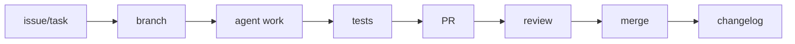

# AI Agent Coding Workbench

Prompting, Agents, GitHub Automation, and Safe AI Coding Workflows

This repository is a public, student-friendly workbench for learning how to use AI coding agents safely. It began as a Codex-focused GitHub automation lab, and now compares and supports multiple agentic coding tools: OpenAI Codex, Claude Code, Cursor, Google Antigravity, GitHub Copilot, OpenCode, Kilo Code, Aider, Windsurf, MCP servers, reusable skills, hooks, prompt evaluation, GitHub Actions, safe autofix, pull request review, and public repository safety.

The practical target is a Windows laptop and a beginner-to-intermediate learner. The repo favors browser, cloud, API, CLI, and lightweight IDE workflows. Heavy Docker stacks, large local language models, WSL-heavy setups, and strong-GPU workflows are intentionally treated as advanced or unsuitable for limited laptops.

## What This Repository Gives You

- A safe `AGENTS.md` operating policy for AI coding agents.
- A public-ready README and tool comparison matrix.
- Beginner docs for Codex, Claude Code, Cursor, Antigravity, GitHub Copilot, OpenCode, Kilo Code, Aider, Windsurf, and MCP.
- Prompt templates for common agent tasks.
- GitHub Actions for CI, safe autofix pull requests, and controlled manual merges.
- Python standard-library scripts for repo health checks and deterministic formatting cleanup.
- A repeatable branch, test, pull request, review, merge, and changelog workflow.
- Explicit safety checklists for secrets, private links, personal data, and risky automation.

## Start Here

Read these first:

1. [AGENTS.md](AGENTS.md)
2. [CONTRIBUTING.md](CONTRIBUTING.md)
3. [SECURITY.md](SECURITY.md)
4. [docs/tools/comparison-matrix.md](docs/tools/comparison-matrix.md)
5. [docs/workflows/agent-task-lifecycle.md](docs/workflows/agent-task-lifecycle.md)
6. [docs/workflows/public-repo-safety.md](docs/workflows/public-repo-safety.md)

Then run the local checks:

```powershell
python scripts/repo_health_check.py
python scripts/safe_autofix.py --check
python -m unittest discover -s tests
```

## Tool Comparison

Tool behavior changes quickly. Treat this table as an orientation map, not a substitute for each vendor's official documentation.

| Tool | What it is used for | Beginner friendliness | Windows suitability | Surface | Main risks | Best first task |
| --- | --- | --- | --- | --- | --- | --- |
| [OpenAI Codex](docs/tools/codex.md) | Local repository edits, terminal-driven coding tasks, docs updates, tests, and PR preparation. | Medium: powerful once Git basics are clear. | Good for PowerShell and Git workflows. | CLI, IDE, web, hybrid depending on setup. | Overbroad edits, command execution, stale assumptions. | Improve one README paragraph and run local checks. |
| [Claude Code](docs/tools/claude-code.md) | Codebase understanding, multi-file edits, documentation review, refactors, and agent workflows. | Medium: strong explanations, still needs review discipline. | Good; verify current Windows install and shell guidance. | CLI, IDE, desktop, web, hybrid. | Excessive scope, tool permissions, cost, changing product surfaces. | Review docs for clarity without editing code. |
| [Cursor](docs/tools/cursor.md) | IDE-based agent planning, inline code edits, chat over a project, and MCP-assisted workflows. | High for users who already like VS Code-style editors. | Good on Windows. | IDE, CLI, hybrid. | Accepting large diffs too quickly, hidden context gaps. | Ask Agent/Plan mode to create a task plan for a small issue. |
| [Google Antigravity](docs/tools/antigravity.md) | Agent-first project work, parallel agent orchestration, and structured artifacts. | Medium: promising, but fast-changing. | Verify current Windows support and installation path. | IDE, CLI, cloud/hybrid depending on product surface. | Preview/rapid-change behavior, unclear permissions, parallel-agent drift. | Create a plan artifact for a documentation cleanup. |
| [GitHub Copilot / Copilot coding agent](docs/tools/github-copilot.md) | IDE assistance, GitHub issue work, cloud-agent branches, pull requests, and review loops. | High for small IDE suggestions; medium for autonomous agent work. | Good through VS Code, Visual Studio, JetBrains, GitHub, and browser flows. | IDE, GitHub cloud, hybrid. | Trusting generated PRs without review, account/plan differences. | Assign or ask for a tiny docs issue and inspect the draft PR. |
| [OpenCode](docs/tools/opencode.md) | Open-source coding-agent workflows in terminal, desktop, or IDE surfaces. | Medium: comfortable for terminal users. | Verify the current Windows install path before teaching it. | CLI, desktop, IDE, hybrid. | Provider configuration mistakes, terminal command permissions. | Ask for a repo overview without allowing edits. |
| [Kilo Code](docs/tools/kilo-code.md) | Open-source agentic coding across IDE, CLI, and cloud-oriented workflows. | Medium: easier in IDE mode than raw CLI. | Good if the chosen IDE or CLI path supports the machine. | IDE, CLI, cloud, hybrid. | Model/provider setup, cost, broad tool permissions. | Use planning mode for one small bug or docs issue. |
| [Aider](docs/tools/aider.md) | Terminal pair programming with explicit files in a Git repository. | Medium: simple mental model, terminal required. | Good with Python and Git installed. | CLI, local/hybrid depending on provider. | Accidentally editing too many files, automatic commits if configured. | Add one selected Markdown file and request a small wording edit. |
| [Windsurf](docs/tools/windsurf.md) | IDE-based AI coding with an agentic assistant for multi-file tasks. | High for editor-first learners. | Good if the current desktop product supports the user's setup. | IDE, hybrid. | Brand/product changes, large generated diffs, extension trust. | Ask the assistant to explain one folder and propose a small edit. |
| [MCP servers](docs/tools/mcp.md) | Connecting agents to tools, files, services, prompts, and workflows through a standard protocol. | Low to medium: useful after basic agent safety is understood. | Good for lightweight local servers; avoid sensitive services at first. | Protocol, local server, cloud server, hybrid. | Tool injection, secret exposure, unsafe write tools, untrusted servers. | Connect a read-only filesystem or documentation server in a test repo. |

## Recommended First 5 Workflows

1. Small Codex README edit: use Codex to improve one paragraph, then run the three local checks.
2. Claude Code documentation review: ask Claude Code to review docs for clarity and public-safety issues before editing.
3. Cursor agent task planning: use Cursor to create a plan for a tiny issue, then manually choose what to implement.
4. GitHub Actions autofix PR: run the safe autofix workflow and review the generated pull request before merging.
5. Manual PR review and squash merge: inspect the diff, read CI logs, verify checks, then merge with a human decision.

## Safe Agent Task Lifecycle



Use [docs/workflows/agent-task-lifecycle.md](docs/workflows/agent-task-lifecycle.md) for the full checklist.

## Public Safety Checklist

Before making this repository public or merging an AI-generated pull request:

- Verify Git commits use a GitHub noreply commit email or another public-safe email.
- Scan for secrets, tokens, private keys, and credentials.
- Check GitHub Actions logs for accidental environment output.
- Confirm no `.env` or `.env.*` files are committed.
- Confirm no private links, school portals, private dashboards, or private repository URLs are included.
- Confirm no personal data, account IDs, browser profile paths, or private machine details appear in docs.
- Review every AI-generated diff before merge.
- Confirm the repository still passes local checks and CI.

See [docs/workflows/public-repo-safety.md](docs/workflows/public-repo-safety.md) for a longer release checklist.

## Laptop Reality Check

This repo is intentionally light. A Dell Latitude-class Windows laptop with 8 GB RAM can handle Git, PowerShell, VS Code, browser-based AI tools, cloud agents, small Python scripts, Markdown docs, prompt templates, and GitHub Actions workflows.

Avoid these as default beginner paths:

- Running large local language models.
- Building Docker-heavy stacks.
- Relying on GPU-heavy local inference.
- Requiring WSL for basic workflows.
- Installing large dependency trees just to edit docs.
- Giving agents broad access to the whole user profile.

Use cloud, browser, API, CLI, and IDE workflows where they reduce local hardware load and keep the review path clear.

## What This Repo Does Not Do

- It does not store API keys.
- It does not run destructive automation.
- It does not auto-merge AI code without review.
- It does not require heavy local models.
- It does not replace human judgment.
- It does not ask agents to edit private folders outside the repository.
- It does not guarantee any third-party tool feature, price, or platform support.

## Repository Map

```text
ai-lab-codex-workbench/
  README.md
  AGENTS.md
  CONTRIBUTING.md
  SECURITY.md
  CHANGELOG.md
  .github/
    workflows/
      ci.yml
      autofix.yml
      merge-pr.yml
  docs/
    codex/
      00-start-here.md
      01-codex-goal-workflow.md
      02-git-branch-pr-merge-workflow.md
      03-safe-autofix-policy.md
      04-review-checklist.md
      05-repository-roadmap.md
    tools/
      comparison-matrix.md
      codex.md
      claude-code.md
      cursor.md
      antigravity.md
      github-copilot.md
      opencode.md
      kilo-code.md
      aider.md
      windsurf.md
      mcp.md
    workflows/
      agent-task-lifecycle.md
      public-repo-safety.md
    templates/
      task-spec.md
      merge-report.md
  prompts/
    codex/
    claude-code/
    cursor/
    antigravity/
    github-copilot/
    opencode/
    aider/
    windsurf/
  scripts/
    repo_health_check.py
    safe_autofix.py
    create_task_branch.ps1
    local_check.ps1
    bootstrap_github_repo.ps1
  tests/
```

## GitHub Automation

This repository includes three controlled workflows:

- CI: runs repository health checks, safe autofix check, and unit tests.
- Safe Autofix PR: applies deterministic whitespace cleanup and opens a pull request when needed.
- Controlled Merge PR: merges a reviewed pull request only after required checks pass.

The automation is deliberately conservative. It should teach safe habits before adding more powerful agents, hooks, prompt evaluation systems, or deployment workflows.

## Public Release Notes for Tool Claims

External AI coding tools change quickly. Before using this repo in a workshop or public course, manually verify the current official docs for:

- OpenAI Codex: <https://developers.openai.com/codex/cli>
- Claude Code: <https://docs.anthropic.com/en/docs/claude-code/overview>
- Cursor: <https://cursor.com/docs>
- Google Antigravity: <https://antigravity.google/docs>
- GitHub Copilot coding agent: <https://docs.github.com/copilot/concepts/agents/cloud-agent/about-cloud-agent>
- OpenCode: <https://opencode.ai/docs/>
- Kilo Code: <https://kilo.ai/docs>
- Aider: <https://aider.chat/docs/>
- MCP: <https://modelcontextprotocol.io/docs/getting-started/intro>
- Windsurf / Devin Desktop Cascade: <https://docs.windsurf.com/windsurf/cascade>

## License

MIT License. Use, modify, and learn from it.
