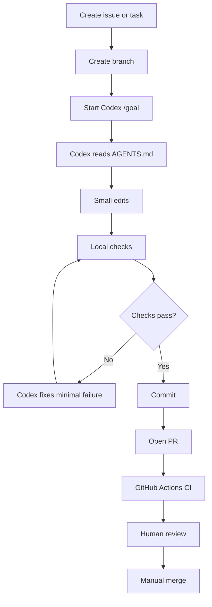

# AI Lab Codex Workbench

A lightweight GitHub repository template for learning prompt engineering, AI agents, repository automation, safe Codex workflows, pull requests, commits, reviews, and controlled merges.

This repository is designed for a Windows 11 student laptop with limited hardware. It avoids heavy local LLMs, Docker-first stacks, GPU workflows, and the usual software-engineering ritual of installing half the internet before writing one useful file.

## What this repository gives you

- A clean `AGENTS.md` for Codex and other coding agents.
- A safe Git workflow: branches, commits, pull requests, CI checks, review, and merge.
- Deterministic autofix scripts for simple formatting cleanup.
- GitHub Actions for CI, autofix PRs, and controlled manual merges.
- Codex `/goal` prompts for bug fixes, feature work, documentation, PR review, and repository cleanup.
- Issue and PR templates so tasks are clear before the agent starts rearranging civilization.
- No required Docker, WSL, GPU, paid API dependency, or large local model.

## Recommended repository name

Use one of these:

1. `ai-lab-codex-workbench`
2. `codex-agent-automation-lab`
3. `prompt-agents-github-lab`
4. `student-codex-github-automation`

Best default: **`ai-lab-codex-workbench`**.

## Quick start on Windows PowerShell

Install base tools:

```powershell
winget install Git.Git
winget install Microsoft.VisualStudioCode
winget install GitHub.cli
```

Install Codex CLI, using the current OpenAI installer:

```powershell
powershell -ExecutionPolicy ByPass -c "irm https://chatgpt.com/codex/install.ps1 | iex"
```

Check tools:

```powershell
git --version
gh --version
codex --version
python --version
```

Create the Git repository:

```powershell
cd "$HOME\Documents"
mkdir AI-Lab
cd AI-Lab
# Copy or extract this template folder here, then:
cd ai-lab-codex-workbench
git init
git add .
git commit -m "Initial Codex automation workbench"
```

Create GitHub repository and push:

```powershell
gh auth login
gh repo create ai-lab-codex-workbench --private --source . --remote origin --push
```

Run local checks:

```powershell
python scripts/repo_health_check.py
python scripts/safe_autofix.py --check
python -m unittest discover -s tests
```

Start Codex:

```powershell
codex
```

Then paste one of the prompts from `prompts/codex/`.

## The safe development loop



## What should be automated

| Task | Automate? | Why |
|---|---:|---|
| Trim trailing spaces | Yes | Safe and deterministic. |
| Ensure final newline | Yes | Safe and deterministic. |
| Run tests | Yes | Computers are good at repetitive disappointment. |
| Create PR after clean changes | Yes, with review | Useful. |
| Merge PRs | Only manual workflow | Merging blindly is how bugs acquire citizenship. |
| Delete files | No | Require explicit human approval. |
| Install dependencies | No | Require explicit human approval. |
| Touch secrets | Never | `.env` and credentials are not playground equipment. |

## Folder structure

```text
ai-lab-codex-workbench/
  README.md
  AGENTS.md
  CONTRIBUTING.md
  SECURITY.md
  CHANGELOG.md
  LICENSE
  .gitignore
  .editorconfig
  .github/
    PULL_REQUEST_TEMPLATE.md
    ISSUE_TEMPLATE/
      bug_report.yml
      feature_request.yml
      codex_task.yml
      prompt_audit.yml
    workflows/
      ci.yml
      autofix.yml
      merge-pr.yml
  docs/
    codex/
      00-start-here.md
      01-codex-goal-workflow.md
      02-git-branch-pr-merge-workflow.md
      03-safe-autofix-policy.md
      04-review-checklist.md
      05-repository-roadmap.md
    templates/
      task-spec.md
      merge-report.md
  prompts/
    codex/
      fix-bug.goal.md
      implement-feature.goal.md
      docs-update.goal.md
      review-pr.goal.md
      repository-cleanup.goal.md
  scripts/
    safe_autofix.py
    repo_health_check.py
    create_task_branch.ps1
    local_check.ps1
    bootstrap_github_repo.ps1
  tests/
    test_safe_autofix.py
    test_repo_health.py
  examples/
    sample-task.md
```

## Daily usage

1. Create an issue or write a task in `docs/templates/task-spec.md`.
2. Create a branch:

```powershell
.\scripts\create_task_branch.ps1 -Name "fix-readme-typos"
```

3. Start Codex:

```powershell
codex
```

4. Paste a `/goal` prompt from `prompts/codex/`.
5. Review the diff:

```powershell
git status
git diff
```

6. Run checks:

```powershell
.\scripts\local_check.ps1
```

7. Commit and push:

```powershell
git add .
git commit -m "Fix README typos"
git push -u origin agent/fix-readme-typos
```

8. Open a PR:

```powershell
gh pr create --fill
```

## Safety rules

- Keep changes small.
- Never let Codex edit `.env`, credentials, browser profiles, school/private documents, or unrelated folders.
- Do not run broad cleanup commands unless Git is clean and you understand the effect.
- Do not use auto-merge until CI is green and you reviewed the diff.
- Prefer cloud/API/browser workflows. Your laptop is good for Git, Codex, prompts, and small Python scripts. It is not a secret datacenter.

## License

MIT License. Use, modify, and learn from it.
