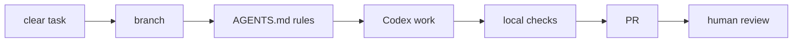

# Start Here

This section teaches one practical skill:

> Use Codex to improve a GitHub repository while keeping scope, checks, review, and public safety under control.

Codex can help with docs, scripts, tests, small features, bug fixes, repository cleanup, PR review, and repeatable workflows. It is not a substitute for Git, CI, human judgment, or security review.

## The Mental Model

Codex is useful because it can:

- Read repository files.
- Follow local instructions such as `AGENTS.md`.
- Edit files.
- Run commands.
- Explain diffs.
- Work toward a durable goal across multiple steps.
- Help prepare a final report for review.

Those capabilities create risk when:

- The prompt is vague.
- The branch is dirty.
- The task touches too many files.
- The agent runs commands without clear purpose.
- The user trusts a summary instead of reviewing the diff.
- External tool claims are copied without verification.

The safety system is Git plus instructions plus checks plus review.



## Recommended Learning Path

| Step | Goal | Output |
| --- | --- | --- |
| 1 | Learn the repo rules. | Read [AGENTS.md](../../AGENTS.md). |
| 2 | Learn local validation. | Run the three local checks. |
| 3 | Practice a small docs edit. | One Markdown diff on one branch. |
| 4 | Try a goal-style prompt. | Codex final report with commands and checks. |
| 5 | Open a PR. | CI result and reviewable diff. |
| 6 | Review before merge. | Findings, risks, and merge decision. |
| 7 | Update changelog. | User-visible change recorded. |
| 8 | Compare other tools. | Read [tool matrix](../tools/comparison-matrix.md). |

## Minimum Concepts

Before using Codex on a real repository, learn these concepts well enough to explain them:

| Concept | Why it matters |
| --- | --- |
| Working tree | Shows what files changed locally. |
| Branch | Isolates one task from `main`. |
| Diff | Shows the actual change, not the agent's summary. |
| Local check | Catches basic problems before PR review. |
| CI check | Repeats validation in GitHub. |
| Pull request | Gives humans a reviewable unit of work. |
| Changelog | Records user-visible changes for future readers. |
| Rollback | Gives maintainers a path if a merged change causes problems. |

If any of those feel unfamiliar, start with the smallest README task and review every command.

## First Local Commands

Run these from PowerShell in the repository root:

```powershell
git status
python scripts/repo_health_check.py
python scripts/safe_autofix.py --check
python -m unittest discover -s tests
```

If these pass before you start, you know later failures are more likely related to your change.

## First Session Script

Use this script as a human checklist, not as something to paste blindly:

| Step | Action | Stop if |
| --- | --- | --- |
| 1 | Run `git status`. | The tree has unexpected changes. |
| 2 | Read `AGENTS.md`. | The task conflicts with repo rules. |
| 3 | Pick one file. | The task needs many files before you understand the workflow. |
| 4 | Create `agent/first-doc-edit`. | Branch creation fails or you are not in the repo root. |
| 5 | Ask Codex for one focused edit. | The prompt cannot name included and excluded scope. |
| 6 | Review `git diff`. | The diff includes unrelated files. |
| 7 | Run local checks. | A check fails and you do not understand the failure. |
| 8 | Write a final report. | You cannot say what changed and what was verified. |

## Your First Codex Task

Use a branch:

```powershell
git switch -c agent/first-doc-edit
```

Give Codex a small prompt:

```text
Objective:
Improve one paragraph in README.md for beginner clarity.

Instructions:
- Read AGENTS.md.
- Inspect README.md before editing.
- Edit only one paragraph.
- Do not add dependencies.
- Do not modify workflow YAML.

Verification:
- python scripts/repo_health_check.py
- python scripts/safe_autofix.py --check
- python -m unittest discover -s tests

Final report:
- Summary
- Files changed
- Commands run
- Checks run
- Remaining risks
```

## How To Read Codex Output

Treat Codex output as a helpful draft, not proof.

| Codex says | You should verify |
| --- | --- |
| "I updated the README." | Open the README diff and read the actual text. |
| "Tests passed." | Check which commands ran and whether they match this repo's checks. |
| "No risks remain." | Look for secrets, private links, broad scope, and unsupported tool claims. |
| "I only changed one file." | Run `git status` or inspect the changed file list. |
| "This is current behavior." | Verify fast-changing product details in official docs. |

The agent's final report is useful for orientation. The Git diff and command output are the evidence.

## What To Learn Before Larger Tasks

Before asking Codex to change multiple files, be comfortable with:

- `git status`
- `git diff`
- Branch naming
- Pull request review
- CI log reading
- Secret scanning basics
- Changelog entries
- Public-safe documentation wording

## Avoid At First

- Auto-merging generated pull requests.
- Installing new frameworks.
- Editing workflow YAML.
- Running Docker-heavy stacks.
- Hosting large local models.
- Connecting write-capable MCP servers.
- Giving agents access outside the repository.
- Asking for whole-repo rewrites.

## Good First Tasks

| Task | Why it is safe |
| --- | --- |
| Improve one README section. | Small diff, easy review. |
| Add one prompt template section. | Clear structure and no runtime risk. |
| Fix one typo or broken internal link. | Easy validation. |
| Add a checklist to one doc. | Low risk and useful. |
| Review a PR without editing. | Builds review discipline. |

## Bad First Tasks

| Task | Why to avoid it at first |
| --- | --- |
| Rewrite every guide in the repo. | Too much surface area to review. |
| Add a new dependency stack. | Adds environment and supply-chain risk. |
| Change GitHub Actions behavior. | Automation changes need careful review. |
| Connect a write-capable MCP server. | Expands the agent's permission boundary. |
| Run broad cleanup commands. | Easy to delete or move unrelated files. |
| State current pricing or model access. | Fast-changing claims need official-doc verification. |

## When To Stop And Ask

Stop and ask a maintainer before:

- Installing dependencies.
- Deleting files.
- Moving many files.
- Editing secrets or environment files.
- Running destructive commands.
- Changing GitHub Actions.
- Connecting external services.
- Making exact claims about product pricing or model access.

## Beginner Troubleshooting

| Problem | Likely explanation | What to do |
| --- | --- | --- |
| You are not sure what changed | You have not inspected the diff yet. | Run `git diff` and read the changed sections. |
| A check fails after a docs edit | Whitespace, missing newline, or unrelated existing issue. | Read the exact failure and fix only the related cause. |
| Codex wants to edit many files | The prompt scope is too broad. | Stop, narrow the task, and retry. |
| The docs mention tool behavior you cannot verify | Product details may have changed. | Reword conservatively and link to official docs. |
| You accidentally changed the wrong file | The branch is still local. | Ask a maintainer how to remove only the unrelated change. |

## Next Guides

- [Codex Goal Workflow](01-codex-goal-workflow.md)
- [Git Branch, Pull Request, and Merge Workflow](02-git-branch-pr-merge-workflow.md)
- [Safe Autofix Policy](03-safe-autofix-policy.md)
- [Review Checklist](04-review-checklist.md)
- [Repository Roadmap](05-repository-roadmap.md)
