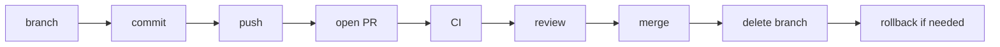

# Git Branch, Pull Request, and Merge Workflow

This guide shows the safe path from local branch to reviewed merge. It applies to Codex work and to other agent-generated changes.

The lifecycle has one shape, every time:



Each stage below gives the exact PowerShell commands. Run them from the repository root.

## Stage 1: Start Clean

Confirm the working tree matches what you expect before touching anything:

```powershell
git status
```

If `git status` shows unexpected changes, stop and understand them first. Do not branch from a dirty tree unless you know exactly what is already staged or modified.

## Stage 2: Create A Focused Branch

```powershell
git switch -c agent/my-task
```

One branch, one task. If the task grows into two unrelated changes, stop and split it into two branches instead of piling both into one PR.

### Branch Naming

Use:

```text
agent/<short-task-name>
```

Examples:

| Task | Branch |
| --- | --- |
| Expand Codex guide | `agent/expand-codex-guide` |
| Add safety checklist | `agent/add-safety-checklist` |
| Fix local check docs | `agent/fix-local-check-docs` |

Avoid private project names, account details, or vague names such as `agent/fixes`.

## Stage 3: Do The Work, Then Inspect It

Run the Codex task, then read the actual diff instead of trusting the agent's summary:

```powershell
git diff
git status
```

Layered review for larger diffs:

```powershell
git diff --stat
git diff -- path\to\one\file.md
```

`git diff --stat` shows file spread first. Review file-by-file after that so an unrelated edit does not slip past you inside a large diff.

## Stage 4: Run Local Checks

```powershell
python scripts/repo_health_check.py
python scripts/safe_autofix.py --check
python -m unittest discover -s tests
```

If `safe_autofix.py --check` reports files that need fixing:

```powershell
python scripts/safe_autofix.py --write
git diff
python scripts/safe_autofix.py --check
```

Always re-read `git diff` after `--write`. See [Safe Autofix Policy](03-safe-autofix-policy.md) for exactly what the write mode is allowed to touch.

## Stage 5: Commit Only Expected Files

```powershell
git status
git add README.md docs prompts CHANGELOG.md
git commit -m "Expand AI agent guide docs"
```

Never run `git add .` on a task you have not fully reviewed. Stage the exact paths you inspected. Commit messages should be concise and factual: describe what changed, not how impressive the agent was.

## Stage 6: Push The Branch

```powershell
git push -u origin agent/my-task
```

`-u` sets the upstream tracking branch so future `git push` and `git pull` on this branch do not need the remote name repeated.

## Stage 7: Open A Pull Request

```powershell
gh pr create --fill
```

`--fill` uses the branch's commit history to prefill the PR title and body. For a more deliberate PR body, write it explicitly:

```powershell
gh pr create --title "Expand AI agent guide docs" --body "Summary of the change, why it changed, commands run, checks run, known limitations."
```

### Pull Request Body

A useful PR includes:

- Summary.
- Why it changed.
- Files touched.
- Commands run.
- Checks run.
- Known limitations.
- Claims that still need official-doc verification.

Template:

```markdown
## Summary
-

## Commands run
-

## Checks
- [ ] python scripts/repo_health_check.py
- [ ] python scripts/safe_autofix.py --check
- [ ] python -m unittest discover -s tests

## Known limitations
-
```

## Stage 8: Check CI Status

```powershell
gh pr checks
```

Add `--watch` to keep polling until every required check finishes:

```powershell
gh pr checks --watch
```

If you know the PR number (for example, from `gh pr list`), target it directly:

```powershell
gh pr checks 42 --watch
```

CI runs on pull requests and verifies:

```powershell
python scripts/repo_health_check.py --ci
python scripts/safe_autofix.py --check
python -m unittest discover -s tests
```

If CI fails:

- Open the failed job log with `gh run view --log-failed` or through the GitHub web UI.
- Find the first meaningful error, not just the last line of output.
- Fix the smallest related cause.
- Rerun the failed check locally when possible.
- Push a focused fix commit.

## Stage 9: Human Review

1. Read the PR summary.
2. Check changed files.
3. Review the actual diff, not only the agent summary.
4. Confirm no secrets or private data were added.
5. Confirm no unrelated files changed.
6. Confirm local checks were reported.
7. Confirm CI passed.
8. Confirm external claims are conservative.
9. Confirm `CHANGELOG.md` is updated when useful.
10. Merge only after human review.

See the [Review Checklist](04-review-checklist.md) for the full review sequence.

## Stage 10: Merge

### Squash Merge (Recommended For Small Tasks)

```powershell
gh pr merge 42 --squash --delete-branch
```

Squash merge keeps `main` readable by turning many small agent iteration commits into one clear commit. `--delete-branch` removes the remote branch immediately after merge, which also completes Stage 11 for you in one command.

Do not squash merge if:

- The PR is still a draft.
- CI failed.
- The diff is not reviewed.
- The PR contains unrelated changes.
- A secret or private link is present.

### Controlled Merge Workflow

This repo includes `.github/workflows/merge-pr.yml`. It is manually triggered and is intended for maintainers who want GitHub Actions to enforce required checks before merging.

The controlled merge workflow:

- Refuses draft PRs.
- Waits for required checks with `gh pr checks --watch --required`.
- Merges with the selected method (`squash`, `merge`, or `rebase`).
- Deletes the branch as part of the merge command.

Trigger it from the GitHub Actions UI, or with the CLI:

```powershell
gh workflow run "Controlled Merge PR" -f pr_number=42 -f merge_method=squash
```

Use it only after the diff has been reviewed. Automation enforcing checks is not a substitute for a human reading the diff.

## Stage 11: Delete The Merged Branch

If the merge command did not already delete it (for example, you merged manually in the GitHub UI):

```powershell
git switch main
git pull
git branch -d agent/my-task
git push origin --delete agent/my-task
```

`git branch -d` (lowercase) refuses to delete a branch with unmerged commits, which is a useful safety check. Only use `git branch -D` (uppercase) if you are certain the branch's work is either merged or intentionally discarded.

## Stage 12: Rollback If Needed

If a bad commit reaches `main`, prefer `git revert`:

```powershell
git log --oneline
git revert <bad_commit_hash>
git push
```

Why revert instead of resetting shared history:

- It preserves shared history.
- It is understandable in public repos.
- It creates an audit trail.
- It avoids force-push risk.

After rollback:

- Run local checks.
- Check CI.
- Add a changelog or PR note when learners need to understand the change.

## Troubleshooting

| Problem | Likely cause | Fix |
| --- | --- | --- |
| Merge conflict on `git push` or in the PR | `main` moved ahead of your branch since you started. | `git switch agent/my-task`, then `git fetch origin`, then `git merge origin/main` (or `git rebase origin/main` for a linear history). Resolve conflict markers in the affected files, `git add` the resolved files, then `git commit` (skip commit if you used `merge --continue`/`rebase --continue`). Push again with `git push`, or `git push --force-with-lease` only if you rebased and the branch is yours alone. |
| CI failing on an unrelated flake | A test or check unrelated to your change failed intermittently, or `main` itself was briefly red. | Re-run the failed job: `gh run rerun <run-id> --failed`. If it passes on rerun, note the flake in the PR. If it fails twice, treat it as real and investigate before merging. |
| Branch diverged from `main` | Other PRs merged to `main` after you branched. | `git fetch origin`, then `git merge origin/main` into your branch (safer for shared branches) or `git rebase origin/main` (cleaner history for a solo branch). Re-run local checks after either. |
| Accidental commit to `main` | Forgot to create a branch before committing. | If not pushed yet: `git branch agent/rescue-branch` to save the commit, then `git reset --hard origin/main` to restore local `main`, then `git switch agent/rescue-branch`. If already pushed to shared `main`, use `git revert` instead of resetting shared history. |
| Force-push risk | `git push --force` can overwrite a collaborator's work on a shared branch. | Prefer `git push --force-with-lease`, which fails safely if the remote has commits you have not seen. Never force-push `main` or any branch other contributors are actively using. |
| PR stuck in draft | PR was opened with `gh pr create --draft`, or GitHub marked it draft automatically. | Mark it ready with `gh pr ready 42`. Controlled merge and squash merge both refuse draft PRs by design, so this step is required before either can run. |
| `gh pr checks` shows a check that never starts | Workflow trigger conditions were not met (for example, path filters or branch name rules). | Confirm the branch name and changed paths match the workflow's `on:` triggers. Re-push a small commit to retrigger if needed. |
| Local checks pass but CI fails | Environment difference, stale local cache, or a check that only runs `--ci` mode in Actions. | Run the exact CI commands locally, including `python scripts/repo_health_check.py --ci`, and compare output line by line. |

## Common Mistakes

| Mistake | Risk | Better habit |
| --- | --- | --- |
| Commit before reviewing `git diff` | Unrelated changes can slip in. | Review diff before `git add`. |
| Use `git add .` blindly | Generated or private files may be added. | Stage only expected files. |
| Merge because the PR summary looks good | Summary may omit issues. | Review full diff and CI logs. |
| Ignore changelog | Future readers miss context. | Update changelog for visible changes. |
| Force-push shared branch | Can disrupt collaborators. | Use revert for shared history. |

## Related Guides

- [Codex Goal Workflow](01-codex-goal-workflow.md)
- [Safe Autofix Policy](03-safe-autofix-policy.md)
- [Review Checklist](04-review-checklist.md)
<!-- RESEARCH-GRADE-EXPANSION:BEGIN -->
## Research-Grade Review Addendum

This file is part of the repository's **repository support file** surface. During broad
maintenance, reviewers should treat `docs/codex/02-git-branch-pr-merge-workflow.md` as a contract-bearing artifact
rather than passive prose. The file should keep a clear audience, explicit
scope, concrete operating steps, public-safety boundaries, and verification
evidence that a maintainer can inspect without trusting an agent summary.

Research-grade review questions for this file:

- Does `02 git branch pr merge workflow` state what decision, workflow, or reusable behavior it supports?
- Are included scope, excluded scope, and unsafe actions clear enough for an
  agent or contributor to follow?
- Are examples public-safe, repository-relative, and free of private data?
- Are fast-changing product or platform claims phrased conservatively or marked
  for official-doc verification?
- Does the file point to the next artifact a reader should inspect: a command,
  template, test, manifest, package, or deeper guide?
- Could a reviewer cite this file in a PR review and know what evidence proves
  the work is complete?

Keep future edits focused on stronger evidence, clearer failure modes, better
navigation, and safer automation boundaries. Do not add length unless the new
material makes the repository easier to operate, teach, audit, or recover.
<!-- RESEARCH-GRADE-EXPANSION:END -->
