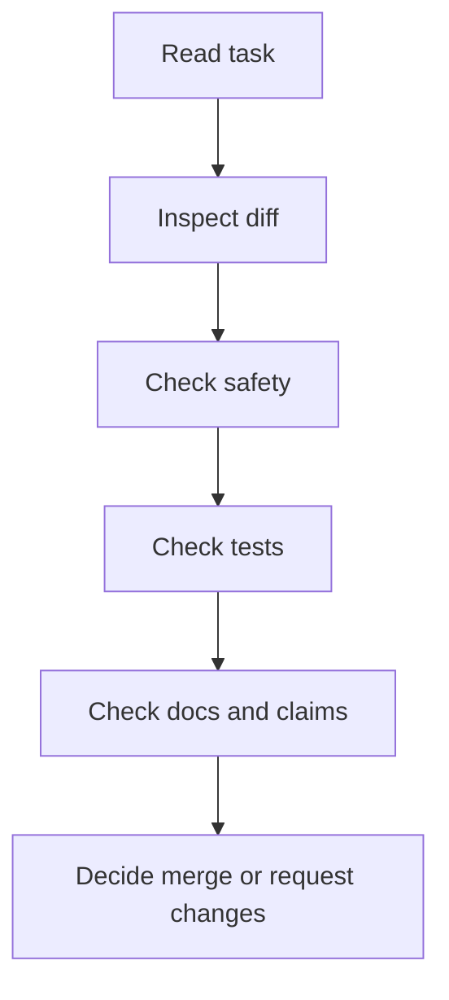

# Review Checklist

Use this before accepting Codex changes or any AI-generated pull request.

Review has one purpose: decide whether the actual diff is safe, focused, correct, and worth merging. Do not rely only on an agent's summary.

## Review Sequence



## Task Fit

- [ ] The PR has a clear objective.
- [ ] The change solves the stated task.
- [ ] The diff is small enough to review.
- [ ] The branch contains one logical change.
- [ ] Unrelated cleanup is absent or clearly justified.

## Diff Review

- [ ] Changed files match the intended scope.
- [ ] No secrets or private data were added.
- [ ] No private links or private machine paths were added.
- [ ] No workflow YAML was changed unless requested.
- [ ] No dependency was added without approval.
- [ ] No generated junk, large files, archives, or binaries were committed.
- [ ] Markdown headings, links, and tables render sensibly.
- [ ] PowerShell examples are appropriate for Windows learners.

Useful commands:

```powershell
git status
git diff --stat
git diff
```

## Test Review

- [ ] `python scripts/repo_health_check.py` passed.
- [ ] `python scripts/safe_autofix.py --check` passed.
- [ ] `python -m unittest discover -s tests` passed.
- [ ] CI passed on the PR.
- [ ] Any failure is explained honestly.
- [ ] Related failures were fixed with the smallest reasonable change.

## Prompt Review

- [ ] The prompt had a clear objective.
- [ ] Included and excluded scope were stated.
- [ ] Success criteria were specific.
- [ ] Safety boundaries were included.
- [ ] Verification commands were included.
- [ ] The final report listed files changed and commands run.
- [ ] Remaining risks were reported.

## Public Safety Review

- [ ] No `.env` or `.env.*` files are tracked.
- [ ] No token-like examples were added.
- [ ] No screenshots reveal account or file-path data.
- [ ] No private repositories or dashboards are linked.
- [ ] GitHub Actions logs do not print secrets.
- [ ] External tool claims are conservative.

## Tool Claim Review

For Codex and other AI tools:

- [ ] Exact pricing is avoided unless freshly verified.
- [ ] Model names and plan availability are not asserted without official docs.
- [ ] Platform support is not overstated.
- [ ] Setup instructions point to official docs.
- [ ] Fast-changing features are marked "verify in official documentation."

## Documentation Review

- [ ] The audience is clear.
- [ ] Beginners can follow the steps.
- [ ] Advanced users can audit the risk.
- [ ] Tables and checklists are useful, not decorative.
- [ ] Examples are safe and public-friendly.
- [ ] Failure modes are included for complex workflows.
- [ ] Internal links are correct.

## Merge Decision

Merge only when:

- The PR is focused.
- The diff is reviewed.
- Local checks and CI passed.
- Public-safety checks are clean.
- Changelog is updated when useful.
- Remaining risks are acceptable.

Request changes when:

- Scope is too broad.
- The agent changed unrelated files.
- Tests failed without explanation.
- Secrets or private links are present.
- Tool claims are unsupported.
- The PR cannot be understood quickly.

## Review Comment Template

```markdown
Verdict: request changes

Required fixes:
-

Reason:
-

Checks reviewed:
-

Optional improvements:
-
```

## Approval Template

```markdown
Verdict: approve

Reviewed:
- Diff
- Local check report
- CI status
- Public safety concerns

Notes:
-
```
