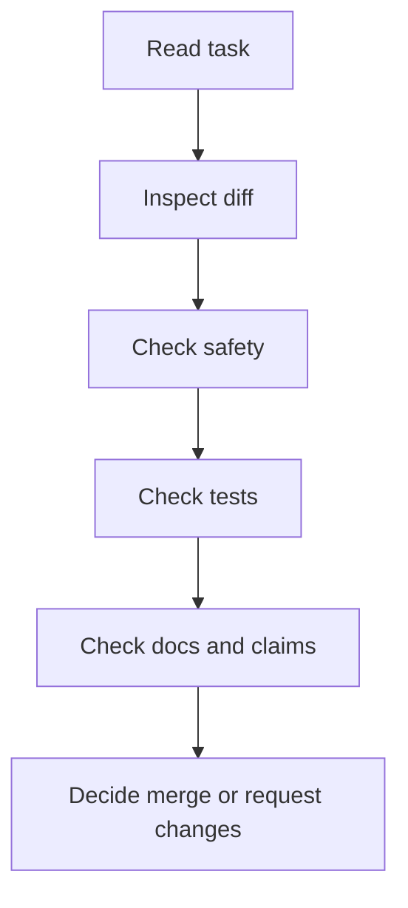

# Review Checklist

Use this before accepting Codex changes or any AI-generated pull request.

Review has one purpose: decide whether the actual diff is safe, focused, correct, and worth merging. Do not rely only on an agent's summary.

## Review Sequence



## Review Mindset

An AI-generated PR should be reviewed like a contribution from a capable new teammate who may misunderstand context. Be respectful, but verify the work directly.

Do not approve because:

- The agent summary sounds confident.
- The diff is large and looks impressive.
- CI passed but the scope is wrong.
- The change fixes one issue while adding unrelated churn.
- The PR says "no risks" without evidence.

Approve only when the actual diff, checks, and review evidence support the merge.

## Task Fit

- [ ] The PR has a clear objective.
- [ ] The change solves the stated task.
- [ ] The diff is small enough to review.
- [ ] The branch contains one logical change.
- [ ] Unrelated cleanup is absent or clearly justified.

Review questions:

- Can you describe the change in one sentence?
- Can you name the files that should have changed before looking at the diff?
- Would this PR still make sense if the agent's summary were deleted?
- Is there a smaller PR that would be easier and safer to merge?

## Diff Review

- [ ] Changed files match the intended scope.
- [ ] No secrets or private data were added.
- [ ] No private links or private machine paths were added.
- [ ] No workflow YAML was changed unless requested.
- [ ] No dependency was added without approval.
- [ ] No generated junk, large files, archives, or binaries were committed.
- [ ] Markdown headings, links, and tables render sensibly.
- [ ] PowerShell examples are appropriate for Windows learners.

Useful commands:

```powershell
git status
git diff --stat
git diff
```

For larger diffs, review in layers:

1. `git diff --stat` to see file spread.
2. File-by-file diff to catch unrelated edits.
3. Public-safety scan for secrets, paths, and links.
4. Documentation rendering or manual read-through.
5. Final task-fit check against the objective.

## Test Review

- [ ] `python scripts/repo_health_check.py` passed.
- [ ] `python scripts/safe_autofix.py --check` passed.
- [ ] `python -m unittest discover -s tests` passed.
- [ ] CI passed on the PR.
- [ ] Any failure is explained honestly.
- [ ] Related failures were fixed with the smallest reasonable change.

Evidence quality matters:

| Claim | Strong evidence | Weak evidence |
| --- | --- | --- |
| Local checks passed | Commands were run after the final edit. | Commands passed before the change. |
| CI passed | Current PR check run is green. | A previous commit or unrelated branch passed. |
| Docs render | Markdown tables and links were checked. | The file was edited but not read. |
| No secrets | Automated check plus manual changed-file review. | Trusting that docs cannot contain secrets. |

## Prompt Review

- [ ] The prompt had a clear objective.
- [ ] Included and excluded scope were stated.
- [ ] Success criteria were specific.
- [ ] Safety boundaries were included.
- [ ] Verification commands were included.
- [ ] The final report listed files changed and commands run.
- [ ] Remaining risks were reported.

If the original prompt was weak but the diff is safe and useful, the PR may still be mergeable. Record the prompt weakness as a lesson so future tasks improve.

## Public Safety Review

- [ ] No `.env` or `.env.*` files are tracked.
- [ ] No token-like examples were added.
- [ ] No screenshots reveal account or file-path data.
- [ ] No private repositories or dashboards are linked.
- [ ] GitHub Actions logs do not print secrets.
- [ ] External tool claims are conservative.

Manual public-safety searches can help:

```powershell
rg -n "\.env|token|secret|password|private key|api key|credential" .
rg -n "C:\\Users\\|/Users/|private|dashboard|portal" README.md docs prompts
```

Treat matches as review prompts, not automatic failures. Safe placeholders and safety guidance may contain words such as `token` or `secret`.

## Tool Claim Review

For Codex and other AI tools:

- [ ] Exact pricing is avoided unless freshly verified.
- [ ] Model names and plan availability are not asserted without official docs.
- [ ] Platform support is not overstated.
- [ ] Setup instructions point to official docs.
- [ ] Fast-changing features are marked "verify in official documentation."

Ask for official-doc verification before merging exact claims about:

- Subscription tiers.
- Model names or model routing.
- Rate limits.
- Platform availability.
- Installer commands.
- Cloud execution behavior.
- Permissions, sandboxing, or connector access.

## Documentation Review

- [ ] The audience is clear.
- [ ] Beginners can follow the steps.
- [ ] Advanced users can audit the risk.
- [ ] Tables and checklists are useful, not decorative.
- [ ] Examples are safe and public-friendly.
- [ ] Failure modes are included for complex workflows.
- [ ] Internal links are correct.

Documentation should answer three questions:

1. What should the reader do?
2. How do they know it worked?
3. What should they avoid?

If a section is long but does not answer those questions, ask for revision.

## Merge Decision

Merge only when:

- The PR is focused.
- The diff is reviewed.
- Local checks and CI passed.
- Public-safety checks are clean.
- Changelog is updated when useful.
- Remaining risks are acceptable.

Request changes when:

- Scope is too broad.
- The agent changed unrelated files.
- Tests failed without explanation.
- Secrets or private links are present.
- Tool claims are unsupported.
- The PR cannot be understood quickly.

Defer when:

- The idea is useful but the scope is too large for the current PR.
- A fast-changing claim needs official-doc verification.
- A visual or static HTML change needs manual browser review that has not happened.
- A script change needs tests that are not yet included.

## Review Comment Template

```markdown
Verdict: request changes

Required fixes:
-

Reason:
-

Checks reviewed:
-

Optional improvements:
-
```

## Approval Template

```markdown
Verdict: approve

Reviewed:
- Diff
- Local check report
- CI status
- Public safety concerns

Notes:
-
```
