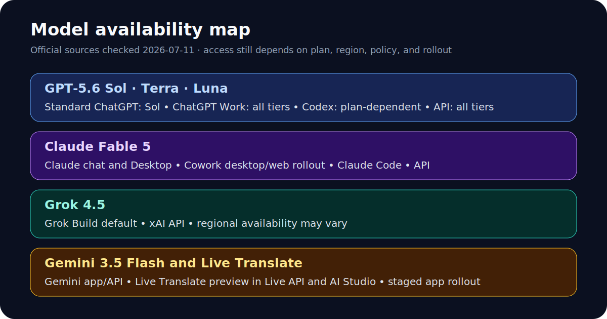

# Current Models, Interfaces, and Effort Controls

Checked: 2026-07-11

This guide separates model names, interface labels, and API parameters. Those
three layers often look similar but are not interchangeable. Availability can
also vary by plan, region, workspace policy, application version, and staged
rollout.

Claim labels used here:

- **CONFIRMED**: verified in a primary source.
- **VENDOR CLAIM**: stated by the model provider but not independently tested.
- **INDEPENDENT**: reported by a third party with a published method.
- **UNVERIFIED**: the available sources do not support the exact claim.



The map is an original summary of the official sources below, not a screenshot
of any vendor interface. See the [media provenance ledger](../research/model-media-provenance-2026-07-11.md)
for source and reuse details.

## Quick Corrections

| Requested wording | Verified wording as of 2026-07-11 |
| --- | --- |
| GPT-5.6 Sol, Terra, and Luna in normal ChatGPT chat | Only Sol powers the Medium, High, and Extra High options. Terra and Luna are not selectable in standard chat. |
| Light effort for GPT-5.6 | Current OpenAI API and Codex labels use `low`, not `light`. Standard ChatGPT no longer offers Thinking Light. |
| GPT-5.6 Ultra as an API effort | `ultra` is a Work/Codex orchestration mode. The API exposes multi-agent separately; `ultra` is not an API `reasoning.effort` value. |
| Fable 5 Ultracode as a higher API effort | Ultracode is a Claude Code orchestration mode built on `xhigh`, not an API effort above `max`. |
| “Claude Desktop Code” | Anthropic documents Claude Code on desktop, or the Code tab in Claude Desktop. |
| Gemini 3.5 Flash Live Translate Preview | The model is Gemini 3.5 Live Translate; its API ID is `gemini-3.5-live-translate-preview`. |
| Every input above 200K costs more | Thresholds are model-specific. Fable 5 keeps its standard rate through 1M tokens; GPT-5.6 changes rates above 272K; Grok 4.5 documents a higher tier above 200K. |

## GPT-5.6

OpenAI describes Sol as the flagship tier, Terra as the balanced lower-cost
tier, and Luna as the fastest and least expensive tier. The API IDs are
`gpt-5.6-sol`, `gpt-5.6-terra`, and `gpt-5.6-luna`; `gpt-5.6` aliases Sol.

### Product surfaces

| Surface | Confirmed model access | Confirmed effort behavior |
| --- | --- | --- |
| Standard ChatGPT | Sol through Medium, High, and Extra High; Sol Pro through Pro. Terra and Luna are not selectable. | Medium, High, Extra High, and Pro depend on plan and workspace policy. |
| ChatGPT Work | Sol, Terra, and Luna on eligible paid plans. | OpenAI confirms per-model effort selection, `max` for users with GPT-5.6 access, and `ultra` for Pro and Enterprise. The public page does not enumerate every lower UI label. |
| Codex desktop and CLI | Terra for Free and Go; Sol, Terra, and Luna for Plus, Pro, Business, and Enterprise. | OpenAI confirms per-model effort selection, `max`, and `ultra` for Plus and higher plans. |
| OpenAI API | Sol, Terra, and Luna. | `none`, `low`, `medium`, `high`, `xhigh`, and `max`; default `medium`. Multi-agent beta is separate from reasoning effort. |

The current local Codex catalog was also inspected with `codex.cmd debug
models` on 2026-07-11. It exposed this account-level snapshot:

| Codex model | Default | Visible effort values |
| --- | --- | --- |
| GPT-5.6 Sol | `low` | `low`, `medium`, `high`, `xhigh`, `max`, `ultra` |
| GPT-5.6 Terra | `medium` | `low`, `medium`, `high`, `xhigh`, `max`, `ultra` |
| GPT-5.6 Luna | `medium` | `low`, `medium`, `high`, `xhigh`, `max` |

This is local evidence, not a promise that every account or interface has the
same menu. OpenAI documents minimum versions of desktop Codex mode
26.707.30751 and Codex CLI 0.144.0 for GPT-5.6 access.

### Prompting by tier

The effort setting controls compute. The prompt still needs an outcome,
context, constraints, verification, and an output format.

| Tier | Best starting point | Prompt emphasis |
| --- | --- | --- |
| Luna | Fast bounded work: extraction, classification, small edits, concise drafting. | Give one output shape, a short source set, and a strict boundary. Avoid hiding a difficult judgment call inside a “simple” task. |
| Terra | Daily coding, research, document work, and multi-file tasks with clear acceptance criteria. | Name files or sources, state what must be checked, and require tests or citations. |
| Sol | Hard architecture, difficult debugging, cross-source synthesis, and correctness-sensitive review. | Provide the failed attempts, competing hypotheses, evidence requirements, and explicit failure modes. |

### Prompting by GPT-5.6 effort

| Effort | Use when | Add to the prompt |
| --- | --- | --- |
| `none` or lowest available | Direct transforms or simple retrieval. | “Return only the requested schema. Do not add analysis.” |
| `low` | The task is bounded and easy to verify. | Exact files or sources, one deliverable, one check. |
| `medium` | Normal work needing some judgment. | Acceptance criteria, edge cases, and required evidence. |
| `high` | Multi-step reasoning or a hard implementation. | Ask for hypotheses, a plan, verification, and a concise risk note. |
| `xhigh` / Extra High | Long or correctness-sensitive work with ambiguity. | Include alternatives considered, adversarial checks, and where the answer could fail. |
| `max` | The hardest single-agent reasoning work. | Supply the full decision record and demand independent validation before completion. |
| `ultra` in Work or Codex | A task can split into independent research or implementation streams. | Define subtask boundaries, shared contracts, merge criteria, and a final integration check. |

Do not use `ultra` merely to make one linear task “think longer.” Its documented
value is coordinated subagents.

### Pricing and context

| Model | Input / 1M | Cached input / 1M | Output / 1M |
| --- | ---: | ---: | ---: |
| GPT-5.6 Sol | $5.00 | $0.50 | $30.00 |
| GPT-5.6 Terra | $2.50 | $0.25 | $15.00 |
| GPT-5.6 Luna | $1.00 | $0.10 | $6.00 |

For prompts above 272K input tokens, OpenAI lists 2x input and 1.5x output
pricing for the full request. Cache writes cost 1.25x uncached input, while
cache reads receive the 90% cached-input discount. OpenAI also documents
explicit cache breakpoints and a 30-minute minimum cache life.

### Watch: a GPT-5.6 Sol explainer

[](https://yaked1.github.io/ai-lab-codex-workbench/site/model-media.html#gpt-sol-explainer)

*Third-party explainer by IBM Technology. Click the image to watch. Use the
official OpenAI sources below for availability and benchmark claims.*

## Claude Fable 5

Claude Fable 5 is the official model name; the API model ID is
`claude-fable-5`. Anthropic positions it for demanding, long-running knowledge
and coding work. That positioning is a vendor claim.

### Product surfaces

| Surface | Status | Effort evidence |
| --- | --- | --- |
| Claude on the web and Claude Desktop chat | Fable 5 confirmed for eligible plans. | General UI docs describe Low, Medium, High, Extra High, and Max, but the Fable-specific UI menu is not consistently enumerated. Check the live picker. |
| Claude Cowork desktop | Fable 5 confirmed; current Claude Desktop required. | Enterprise effort caps apply, but exact Fable choices remain account-dependent. |
| Claude Cowork on web | Rollout began 2026-07-07, starting with Max plans over several weeks. | Availability and Fable effort choices may not yet be visible on every eligible account. |
| Claude Code CLI, remote, and desktop | Fable 5 confirmed; the promotion page requires CLI 2.1.170 or later. | `/effort` supports `low`, `medium`, `high`, `xhigh`, `max`, and `auto`. Ultracode is separately documented. |
| Claude API | `claude-fable-5`. | `low`, `medium`, `high`, `xhigh`, and `max`; `high` is the recommended default. No `auto` or `ultracode` API value. |

Anthropic originally said included promotional access would end July 7. Its
newer Help Center article extends access through July 12, 2026 at 11:59:59 PM
PT, for up to 50% of weekly limits on Pro, Max, Team, and eligible premium
Enterprise seats. After that, Fable remains available through usage credits.
Free, standard Enterprise, usage-based Enterprise, and API use are not covered
by the promotion.

### Prompting by Fable effort

| Effort | Best use | Prompt pattern |
| --- | --- | --- |
| Low | Routine drafting, extraction, or small edits. | One objective, narrow context, explicit format, quick check. |
| Medium | Normal analysis, coding, and document work. | Include acceptance criteria and ask Claude to verify the finished artifact. |
| High | Default for difficult work. | Ask for a staged plan, tool use, tests, and a completion report tied to evidence. |
| Extra High (`xhigh`) | Long-horizon coding or agent work where deeper search is worth the cost. | Require checkpoints, explicit hypotheses, and recovery behavior after a failed check. |
| Max | The deepest single-agent analysis and correctness-sensitive review. | Add an adversarial review pass and require it to state unresolved uncertainty. |
| Ultracode | Claude Code work that benefits from delegated agents. | Define independent workstreams, worktree or file ownership, integration tests, and review responsibility. |

Anthropic says Ultracode combines `xhigh` with standing permission to launch
multi-agent workflows. It should not be described as “more reasoning than
Max.”

### Pricing, context, and safeguards

Fable 5 costs $10 per million input tokens and $50 per million output tokens.
Batch processing is $5/$25. Anthropic lists the full 1M context window at the
same per-token rate, including requests above 200K input tokens. Large prompts
still cost more in total because they contain more billable tokens.

Fable 5 includes conservative cyber, biology, and chemistry safeguards. In
most Claude applications, flagged requests can route to Opus 4.8. This matters
when interpreting both cost and benchmark results: a routed Fable product is
not always one unchanged checkpoint.

### Watch: Introducing Claude Fable 5

[](https://yaked1.github.io/ai-lab-codex-workbench/site/model-media.html#fable-official)

*Official Anthropic launch video. Click the image to watch; capability claims
inside the video remain vendor claims.*

## Grok 4.5 in Grok Build

Grok 4.5 (`grok-4.5`) is the default model in Grok Build. The official model
page lists Low, Medium, and High reasoning, with High as the default. A useful
High-effort prompt should include:

```text
Outcome: <working result>
Context: <repo, files, constraints>
Plan: inspect first; identify risks before editing
Verification: run <tests/checks> and inspect the diff
Report: changed files, evidence, remaining uncertainty
```

Official pricing is $2 per million input tokens, $0.50 cached input, and $6
output. The official model page confirms higher pricing above 200K input
tokens. Artificial Analysis reports that the rates double to $4/$1/$12, but
that numeric long-context tier was not visible in the official page fetched
during this review, so it is labeled **INDEPENDENT**, not confirmed here.

Grok 4.5 launched outside the EU on 2026-07-08, with EU availability expected
in mid-July. Recheck the console for a current regional claim.

## Gemini 3.5 Flash

Gemini 3.5 Flash is available in the Gemini app and through the Gemini API. The
web interface uses user-facing thinking choices such as Standard and Extended
where available. The API uses `minimal`, `low`, `medium`, and `high`, with
`medium` as the default. Google does not document a one-to-one mapping from the
web labels to API values.

| Surface choice | Prompting guidance |
| --- | --- |
| Standard | Use for everyday analysis, document work, and normal coding. State the goal, relevant context, and output format. |
| Extended | Use for hard math, multi-step technical work, or difficult code. Add verification, edge cases, and a request to test competing approaches. |
| API `minimal` / `low` | Optimize for latency on simple tasks and shorter agent loops. Keep tool permissions narrow. |
| API `medium` | Default for most complex coding and agent work. |
| API `high` | Use for the hardest reasoning, math, code, and tool-use tasks. Expect higher latency. |

Google recommends keeping default sampling settings and using
`thinking_level` instead of the older `thinking_budget` control for Gemini 3
models.

## Uncertainties

- OpenAI's launch post and Help Center conflict on some plan details, including
  Business access to Sol Pro and whether Free/Go includes ChatGPT Work.
- OpenAI does not publish every lower Work/Codex UI label on the launch page.
  The local Codex catalog is included as a dated snapshot, not a global rule.
- Anthropic's general UI help is inconsistent with newer Fable-specific API
  effort documentation. Check the live model picker for chat and Cowork.
- Cowork web is in a staged rollout.
- Google does not publish an exact Standard/Extended to API-effort mapping.
- Grok's exact numeric long-context rates need confirmation in the live xAI
  console or an official pricing table that renders the tier.

## Sources

Primary sources, accessed 2026-07-11:

- [OpenAI: GPT-5.6 launch](https://openai.com/index/gpt-5-6/), published 2026-07-09.
- [OpenAI Help: GPT-5.6 in ChatGPT](https://help.openai.com/en/articles/20001354-gpt-56-in-chatgpt), updated 2026-07-11.
- [OpenAI Help: ChatGPT Work and Codex](https://help.openai.com/en/articles/20001275), updated 2026-07-11.
- [OpenAI API: GPT-5.6 model guidance](https://developers.openai.com/api/docs/guides/latest-model).
- [OpenAI API: GPT-5.6 Sol](https://developers.openai.com/api/docs/models/gpt-5.6-sol).
- [Anthropic: Claude Fable 5](https://www.anthropic.com/claude/fable).
- [Anthropic Help: Fable 5 promotional access](https://support.claude.com/en/articles/15424964-claude-fable-5-promotional-access).
- [Anthropic Platform: effort](https://platform.claude.com/docs/en/build-with-claude/effort).
- [Anthropic Platform: pricing](https://platform.claude.com/docs/en/about-claude/pricing).
- [SpaceXAI: Introducing Grok 4.5](https://x.ai/news/grok-4-5), published 2026-07-08.
- [SpaceXAI Docs: Grok 4.5](https://docs.x.ai/developers/grok-4-5), updated 2026-07-08.
- [Google: Gemini 3.5 Flash changes](https://ai.google.dev/gemini-api/docs/whats-new-gemini-3.5).
- [Google: Gemini thinking](https://ai.google.dev/gemini-api/docs/thinking).

## Method

Official launch posts, help pages, and developer documentation were checked
first. Community material was used only to locate newer primary pages. Local
Codex output was recorded as account-specific evidence. Conflicting official
pages are reported rather than silently reconciled.
