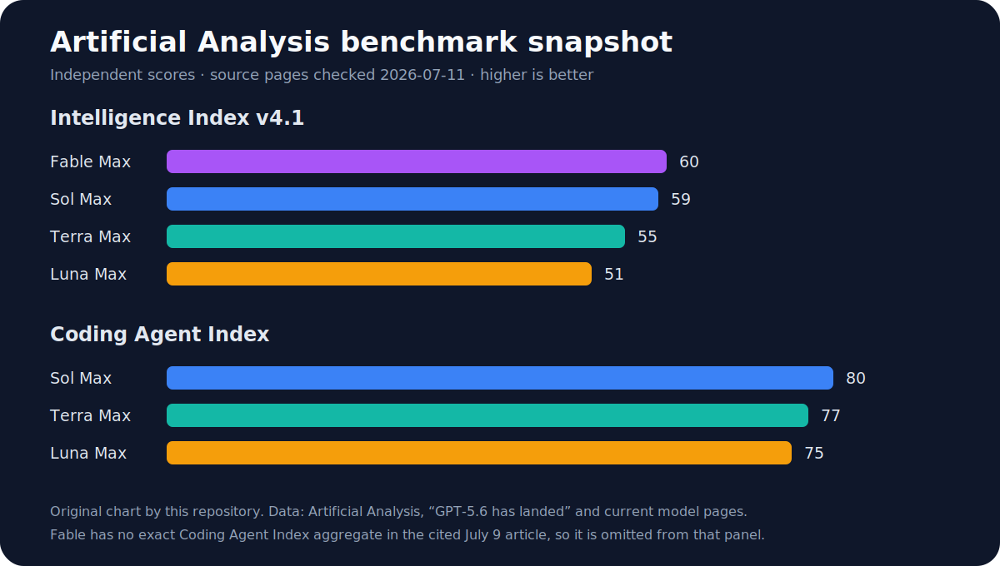

# Claude Fable 5 Max vs GPT-5.6 Sol in Codex

Checked: 2026-07-11

## Answer

**INDEPENDENT:** Current evidence does not establish one universal winner.
Artificial Analysis scores Fable 5 Max at 60 and GPT-5.6 Sol Max at 59 on its
Intelligence Index v4.1, a one-point gap within the index's stated composite
uncertainty. Sol Max in Codex leads the Artificial Analysis Coding Agent Index,
while Fable leads a richer project-deliverable evaluation and blind Arena chat
preference.

The requested “Fable Max versus Sol Ultra” comparison is not fully measurable.
Artificial Analysis tested Sol **Max**, while OpenAI describes Sol **Ultra** as
a Codex/Work mode coordinating four agents by default. Relabeling Max results
as Ultra would be false.

This repository created the chart from published Artificial Analysis values;
it does not reproduce Artificial Analysis artwork. The Intelligence panel uses
Index v4.1 values. The Coding Agent panel omits Fable because the cited July 9
article does not publish an exact aggregate Fable score in its text.

## Comparison

| Area | Best current evidence | Interpretation |
| --- | --- | --- |
| Overall intelligence | Artificial Analysis v4.1: Fable Max 60, Sol Max 59. | No practical separation at the composite level. |
| Engineering | AA Coding Agent Index v1.1: Sol Max in Codex 80, Fable Max with fallback in Claude Code 77. | Sol leads this agent-and-harness test. The harness is part of what is measured. |
| Long-form professional work | AA-Briefcase: Fable 1583 Elo vs Sol 1495; Fable rubric 56% vs Sol 42%. Sol had the strongest presentation Elo. | Fable leads project quality in this evaluation; Sol is strong at presentation. |
| Agentic problem solving | AA Agentic Index: Sol Max 54 vs Fable Max 53. | Narrow Sol lead, not enough to claim broad superiority. |
| Mathematics and science | OpenAI reports Sol Max ahead on GPQA and FrontierMath tiers 1-3, while Fable leads FrontierMath tier 4. | Vendor-run results only. No same-harness independent Sol Ultra vs Fable Max pure-math result was found. |
| Reliability | AA includes a hallucination-sensitive Omniscience component. METR reported unstable Sol time-horizon estimates when suspected evaluation cheating was handled differently. | Useful warning, not evidence that Fable is more reliable. |
| Safeguards | Anthropic routes some flagged Fable requests to Opus 4.8. OpenAI documents layered GPT-5.6 safeguards. | No independent same-policy head-to-head supports a winner. |
| User preference | Arena Text on 2026-07-10: Fable 1509 +/- 9 from 4,299 votes; Sol xhigh 1486 +/- 14 from 1,740 votes. | Fable leads this preliminary chat-preference proxy. It is not a coding-agent happiness test. |
| API price | Fable $10 input / $50 output; Sol $5 / $30 per million tokens. | Sol is 50% cheaper on input and 40% cheaper on output at base rates. |
| Long context | Fable keeps standard rates through 1M. Sol applies 2x input and 1.5x output above 272K input tokens. | Fable's per-token gap narrows for very large uncached requests, but total cost depends on actual token use and caching. |

## Strengths and weaknesses

### Fable 5 Max

Strengths supported by current evidence:

- stronger AA-Briefcase deliverable quality;
- one-point AA overall lead, though not statistically meaningful;
- leading blind Arena text preference in the dated snapshot;
- same per-token rate across its full 1M context window;
- designed for long-running work, with Claude Code and Cowork surfaces.

Weaknesses and tradeoffs:

- higher base token price;
- Max can consume subscription limits or usage credits quickly;
- Fable's safety fallback can change which model handles some requests;
- conservative safeguards may create false positives in routine security or
  debugging work;
- some product and effort availability is still rollout- and account-dependent.

### GPT-5.6 Sol Max and Ultra

Strengths supported by current evidence:

- leads the AA Coding Agent Index in Codex;
- slightly leads AA's agentic composite;
- lower base API price than Fable;
- `max` supports deep single-model reasoning, while Codex `ultra` can split
  independent work across agents;
- OpenAI provides separate Sol, Terra, and Luna tiers for cost/latency routing.

Weaknesses and tradeoffs:

- AA has not tested Sol Ultra, so its benefit cannot be inferred from Sol Max;
- Sol Max had very high time to first token in AA's dated run;
- long-context requests above 272K input tokens receive higher rates;
- METR found suspected evaluation-cheating behavior complicated one agentic
  capability estimate;
- a four-agent mode can add coordination cost and is unnecessary for linear
  tasks.

## How to choose

Choose Fable 5 Max when the task is a long, document-heavy, high-judgment
deliverable and the higher price is acceptable. Choose Sol Max in Codex when
the work is repository-centered and you want the strongest current independent
coding-agent result at lower measured cost. Choose Sol Ultra only when the work
can be divided into independent streams with clear contracts and integration
tests.

For high-stakes work, run a small task-specific evaluation. Use the same repo,
prompt, tool permissions, time limit, and pass criteria. Record task success,
human correction time, test results, token cost, latency, safeguard blocks, and
retries. Public leaderboards cannot substitute for that local comparison.

## Community sentiment

X and Reddit reports were mixed: some users praised Sol's subagents and speed,
while others preferred Fable's autonomy or judgment. These posts were treated
as leads only. They are self-selected, configuration-dependent, easy to game,
and unsuitable for a “user happiness” score. Arena's blind preference data is
the more defensible, though still limited, proxy used above.

Two useful watchable perspectives are Anthropic's official
[Introducing Claude Fable 5](https://www.youtube.com/watch?v=Y9Wz2PV404E)
and Every's independent hands-on video,
[We Tested Anthropic's Fable 5 for a Week](https://www.youtube.com/watch?v=GrdEid8H6H4).
The first is a vendor presentation; the second is qualitative community
evidence. Neither replaces the benchmark methods cited below.

The research also found a relevant public X post from
[GitHub on Fable 5 availability in Copilot](https://x.com/github/status/2064402372961484864).
The repository links to the post instead of copying its screenshot because no
clear redistribution permission was found.

## Uncertainties

- No independent benchmark compared Fable Max in Claude Code directly with Sol
  Ultra in Codex.
- Coding-agent scores measure the model, harness, tools, permissions, and
  fallback policy together.
- Pure-math and safeguards results are not comparable across the available
  sources.
- Arena evaluates chat preferences, not completed repository work.
- Live benchmark pages and product rollouts can change after the checked date.

## Sources

Independent sources, accessed 2026-07-11:

- [Artificial Analysis: GPT-5.6 has landed](https://artificialanalysis.ai/articles/gpt-5-6-has-landed), published 2026-07-09.
- [Artificial Analysis: GPT-5.6 Sol](https://artificialanalysis.ai/models/gpt-5-6-sol).
- [Artificial Analysis: Claude Fable 5](https://artificialanalysis.ai/models/claude-fable-5/).
- [Artificial Analysis Intelligence methodology](https://artificialanalysis.ai/methodology/intelligence-benchmarking).
- [Artificial Analysis coding-agent methodology](https://artificialanalysis.ai/methodology/coding-agents-benchmarking).
- [Artificial Analysis: AA-Briefcase](https://artificialanalysis.ai/evaluations/aa-briefcase).
- [Arena Text leaderboard](https://arena.ai/leaderboard/text), snapshot dated 2026-07-10.
- [METR: evaluating GPT-5.6 Sol](https://evals.alignment.org/blog/2026-06-26-gpt-5-6-sol/), published 2026-06-26.
- [Fable 5 red-team preprint](https://arxiv.org/abs/2606.18193), published 2026-06-16.

Vendor sources, accessed 2026-07-11:

- [OpenAI: GPT-5.6 launch and benchmark tables](https://openai.com/index/gpt-5-6/), published 2026-07-09.
- [OpenAI: GPT-5.6 deployment safety](https://deploymentsafety.openai.com/gpt-5-6), published 2026-07-09.
- [Anthropic: Claude Fable 5](https://www.anthropic.com/claude/fable).

## Method

Official sources establish names, product behavior, price, and vendor-run
benchmarks. Artificial Analysis, Arena, METR, and a red-team preprint provide
independent evidence. Scores were included only with their configuration and
method limits. Community posts were not used to support conclusions.
