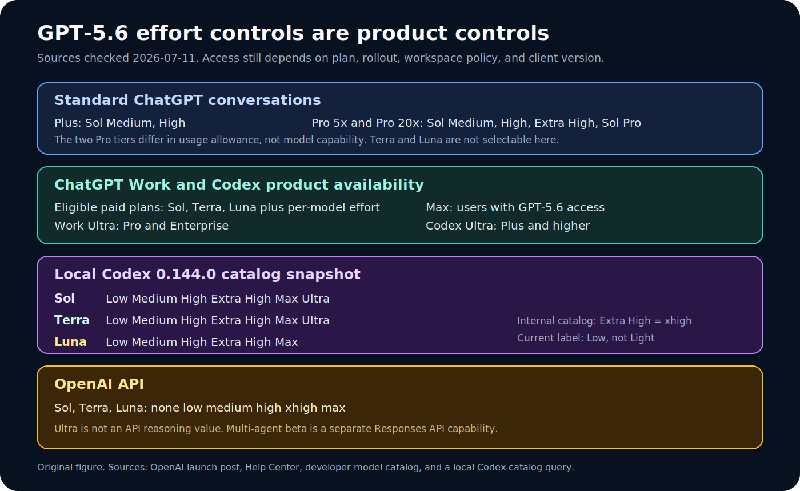
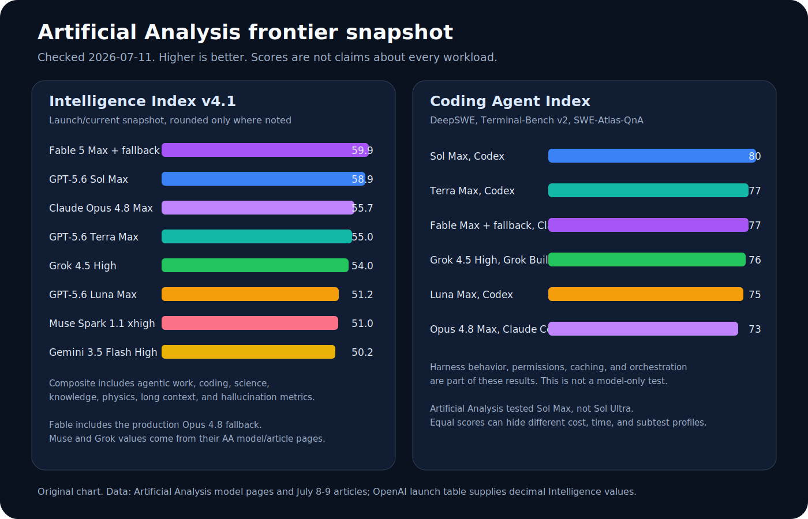
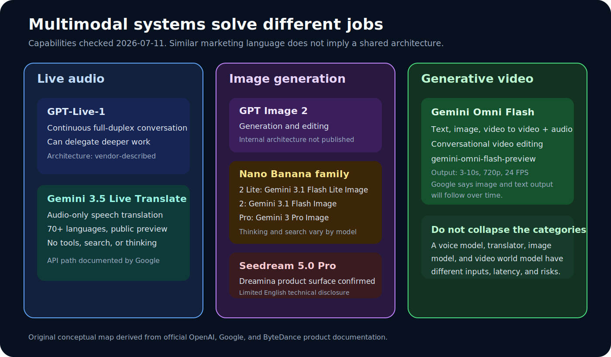

# Frontier Models and Multimodal Systems in 2026

Checked: 2026-07-12

This guide explains the GPT-5.6 family, current Claude, DeepSeek, GLM, Mistral,
Google open-model, media, robotics, live-audio, image, and video systems. It now
contains announcement-style release dossiers for every named model and major
variant, alongside the architecture, benchmark, quantization, and deployment
reference sections. It is
a dated research snapshot, not a promise that every model picker will look the
same on every account or an exhaustive catalog of every vendor release.

Facts are labeled by evidence type:

- **Official** means a vendor launch post, help article, API page, or live
  product catalog.
- **Independent** means a benchmark maintainer tested the model and published
  the method or configuration.
- **Local evidence** means a deterministic query of the Codex catalog installed
  in this checkout on the checked date.
- **Unconfirmed** means the checked public sources did not establish the claim.

Two additional labels matter throughout this guide. **Vendor claim** identifies
a result or qualitative statement published by the model maker but not
independently reproduced here. **Interpretation** identifies a recommendation
derived from the cited facts rather than a property guaranteed by a vendor.
Third-party videos are workflow evidence only. They do not establish prices,
plan eligibility, model IDs, architecture, or benchmark scores. The
[video research pack](../research/video-research-pack-2026-07-11.md) records
verified videos and discovery searches separately.

## How the Expanded Technical Dossiers Are Structured

The short family summaries above are useful for orientation, but they are not
sufficient for architecture review, deployment planning, benchmark comparison,
or procurement. The expanded dossiers later in this guide use one common
schema so that a closed API model, an open-weight checkpoint, a speech system,
and a video generator are not compared as though they disclosed the same kind
of evidence.

Every expanded dossier tries to answer the following questions:

1. **Identity and status.** What is the exact model or product name, release
   state, model identifier, access surface, and checked date?
2. **Architecture.** Is the checkpoint dense or Mixture-of-Experts? How many
   total and active parameters, transformer layers, attention heads, key/value
   heads, experts, active experts, vision/audio layers, and context positions
   are publicly documented?
3. **Generation method.** Is output autoregressive, diffusion-based,
   full-duplex streaming, retrieval-augmented, tool-mediated, or undisclosed?
4. **Training and post-training.** What does the vendor disclose about
   pretraining scale, reinforcement learning, distillation, safety tuning,
   multimodal alignment, speculative decoding, or reasoning controls?
5. **Performance.** Which results are vendor claims, which are independent,
   which include an agent harness or fallback, and which cannot be compared
   because the evaluator, tools, token budget, or judge differs?
6. **Deployment.** Are weights available? Under what license? Which reference
   precisions, first-party quantizations, runtimes, context limits, and hardware
   assumptions are documented?
7. **Failure modes.** What is likely to break in long context, tool loops,
   structured output, multimodal grounding, streaming, editing, or physical
   control?
8. **Unknowns.** Which requested facts remain undisclosed rather than being
   reverse-engineered from branding, UI behavior, or third-party speculation?

### Architecture disclosure scale

| Level | Meaning | What this guide is allowed to report |
| --- | --- | --- |
| A | Public weights plus a first-party configuration and model card | Exact layer, head, expert, context, tensor type, and checkpoint facts from the named revision |
| B | Public technical report or detailed system card without weights | Vendor-described architecture and training methods, but not unreported checkpoint dimensions |
| C | Product/API documentation only | Modalities, limits, tools, price, and product controls; parameter count and internal topology remain unknown |
| D | Announcement or preview with limited technical material | Only explicitly announced capabilities and restrictions; no deployment recipe is inferred |
| U | Unconfirmed | No stable factual model entry is created until a primary source appears |

A closed model can still be excellent while receiving a Level C architecture
rating. The rating measures disclosure, not intelligence. Likewise, an open
checkpoint can disclose every tensor dimension and still perform poorly on a
particular task. Humanity has somehow managed to confuse transparency,
capability, popularity, and marketing volume into one number often enough that
this guide keeps them deliberately separate.

### Rules for architecture tables

For open-weight systems, the tables use the vendor's model card and the exact
configuration files linked in the Sources section. A configuration describes a
checkpoint artifact, not necessarily every detail of the training run or hosted
service. Parameter totals can also include embeddings, routers, vision towers,
audio encoders, projectors, and output heads that are not obvious from a single
`hidden_size × layer_count` calculation.

For closed systems, an entry of **Undisclosed** is a result, not a missing
paragraph. The guide does not infer MoE routing from pricing, parameter count
from latency, attention type from context length, or diffusion versus
autoregression from visual artifacts. Those guesses can be interesting research
hypotheses, but they are not product facts.

### Rules for benchmark tables

Benchmark rows retain five pieces of context whenever the source provides them:
model identifier, effort or reasoning mode, harness, evaluator/version, and
fallback behavior. A score without those fields should be treated as a lead for
further testing, not a procurement verdict. Vendor numbers remain vendor claims
even when the chart is beautifully typeset. Independent numbers remain specific
to the independent evaluator's harness rather than becoming universal properties
of the bare checkpoint.

## Prompting Guides for These Models

For copy-ready work orders, effort playbooks, and surface-specific templates
for every model family in this essay, use the
[model and effort prompting pack](model-prompting/README.md). Start with the
[surface and effort map](model-prompting/surface-and-effort-map.md) when you
need Codex vs Desktop Light vs Work Ultra vs Claude Extra/xhigh labels.

## The Short Answer

GPT-5.6 is not one model with cosmetic speed buttons. Sol, Terra, and Luna are
three capability and price tiers, while effort controls how much work a tier
does before answering. Product surfaces then add another layer. Standard
ChatGPT exposes Sol reasoning choices. Work and Codex expose the family more
broadly. The API exposes model IDs and single-model reasoning levels. `ultra`
is different again because it coordinates agents rather than merely increasing
one model's reasoning setting.

Claude Fable 5 sits near Sol Max on broad independent intelligence testing and
below Sol Max in the current coding-agent composite, but its product safeguards
can route some requests to Opus 4.8. Grok 4.5 is a strong lower-cost coding
option in Grok Build. Gemini 3.5 Flash combines high throughput with agentic
performance. Muse Spark 1.1 is a fast, lower-cost Meta reasoning model. None of
those summaries means one model wins every math, engineering, coding, visual,
audio, or safety task.

## Announcement-Style Release Dossiers
This section rewrites the model catalog in the form of substantive launch dossiers. Each entry
combines the announcement story, product positioning, disclosed architecture, capabilities,
benchmark and result interpretation, access and economics, deployment consequences, limitations,
and a practical verdict. It deliberately refuses the most common release-post trick: presenting
an undisclosed field as though confident adjectives were a technical specification.

The entries are not substitutes for the later architecture tables. They are the narrative layer
that explains why a release exists, what changed relative to the preceding market, which results
matter, and what a builder should actually measure. Vendor benchmark claims are labeled in the
prose; independent numbers retain their evaluator and harness; preview systems retain their
preview status; unreleased systems remain watchlist entries.

### How to read each release dossier

| Block | Purpose |
| --- | --- |
| Release card | Exact identity, status, role, interface, context, price, weights, and architecture disclosure |
| Launch story | What the vendor is claiming changed and why the model exists |
| Capabilities | Concrete task and tool surface rather than broad adjectives |
| Benchmarks and results | Vendor claims, independent measurements, harness effects, and non-comparable rows |
| Deployment and evaluation | What must be recorded to reproduce or purchase intelligently |
| Limits and unknowns | Facts the sources do not establish |
| Practical verdict | A bounded recommendation rather than a universal winner claim |

### GPT-5.6 Sol: OpenAI’s flagship tier for frontier professional work

| Release field | Evidence-conscious record |
| --- | --- |
| Announcement / checked date | 2026-07-09 |
| Release state | Generally available across documented GPT-5.6 surfaces, subject to plan and product limits |
| Model identifier | `gpt-5.6-sol` |
| Intended role | Highest-capability GPT-5.6 tier |
| Modalities and product surface | Hosted multimodal reasoning and tool use; exact modality matrix depends on surface |
| Context or generation envelope | 1.05M input tokens; 128K maximum output |
| Pricing | $5 input / $30 output per million API tokens |
| Weights and license | Closed; no public checkpoint or first-party quantization |
| Architecture disclosure | Undisclosed. OpenAI does not publish parameter count, layer count, attention topology, expert routing, or training-token totals. |

#### Launch story

GPT-5.6 Sol is the model OpenAI places at the top of the GPT-5.6 family: the tier intended for
difficult research, software engineering, scientific analysis, computer use, browsing,
documents, spreadsheets, and presentation work where failure costs more than latency. The
announcement is less about a single benchmark crown than a broader claim that professional work
quality can improve at the same time as tool efficiency.

#### Capabilities and product behavior

The launch emphasizes long-horizon knowledge work, agentic browsing, computer use,
source-grounded research, coding, editable office artifacts, complex visual layouts, and
tool-mediated workflows. Sol supports the family reasoning settings through `max`; supported
products may add `ultra` orchestration, which coordinates multiple agents and must not be
misreported as a larger single-model checkpoint.

#### Benchmarks, results, and what they actually establish

OpenAI reports 92.2% on BrowseComp and 62.6% on OSWorld 2.0 for Sol, describing both as
state-of-the-art launch results. OpenAI also reports that the OSWorld result exceeds Opus 4.8
while using 85% fewer output tokens. Artificial Analysis separately reports 58.9 on Intelligence
Index v4.1 and 80 in its Codex Coding Agent Index for Sol Max. Those independent numbers include
the Codex harness and Max effort; they are not bare API scores and are not Sol Ultra results.

#### Deployment and evaluation consequences

Use Sol when the task is ambiguous, cross-domain, expensive to get wrong, or difficult to
validate with one deterministic check. Log model ID, reasoning effort, orchestration mode,
tools, token use, wall time, retries, and human correction. For production economics, remember
that requests above the published long-context billing threshold, cache writes, tool traces, and
agent coordination can dominate the headline token price.

#### Limits, unknowns, and misleading shortcuts to avoid

OpenAI has not disclosed whether Sol is dense or MoE, its total or active parameters, its
transformer depth, its attention and KV-head counts, the structure of its multimodal encoders,
its training data mixture, or the serving precision. Product polish and benchmark strength do
not reveal those internals.

#### Practical verdict

Sol is the default candidate for the hardest GPT-5.6 work, but it should earn its extra cost on
a matched task set. A cheaper tier with a strict validator can still be the better engineering
choice.

### GPT-5.6 Terra: The balanced GPT-5.6 tier for daily engineering and professional workflows

| Release field | Evidence-conscious record |
| --- | --- |
| Announcement / checked date | 2026-07-09 |
| Release state | Available through documented API, Work, and Codex paths; account and rollout restrictions can apply |
| Model identifier | `gpt-5.6-terra` |
| Intended role | Balanced capability, latency, and price |
| Modalities and product surface | Hosted multimodal reasoning and tool use by product surface |
| Context or generation envelope | 1.05M input tokens; 128K maximum output |
| Pricing | $2.50 input / $15 output per million API tokens |
| Weights and license | Closed |
| Architecture disclosure | Undisclosed; no public checkpoint dimensions or quantization choices |

#### Launch story

Terra is the deliberately practical member of the GPT-5.6 family. OpenAI positions it for
everyday repository work, documents, analysis, and tool-heavy tasks where Luna may be too
constrained and Sol may be economically excessive. The important launch idea is not that Terra
is “half a Sol,” but that it occupies its own price-performance envelope.

#### Capabilities and product behavior

Terra inherits the family’s long context, tool use, structured professional work, coding,
browsing, and reasoning controls. In Codex it is especially relevant for multi-file repairs,
test updates, refactors, source synthesis, and routine agent loops. Supported products can
expose Ultra orchestration, but Terra Ultra is a multi-agent configuration rather than a seventh
API reasoning value.

#### Benchmarks, results, and what they actually establish

OpenAI states that Terra surpasses GPT-5.5 performance at lower cost in its launch analysis.
Artificial Analysis reports Terra Max at 55 on Intelligence Index v4.1 and 77 in the Codex
Coding Agent Index, three points behind Sol Max in that coding composite while carrying a much
lower measured task cost. The result is evidence for a strong balanced tier, not proof that
every Terra run will be within three points of Sol.

#### Deployment and evaluation consequences

Terra is the strongest default for broad but bounded engineering work. Begin at Medium or High,
require inspect-first behavior, name the exact test command, and escalate to Max only when a
measurable failure remains. Ultra is appropriate only when workstreams can be separated without
agents colliding on the same mutable state.

#### Limits, unknowns, and misleading shortcuts to avoid

As with Sol, network topology, active parameter count, training recipe, attention mechanism, and
serving precision remain undisclosed. The lower price cannot be used to infer distillation,
quantization, or a smaller dense backbone.

#### Practical verdict

Terra is likely to deliver the best cost-adjusted result for many real repositories and office
workflows. The rational default is Terra first, then Sol when evidence shows the task needs more
headroom.

### GPT-5.6 Luna: OpenAI’s fastest and least expensive GPT-5.6 tier

| Release field | Evidence-conscious record |
| --- | --- |
| Announcement / checked date | 2026-07-09 |
| Release state | Available on documented API and Codex surfaces; no Luna Ultra in the checked local catalog |
| Model identifier | `gpt-5.6-luna` |
| Intended role | High-throughput execution, extraction, classification, and bounded subagent work |
| Modalities and product surface | Hosted multimodal and tool-capable behavior varies by surface |
| Context or generation envelope | 1.05M input tokens; 128K maximum output |
| Pricing | $1 input / $6 output per million API tokens |
| Weights and license | Closed |
| Architecture disclosure | Undisclosed |

#### Launch story

Luna is the speed-and-volume tier of GPT-5.6. Its announcement matters because OpenAI is not
treating low cost as synonymous with non-reasoning utility: Luna supports the same published API
reasoning ladder through `max`, allowing developers to spend more test-time computation on a
cheaper checkpoint when the workload benefits.

#### Capabilities and product behavior

Luna is suited to extraction, classification, repetitive code edits, bounded transformations,
metadata work, high-volume document processing, and subagent roles inside a larger workflow. It
can also handle small features and source packets when the output contract and validator are
explicit.

#### Benchmarks, results, and what they actually establish

OpenAI says Luna nearly matches GPT-5.5 peak performance at less than half the estimated cost in
the launch comparison. Artificial Analysis reports 51.2 on Intelligence Index v4.1 and 75 in the
Codex Coding Agent Index at Max. The coding score is only five points below Sol in that dated
composite, but the gap can widen on tasks that demand ambiguous architectural judgment, deep
visual reasoning, or difficult recovery.

#### Deployment and evaluation consequences

Use Luna when correctness can be tested cheaply and failures can be retried or escalated. Keep
prompts narrow, schemas explicit, and tool permissions minimal. For large batches, measure
first-pass validity, retry rate, latency distribution, and correction time rather than
celebrating the cheapest token price while paying humans to repair malformed outputs.

#### Limits, unknowns, and misleading shortcuts to avoid

OpenAI does not disclose whether Luna is a distilled model, a separately trained checkpoint, a
sparse model, or a quantized hosted variant. The local catalog’s absence of Luna Ultra is a
product fact, not evidence of an architectural limitation.

#### Practical verdict

Luna is a serious production tier, not merely a toy fast model. It becomes impressive when
paired with validators and disciplined escalation.

### Claude Fable 5: Anthropic’s generally available Mythos-class frontier model with conservative safeguards

| Release field | Evidence-conscious record |
| --- | --- |
| Announcement / checked date | 2026-06-09; redeployed 2026-07-01 |
| Release state | Generally available again after a temporary access suspension |
| Model identifier | Claude Platform Fable 5 identifier as documented in the live model catalog |
| Intended role | Anthropic’s highest-capability generally available model in this snapshot |
| Modalities and product surface | Text, vision, coding, tools, long-horizon agents, and product-integrated workflows |
| Context or generation envelope | Published 1M-context policy in the cited Anthropic documentation |
| Pricing | $10 input / $50 output per million tokens |
| Weights and license | Closed |
| Architecture disclosure | Anthropic calls it Mythos-class but does not disclose checkpoint dimensions |

#### Launch story

Fable 5 is Anthropic’s attempt to make its strongest underlying model broadly usable while
adding a safeguard layer for capability areas where misuse risk rises sharply. The launch story
therefore has two inseparable parts: frontier performance and product routing. A request can
target Fable yet be handled by Opus 4.8 when safeguards trigger, with the user notified.

#### Capabilities and product behavior

Anthropic highlights sustained autonomous work, software engineering, analytical knowledge work,
vision, memory, scientific research, complex browser tasks, CAD, simulation, and long-running
game or environment interaction. The company says the longer and more complex the task, the
larger Fable’s lead over prior Claude models.

#### Benchmarks, results, and what they actually establish

Anthropic describes state-of-the-art performance on nearly all tested capability benchmarks and
cites partner results in coding, finance, trading analysis, visual reconstruction, and
long-horizon tasks. Artificial Analysis reports Fable Max with fallback at 59.9 on Intelligence
Index v4.1 and 77 in the Claude Code coding-agent composite. AA-Briefcase also places it
strongly on rubric completion and analytical quality. Every public score must retain the “with
fallback” qualifier when routing was possible.

#### Deployment and evaluation consequences

Fable suits high-value analytical work, difficult codebase changes, research, and professional
artifacts where its price is justified and occasional fallback is acceptable. Evaluation logs
should record requested model, effort, product surface, fallback notice, tools, and final
outcome. A sensitive-domain test must not quietly mix Fable and Opus outputs into one
pure-checkpoint claim.

#### Limits, unknowns, and misleading shortcuts to avoid

Dense versus MoE, parameter counts, layers, attention design, training tokens, multimodal
encoders, and internal effort allocation remain undisclosed. “Mythos-class” is a product family
label, not a public architecture specification.

#### Practical verdict

Fable 5 is one of the strongest systems in the guide, but it is a safeguarded routed product.
That distinction is central, not a footnote.

### Claude Opus 4.8: Anthropic’s premium closed model for demanding coding, analysis, and agent work

| Release field | Evidence-conscious record |
| --- | --- |
| Announcement / checked date | 2026-05-28 |
| Release state | Generally available in documented Claude surfaces |
| Model identifier | Claude Opus 4.8 model identifier from the current Anthropic catalog |
| Intended role | High-capability premium Claude model and documented Fable fallback |
| Modalities and product surface | Text, vision, tools, Claude Code, Cowork, and professional workflows |
| Context or generation envelope | Published 1M-context policy in the cited documentation |
| Pricing | $5 input / $25 output per million tokens |
| Weights and license | Closed |
| Architecture disclosure | Undisclosed |

#### Launch story

Opus 4.8 remains important even after Fable 5 because it offers a cleaner named-checkpoint
comparison, a lower API price, and a mature place inside Claude Code and other Anthropic
products. It also serves as the documented fallback for some safeguarded Fable requests, giving
it an operational role beyond ordinary model selection.

#### Capabilities and product behavior

Anthropic positions Opus for difficult coding, long-horizon agents, document analysis, financial
work, research, and finished professional artifacts. In Claude Code, its behavior includes
repository inspection, terminal use, patches, test execution, and iterative recovery, but those
actions belong to the harness rather than the bare API checkpoint.

#### Benchmarks, results, and what they actually establish

Artificial Analysis reports 55.7 on Intelligence Index v4.1 at Max and 73 in the Claude Code
Coding Agent Index. The coding figure includes Claude Code’s system prompt, tools, permissions,
caching, file editor, and terminal loop. The model is therefore best compared either in the same
harness or through a separately controlled API evaluation.

#### Deployment and evaluation consequences

Use `xhigh` as the demanding coding and agentic starting point where Anthropic recommends it,
and reserve Max for task classes where measured quality gains justify additional latency and
token use. Track citation correctness, test success, spreadsheet or document operations, and
correction burden rather than relying on prose polish.

#### Limits, unknowns, and misleading shortcuts to avoid

Anthropic does not publish parameter counts, layers, head counts, MoE routing, training corpus,
or serving precision. Max is an effort label, not an architectural variant.

#### Practical verdict

Opus 4.8 is the dependable premium Claude reference point: expensive enough to require
measurement, but easier to attribute than a routed Fable product.

### Claude Sonnet 5: Anthropic’s agentic Sonnet release aimed at frontier performance per dollar

| Release field | Evidence-conscious record |
| --- | --- |
| Announcement / checked date | 2026-06-30 |
| Release state | Available across all Claude plans, Claude Code, and the Claude Platform |
| Model identifier | `claude-sonnet-5` |
| Intended role | Cost-sensitive agentic coding and professional work |
| Modalities and product surface | Text, vision, browser and terminal use when the product or host supplies those tools |
| Context or generation envelope | Current Claude context policy; exact surface limits should be checked live |
| Pricing | Introductory $2/$10 per million input/output tokens through 2026-08-31; then $3/$15 |
| Weights and license | Closed |
| Architecture disclosure | Undisclosed |

#### Launch story

Sonnet 5 is framed as a change in follow-through rather than merely another quality bump.
Anthropic’s launch emphasizes that it completes multi-step jobs that earlier Sonnet models
abandoned halfway, checks its work, navigates messy technical contexts, and reaches some Opus
4.8 capability levels at higher effort while preserving a lower cost envelope.

#### Capabilities and product behavior

The model targets software engineering, browser and computer use, research, enterprise
automation, legal analysis, live-data exploration, and brownfield debugging. Early-access
reports describe reproducing bugs, writing tests, implementing fixes, validating regressions,
and completing multi-application business workflows end to end. Those examples are partner
testimonials, not independently controlled benchmark replications.

#### Benchmarks, results, and what they actually establish

Anthropic publishes cost-performance curves on BrowseComp and OSWorld-Verified across effort
levels, showing Sonnet 5 as a strict improvement over Sonnet 4.6 and as overlapping Opus 4.8 on
some tasks. The company corrected its BrowseComp chart to use the standard 10M-token methodology
with compaction and programmatic tool calling. That correction is valuable evidence that
methodology can materially change headline performance.

#### Deployment and evaluation consequences

Sonnet 5 should be the first Claude candidate for routine agents, repository work, and knowledge
tasks when Fable or Opus economics are excessive. Pin the effort, tool schema, compaction
policy, token budget, and recovery loop. Re-evaluate pricing after the introductory period
rather than freezing a launch discount into a permanent comparison.

#### Limits, unknowns, and misleading shortcuts to avoid

No public parameter, layer, expert, attention, training-token, or quantization data exists in
the checked sources. Browser and terminal claims describe supported products and host
integrations, not powers automatically granted to a raw API call.

#### Practical verdict

Sonnet 5 is the practical Claude release: more autonomous than earlier Sonnet models and
potentially close to Opus on selected tasks, provided the harness and effort are recorded.

### DeepSeek-V4-Pro: DeepSeek’s 1.6T-total, 49B-active open MoE flagship

| Release field | Evidence-conscious record |
| --- | --- |
| Announcement / checked date | 2026-04-24 |
| Release state | Preview API and open weights |
| Model identifier | `deepseek-v4-pro` |
| Intended role | Open-weight frontier reasoning, coding, agents, and long context |
| Modalities and product surface | Text-focused API with thinking/non-thinking, JSON, tools, chat prefix, and completion interfaces |
| Context or generation envelope | 1M context; 384K maximum output in the current API table |
| Pricing | $0.435 cache-miss input / $0.87 output per million tokens in the checked pricing table |
| Weights and license | Open weights; exact license must be checked on the selected repository revision |
| Architecture disclosure | 1.6T total parameters, 49B active; sparse MoE with token-wise compression and DeepSeek Sparse Attention |

#### Launch story

DeepSeek-V4-Pro is the scale-heavy member of the V4 Preview release. Its announcement combines
an unusually large public checkpoint with a low active-parameter footprint, million-token
context, dual thinking modes, and an explicit claim that open models can compete with leading
closed systems in coding, reasoning, and world knowledge.

#### Capabilities and product behavior

The API supports OpenAI-compatible and Anthropic-compatible interfaces, tool calls, JSON output,
context caching, chat prefix completion, and Fill-in-the-Middle where documented. DeepSeek also
emphasizes integration with coding agents and long-context efficiency. Thinking and non-thinking
are separate operating modes and must be held constant in any comparison.

#### Benchmarks, results, and what they actually establish

DeepSeek claims open-source state of the art on agentic coding, leading open-model world
knowledge, and top-tier math, STEM, and coding performance. Those charts are vendor results
unless reproduced under a matching harness. The technical report and first-party configuration
are the correct sources for architecture, but benchmark procurement decisions should use a
frozen external task set.

#### Deployment and evaluation consequences

The 49B active figure describes per-token compute, not checkpoint storage. Hosting 1.6T
parameters requires aggressive sharding, expert parallelism, high-bandwidth interconnects, and
careful routing balance. A deployment report must name weight revision, precision, quantization,
runtime, expert-parallel topology, context cap, attention backend, hardware, throughput, and
quality regressions.

#### Limits, unknowns, and misleading shortcuts to avoid

“Open-sourced” does not by itself establish the license, commercial terms, supported
quantizations, or parity with DeepSeek’s hosted service. Long context and sparse attention also
do not guarantee accurate retrieval across one million tokens.

#### Practical verdict

V4-Pro is technically ambitious and unusually transparent at the checkpoint level, but it is a
data-center-scale open model, not a casual single-GPU download.

### DeepSeek-V4-Flash: A 284B-total, 13B-active V4 checkpoint optimized for speed and cost

| Release field | Evidence-conscious record |
| --- | --- |
| Announcement / checked date | 2026-04-24 |
| Release state | Preview API and open weights |
| Model identifier | `deepseek-v4-flash` |
| Intended role | Fast reasoning, simple agents, completion, and high-volume API work |
| Modalities and product surface | Text, thinking/non-thinking, JSON, tools, chat prefix, and FIM where supported |
| Context or generation envelope | 1M context; 384K maximum output |
| Pricing | $0.14 cache-miss input / $0.28 output per million tokens |
| Weights and license | Open weights; license must be verified on the exact artifact |
| Architecture disclosure | 284B total parameters, 13B active; V4 sparse-attention and MoE family |

#### Launch story

DeepSeek-V4-Flash is not presented as a tiny companion model. DeepSeek says its reasoning
approaches V4-Pro and that it can perform on par with Pro on simpler agent tasks, while using a
much smaller total and active parameter budget. That makes Flash the operationally interesting
part of the V4 release for many teams.

#### Capabilities and product behavior

Flash supports the same broad API mode split as Pro, including thinking and non-thinking
operation. The legacy `deepseek-chat` and `deepseek-reasoner` aliases temporarily route to Flash
non-thinking and thinking, with retirement scheduled for 2026-07-24. Production code should use
the explicit V4 ID rather than relying on compatibility aliases.

#### Benchmarks, results, and what they actually establish

Vendor materials claim reasoning close to Pro and parity on simple agent tasks. Those claims
should be tested with matched prompts, tool schemas, output caps, and deadlines. A non-thinking
FIM run must not be compared with a thinking chat agent and summarized as a pure model
difference.

#### Deployment and evaluation consequences

At 284B total, Flash still requires serious memory capacity even though only 13B parameters are
active per token. Expert routing lowers arithmetic but adds communication, routing, and
load-balancing costs. Test open checkpoints separately from the hosted API and document
precision, quantizer, runtime, hardware, batch size, and long-context memory.

#### Limits, unknowns, and misleading shortcuts to avoid

Preview status, hosted/self-hosted parity, license details, quantization quality, and exact
training data remain areas to verify. The inexpensive API rate can be overwhelmed by retries or
oversized million-token prompts.

#### Practical verdict

V4-Flash is one of the strongest candidates for low-cost open-model agents, provided the
evaluator resists mixing modes and pretending active parameters equal memory footprint.

### GLM-5.2: Z.ai’s 744B-total, 40B-active long-horizon MoE flagship

| Release field | Evidence-conscious record |
| --- | --- |
| Announcement / checked date | 2026-06-16 |
| Release state | Released with public weights and MIT license |
| Model identifier | `GLM-5.2` in official materials |
| Intended role | Long-horizon coding, reasoning, and agent engineering |
| Modalities and product surface | Text-centric agent and coding workflows; exact checkpoint capabilities depend on release artifact |
| Context or generation envelope | 1M tokens |
| Pricing | No current per-token price established in the reviewed release source |
| Weights and license | Public weights; MIT license |
| Architecture disclosure | 744B total, 40B active MoE; IndexShare sparse-attention design described by Z.ai |

#### Launch story

GLM-5.2 is presented as the point where “vibe coding” gives way to agentic engineering: a model
expected to maintain plans, state, tools, and verification across long projects rather than
merely emit a plausible patch. The release extends the 744B/40B-active GLM-5 scale with a
changed sparse-attention design and explicit High and Max coding-surface choices.

#### Capabilities and product behavior

Z.ai highlights long-horizon coding, repository operation, planning, tool use, context
retention, and difficult reasoning. Public weights and a permissive license make the model
relevant for sovereign deployment and custom agent stacks, but the operator must recreate the
tool loop, compaction, permissions, and safety system that a hosted product would otherwise
supply.

#### Benchmarks, results, and what they actually establish

The GLM release and repository publish coding and agent benchmark results with setup notes. They
remain vendor claims until reproduced with the same model revision, effort, tools, context,
timeout, and judge. Grok’s launch chart lists GLM-5.2 at 44% on DeepSWE 1.1 and 62.1% on
SWE-Bench Pro under the cited external configurations; those rows still belong to those specific
harnesses.

#### Deployment and evaluation consequences

A 744B checkpoint is a cluster-scale deployment despite only 40B active parameters. Plan for
expert parallelism, interconnect bandwidth, router imbalance, checkpoint storage, optimizer-free
inference memory, KV cache, and long-context attention cost. FP8 artifacts reduce storage and
bandwidth but require a matched accuracy evaluation.

#### Limits, unknowns, and misleading shortcuts to avoid

A million-token window is capacity, not a persistent memory guarantee. The reviewed release does
not establish a universal output cap, current API token price, or one canonical serving stack.

#### Practical verdict

GLM-5.2 is a major open-weight agent model for organizations that can afford the infrastructure
and operational discipline its scale demands.

### Mistral Medium 3.5: A dense 128B open-weight multimodal model for coding and agents

| Release field | Evidence-conscious record |
| --- | --- |
| Announcement / checked date | 2026-04-28 |
| Release state | Open weights under Modified MIT |
| Model identifier | `mistral-medium-3-5` |
| Intended role | Frontier-class generalist for coding, agents, and multimodal work |
| Modalities and product surface | Text and image in the documented model card |
| Context or generation envelope | 256K tokens |
| Pricing | $1.50 input / $7.50 output per million hosted tokens |
| Weights and license | Open; Modified MIT |
| Architecture disclosure | Dense 128B transformer; exact first-party configuration supplies layer, width, and attention dimensions |

#### Launch story

Mistral Medium 3.5 is the company’s argument that an open dense model can still occupy a useful
frontier-class position in an era dominated by sparse MoE releases. Its role is broad: coding,
multimodal understanding, agents, professional work, and self-deployment without forcing teams
into a trillion-parameter expert system.

#### Capabilities and product behavior

The documented surface includes chat, function calling, structured outputs, multimodal input,
and agent-oriented use cases. For coding, the relevant question is not whether the card says
“agentic,” but whether the chosen harness can inspect a repository, call tools correctly,
recover from failures, and satisfy a test suite.

#### Benchmarks, results, and what they actually establish

Mistral’s launch and model card provide vendor comparisons. Those results should be retained
with their prompt, precision, runtime, and harness. The model’s real advantage may appear in
deployment simplicity and predictable dense execution rather than a single composite score.

#### Deployment and evaluation consequences

Dense 128B means all parameters participate in each token, producing simpler routing behavior
but high arithmetic cost. Record BF16 or quantized format, tensor parallelism, context cap,
batch size, attention backend, vision-encoder precision, and tool adapter. Compare hosted and
self-hosted runs separately.

#### Limits, unknowns, and misleading shortcuts to avoid

Modified MIT is not identical to Apache 2.0; teams must read the actual terms. A 256K advertised
window does not prove reliable retrieval or affordable KV-cache growth.

#### Practical verdict

Medium 3.5 is the cleaner operational choice when a team wants a large open dense model and can
accept its compute cost in exchange for simpler execution than giant MoE systems.

### Mistral Small 4: A 119B-total, 6.5B-active multimodal MoE with first-party NVFP4

| Release field | Evidence-conscious record |
| --- | --- |
| Announcement / checked date | 2026-03-16 |
| Release state | Open weights under Apache 2.0 |
| Model identifier | `mistral-small-2603` |
| Intended role | Cost-sensitive multimodal agents and coding |
| Modalities and product surface | Text and image |
| Context or generation envelope | 256K tokens |
| Pricing | $0.15 input / $0.60 output per million hosted tokens |
| Weights and license | Open; Apache 2.0; first-party NVFP4 checkpoint available |
| Architecture disclosure | 119B total, about 6.5B active; 128 experts with routed and shared expert participation in the first-party configuration |

#### Launch story

Mistral Small 4 stretches the word “Small” until it becomes a philosophical question. The model
stores 119B parameters but activates roughly 6.5B per token, targeting strong reasoning, coding,
and multimodal performance at a much lower serving cost than a dense model of similar total
scale.

#### Capabilities and product behavior

The model is intended for agentic coding, multimodal analysis, function calling, structured
output, and high-throughput production. Mistral also provides a first-party NVFP4 checkpoint,
giving deployers a better provenance story than an anonymous community conversion.

#### Benchmarks, results, and what they actually establish

Mistral reports substantial completion-time and throughput gains over Mistral Small 3 in
optimized setups. These are vendor system measurements, so hardware, batching, speculative
decoding, quantization, and attention kernels must be matched before treating the gains as
portable.

#### Deployment and evaluation consequences

The A6.5B label describes active compute, not the amount of weight memory. All 119B parameters
must be resident, sharded, or streamed. Expert parallelism and routing can reduce arithmetic
while creating communication and imbalance costs. Compare reference and NVFP4 checkpoints on
coding, tool calls, long context, multilingual output, vision grounding, and reasoning.

#### Limits, unknowns, and misleading shortcuts to avoid

Quantization can alter router logits and expert selection even when broad perplexity loss
appears small. The word “Small” should not be used to promise laptop deployment without a
complete memory calculation.

#### Practical verdict

Small 4 is one of the most compelling open MoE releases in the guide because it combines low
active compute, a permissive license, multimodality, and first-party low-precision weights.

### Mistral OCR 4: A document-intelligence service built around structured extraction rather than chat scores

| Release field | Evidence-conscious record |
| --- | --- |
| Announcement / checked date | 2026-06-23 |
| Release state | Premier hosted service |
| Model identifier | `mistral-ocr-4-0` |
| Intended role | OCR, layout understanding, structural labels, and bounding boxes |
| Modalities and product surface | Documents and images to structured text and layout data |
| Context or generation envelope | Page-oriented service limits from the live documentation |
| Pricing | $4 per 1,000 pages or $5 per 1,000 annotated pages |
| Weights and license | Not public |
| Architecture disclosure | Undisclosed service architecture |

#### Launch story

OCR 4 is best understood as a product announcement for extraction infrastructure, not another
general-purpose model on a chatbot leaderboard. Mistral highlights paragraph bounding boxes,
structural block labels, reading order, and document-aware outputs that can feed downstream
validation or retrieval systems.

#### Capabilities and product behavior

The service targets native PDFs, scans, images, tables, forms, multilingual documents, and
layout-sensitive conversion. High-value use comes from preserving page provenance and
coordinates, not merely producing attractive Markdown.

#### Benchmarks, results, and what they actually establish

The guide does not claim a universal OCR accuracy number because the reviewed source does not
establish one across every language, scan quality, handwriting style, or document class. Teams
should build representative ground truth and measure character or word accuracy, field accuracy,
table-cell accuracy, reading order, block classification, bounding-box overlap, and correction
minutes per page.

#### Deployment and evaluation consequences

Use two stages for consequential documents: extraction with provenance, followed by
deterministic domain validation. Dates must parse, totals must reconcile, IDs must match
checksums, and uncertain fields must go to review. Cost should be measured per accepted
document, including preprocessing, retries, annotation mode, storage, and human correction.

#### Limits, unknowns, and misleading shortcuts to avoid

Parameter count, vision encoder, decoder design, training data, handwriting coverage, security
certifications, and self-hosted availability are not inferred.

#### Practical verdict

OCR 4 should win or lose on faithful extraction and reduced correction labor, not on whether its
output looks polished in a demo.

### Voxtral TTS: Mistral’s open 4B streaming speech model with voice adaptation

| Release field | Evidence-conscious record |
| --- | --- |
| Announcement / checked date | 2026-03-23 |
| Release state | Open weights and hosted service |
| Model identifier | `voxtral-mini-tts-2603` |
| Intended role | Low-latency multilingual speech synthesis |
| Modalities and product surface | Text and optional voice prompt to audio |
| Context or generation envelope | Speech-generation interface rather than a conventional long-text context claim |
| Pricing | Hosted generation pricing from the live Mistral pricing page |
| Weights and license | Open; checked catalog lists CC BY-NC 4.0 |
| Architecture disclosure | 4B parameters; deeper layer and head details are not fully established in the reviewed card |

#### Launch story

Voxtral TTS brings Mistral’s open-model strategy into speech generation. The launch combines
streaming, nine-language support, approximately 90 ms time to first audio in the vendor setup,
and zero-shot voice cloning from a prompt recording without requiring a transcript.

#### Capabilities and product behavior

The model supports controllable speech, multilingual generation, streaming output, and voice
adaptation. Those features should be evaluated separately for intelligibility, pronunciation,
prosody, pacing, latency, clipping, continuity, and voice similarity.

#### Benchmarks, results, and what they actually establish

No single text-model benchmark is relevant. Build scripts containing names, numbers,
abbreviations, domain terms, code-switching, emotional directions, and interruption cases.
Measure word and number errors, time to first audio, tail latency, real-time factor,
repeated-sample consistency, and listener preference.

#### Deployment and evaluation consequences

Record checkpoint revision, precision or quantization, runtime, GPU, batch size, sample rate,
streaming chunk size, and real-time factor. Voice adaptation requires explicit permission from
the speaker, controlled source recordings, and clear disclosure when output is synthetic.

#### Limits, unknowns, and misleading shortcuts to avoid

CC BY-NC is not blanket commercial permission. Watermarking, identity protections, and
provenance behavior remain surface-specific unless documented.

#### Practical verdict

Voxtral TTS is technically attractive for custom speech systems, but consent and licensing are
as important as latency.

### Leanstral 1.5: A 119B-total, 6.5B-active model specialized for Lean 4 proof engineering

| Release field | Evidence-conscious record |
| --- | --- |
| Announcement / checked date | 2026-06-30 |
| Release state | Labs model with weights |
| Model identifier | `labs-leanstral-1-5` |
| Intended role | Automated theorem proving and autoformalization |
| Modalities and product surface | Lean code, mathematical text, repository context, and tool-mediated proof workflows |
| Context or generation envelope | 256K tokens |
| Pricing | Listed at $0 in the checked catalog |
| Weights and license | Public checkpoint in the Mistral Small 4 MoE family |
| Architecture disclosure | 119B total, about 6.5B active; specialized post-training rather than a wholly new backbone |

#### Launch story

Leanstral 1.5 is an announcement for formal proof engineering, not a claim that one model has
“solved mathematics.” Its backbone belongs to the Mistral Small 4 family; the release value
comes from specialized data, post-training, tool behavior, and repository-aware Lean workflows.

#### Capabilities and product behavior

The model targets proof search, code repair, theorem completion, autoformalization, use of
project lemmas, and multi-step interaction with the Lean compiler. It can propose statements and
proofs, but validity comes only from the pinned compiler and project environment.

#### Benchmarks, results, and what they actually establish

The correct result is a successfully compiled proof of the intended theorem. Measure first-pass
compile rate, success after bounded repair, unsupported-library hallucination, attempts, wall
time, and human edits. Separately review whether the formal statement faithfully captures the
natural-language mathematics.

#### Deployment and evaluation consequences

Pin the repository commit, Lean version, imports, dependency lock, model revision, prompt,
tool/MCP version, and compilation command. Preserve the final `.lean` artifact and diagnostic
transcript.

#### Limits, unknowns, and misleading shortcuts to avoid

A fluent mathematical explanation with invalid Lean is a failure. A valid proof of the wrong
formal statement is also a failure. Hosted zero price does not imply unlimited capacity or
permanent terms.

#### Practical verdict

Leanstral 1.5 is valuable precisely because the compiler can reject its mistakes. Formal
verification remains a workflow, not a model adjective.

### Robostral Navigate: Mistral’s announced embodied-navigation system

| Release field | Evidence-conscious record |
| --- | --- |
| Announcement / checked date | 2026-07-08 |
| Release state | Announcement with limited public technical material |
| Model identifier | No public model identifier established in the checked sources |
| Intended role | Embodied navigation research |
| Modalities and product surface | Expected perception and navigation inputs; exact interface undisclosed |
| Context or generation envelope | Undisclosed |
| Pricing | Undisclosed |
| Weights and license | No public weight download established |
| Architecture disclosure | Undisclosed |

#### Launch story

Robostral Navigate appears in the guide as an announcement-stage system rather than a deployable
product. Mistral identifies it as a model built for embodied navigation, but the public material
reviewed here does not yet provide the API contract, weight artifact, supported robots,
simulation interface, or safety procedure needed for production guidance.

#### Capabilities and product behavior

A future system in this category would need to separate scene understanding, mapping, route
planning, action selection, collision avoidance, recovery, and operator override. Success at
visual question answering or high-level planning would not prove safe motor control.

#### Benchmarks, results, and what they actually establish

A meaningful evaluation must record world or simulator version, sensor suite, action space,
latency, success definition, collision policy, recovery behavior, and transfer to physical
hardware. No general-chat benchmark should be treated as evidence of navigation safety.

#### Deployment and evaluation consequences

Do not connect an announcement-stage model directly to motors. Any future trial requires
simulation, independent safety control, hard motion limits, an emergency stop, monitoring,
staged authority, and a human operator.

#### Limits, unknowns, and misleading shortcuts to avoid

Identifier, API, pricing, license, weights, hardware support, output schema, and operating
envelope remain unknown.

#### Practical verdict

Keep Robostral Navigate on the watchlist until Mistral publishes an interface and safety
contract. An announcement is not a robot controller.

### Gemma 4 E2B: Ultra-mobile effective-parameter model

| Release field | Evidence-conscious record |
| --- | --- |
| Announcement / checked date | 2026-04 launch family; model card updated 2026-06-26 |
| Release state | Open weights for pre-trained and instruction-tuned variants |
| Model identifier | First-party Google/Hugging Face identifier for Gemma 4 E2B |
| Intended role | Ultra-mobile effective-parameter model |
| Modalities and product surface | Text, image, video, audio input to text |
| Context or generation envelope | 128K |
| Pricing | Self-hosted economics; hosted availability varies by surface |
| Weights and license | Open weights with responsible commercial use under Gemma terms |
| Architecture disclosure | Dense edge design; 35 text layers; hidden size 1536; query/KV heads 8 / 1; hybrid local/global attention |

#### Launch story

Gemma 4 E2B is one member of Google’s five-model Gemma 4 release, a family built to cover mobile
devices, laptops, workstations, and servers without pretending that one checkpoint suits every
system. E2B is built for phones, browsers, IoT, and other constrained environments. Its
effective-parameter design makes deployment behavior as important as nominal model scale.
Evaluate on-device latency, thermals, memory pressure, modality activation, and quality after
mobile conversion.

#### Capabilities and product behavior

All Gemma 4 variants add configurable thinking, native system-role support, function calling,
multimodal understanding according to the exact variant, hybrid attention, and a dedicated draft
model for speculative decoding. The family supports more than 140 languages and increases
context to 128K or 256K by size.

#### Benchmarks, results, and what they actually establish

Google describes frontier-level performance at each size and publishes model-card benchmark
tables. Those are vendor results tied to specific checkpoints, prompts, and runtimes. Local
evaluation should freeze prompt templates and compare the reference checkpoint, quantized build,
and application wrapper separately.

#### Deployment and evaluation consequences

Approx. 11.4 GB BF16, 5.7 GB SFP8, 2.9 GB Q4_0; mobile footprints also published. Add KV cache,
runtime workspace, speculative draft model, multimodal encoders or projectors, batch buffers,
and framework overhead. Record exact revision, precision, quantizer, context cap, attention
backend, processor, device, and tokens per second.

#### Limits, unknowns, and misleading shortcuts to avoid

Open weights disclose far more than hosted APIs, but they do not disclose every training
example, guarantee runtime compatibility, or promise that a four-bit conversion preserves tool
calling, visual grounding, and long-context behavior.

#### Practical verdict

Gemma 4 E2B should be selected by hardware and task, not by family prestige. Its announcement
value is the combination of transparent architecture and a clearly targeted deployment envelope.

### Gemma 4 E4B: Higher-capability mobile and edge model

| Release field | Evidence-conscious record |
| --- | --- |
| Announcement / checked date | 2026-04 launch family; model card updated 2026-06-26 |
| Release state | Open weights for pre-trained and instruction-tuned variants |
| Model identifier | First-party Google/Hugging Face identifier for Gemma 4 E4B |
| Intended role | Higher-capability mobile and edge model |
| Modalities and product surface | Text, image, video, audio input to text |
| Context or generation envelope | 128K |
| Pricing | Self-hosted economics; hosted availability varies by surface |
| Weights and license | Open weights with responsible commercial use under Gemma terms |
| Architecture disclosure | Dense edge design; 42 text layers; hidden size 2560; query/KV heads 8 / 2; hybrid local/global attention |

#### Launch story

Gemma 4 E4B is one member of Google’s five-model Gemma 4 release, a family built to cover mobile
devices, laptops, workstations, and servers without pretending that one checkpoint suits every
system. E4B trades additional memory and compute for stronger edge reasoning and multimodality.
It should be compared with E2B on the same device under the same thermal and power envelope
rather than on server throughput alone.

#### Capabilities and product behavior

All Gemma 4 variants add configurable thinking, native system-role support, function calling,
multimodal understanding according to the exact variant, hybrid attention, and a dedicated draft
model for speculative decoding. The family supports more than 140 languages and increases
context to 128K or 256K by size.

#### Benchmarks, results, and what they actually establish

Google describes frontier-level performance at each size and publishes model-card benchmark
tables. Those are vendor results tied to specific checkpoints, prompts, and runtimes. Local
evaluation should freeze prompt templates and compare the reference checkpoint, quantized build,
and application wrapper separately.

#### Deployment and evaluation consequences

Approx. 17.9 GB BF16, 8.9 GB SFP8, 4.5 GB Q4_0; mobile figures published. Add KV cache, runtime
workspace, speculative draft model, multimodal encoders or projectors, batch buffers, and
framework overhead. Record exact revision, precision, quantizer, context cap, attention backend,
processor, device, and tokens per second.

#### Limits, unknowns, and misleading shortcuts to avoid

Open weights disclose far more than hosted APIs, but they do not disclose every training
example, guarantee runtime compatibility, or promise that a four-bit conversion preserves tool
calling, visual grounding, and long-context behavior.

#### Practical verdict

Gemma 4 E4B should be selected by hardware and task, not by family prestige. Its announcement
value is the combination of transparent architecture and a clearly targeted deployment envelope.

### Gemma 4 12B: Unified multimodal workstation model

| Release field | Evidence-conscious record |
| --- | --- |
| Announcement / checked date | 2026-04 launch family; model card updated 2026-06-26 |
| Release state | Open weights for pre-trained and instruction-tuned variants |
| Model identifier | First-party Google/Hugging Face identifier for Gemma 4 12B |
| Intended role | Unified multimodal workstation model |
| Modalities and product surface | Text, image, video, audio input to text |
| Context or generation envelope | 256K |
| Pricing | Self-hosted economics; hosted availability varies by surface |
| Weights and license | Open weights with responsible commercial use under Gemma terms |
| Architecture disclosure | Dense unified architecture; 48 text layers; hidden size 3840; query/KV heads 16 / 8; hybrid local/global attention |

#### Launch story

Gemma 4 12B is one member of Google’s five-model Gemma 4 release, a family built to cover mobile
devices, laptops, workstations, and servers without pretending that one checkpoint suits every
system. The 12B model uses a unified or encoder-free multimodal design described by Google,
replacing separate vision and audio encoders with direct projections. Runtime support must match
the exact model class and processor rather than assuming an older Gemma pipeline.

#### Capabilities and product behavior

All Gemma 4 variants add configurable thinking, native system-role support, function calling,
multimodal understanding according to the exact variant, hybrid attention, and a dedicated draft
model for speculative decoding. The family supports more than 140 languages and increases
context to 128K or 256K by size.

#### Benchmarks, results, and what they actually establish

Google describes frontier-level performance at each size and publishes model-card benchmark
tables. Those are vendor results tied to specific checkpoints, prompts, and runtimes. Local
evaluation should freeze prompt templates and compare the reference checkpoint, quantized build,
and application wrapper separately.

#### Deployment and evaluation consequences

Approx. 26.7 GB BF16, 13.4 GB SFP8, 6.7 GB Q4_0. Add KV cache, runtime workspace, speculative
draft model, multimodal encoders or projectors, batch buffers, and framework overhead. Record
exact revision, precision, quantizer, context cap, attention backend, processor, device, and
tokens per second.

#### Limits, unknowns, and misleading shortcuts to avoid

Open weights disclose far more than hosted APIs, but they do not disclose every training
example, guarantee runtime compatibility, or promise that a four-bit conversion preserves tool
calling, visual grounding, and long-context behavior.

#### Practical verdict

Gemma 4 12B should be selected by hardware and task, not by family prestige. Its announcement
value is the combination of transparent architecture and a clearly targeted deployment envelope.

### Gemma 4 26B-A4B: Sparse high-throughput reasoning model

| Release field | Evidence-conscious record |
| --- | --- |
| Announcement / checked date | 2026-04 launch family; model card updated 2026-06-26 |
| Release state | Open weights for pre-trained and instruction-tuned variants |
| Model identifier | First-party Google/Hugging Face identifier for Gemma 4 26B-A4B |
| Intended role | Sparse high-throughput reasoning model |
| Modalities and product surface | Text and image, with exact variant modality support from the card |
| Context or generation envelope | 256K |
| Pricing | Self-hosted economics; hosted availability varies by surface |
| Weights and license | Open weights with responsible commercial use under Gemma terms |
| Architecture disclosure | MoE, 26B total / about 4B active; 30 text layers; hidden size 2816; query/KV heads 16 / 8; global KV 2; hybrid local/global attention |

#### Launch story

Gemma 4 26B-A4B is one member of Google’s five-model Gemma 4 release, a family built to cover
mobile devices, laptops, workstations, and servers without pretending that one checkpoint suits
every system. The 26B-A4B selects eight of 128 experts per token. Active compute is small
relative to total storage, making it attractive for throughput once the full checkpoint and
expert routing infrastructure are handled correctly.

#### Capabilities and product behavior

All Gemma 4 variants add configurable thinking, native system-role support, function calling,
multimodal understanding according to the exact variant, hybrid attention, and a dedicated draft
model for speculative decoding. The family supports more than 140 languages and increases
context to 128K or 256K by size.

#### Benchmarks, results, and what they actually establish

Google describes frontier-level performance at each size and publishes model-card benchmark
tables. Those are vendor results tied to specific checkpoints, prompts, and runtimes. Local
evaluation should freeze prompt templates and compare the reference checkpoint, quantized build,
and application wrapper separately.

#### Deployment and evaluation consequences

Approx. 57.7 GB BF16, 28.8 GB SFP8, 14.4 GB Q4_0. Add KV cache, runtime workspace, speculative
draft model, multimodal encoders or projectors, batch buffers, and framework overhead. Record
exact revision, precision, quantizer, context cap, attention backend, processor, device, and
tokens per second.

#### Limits, unknowns, and misleading shortcuts to avoid

Open weights disclose far more than hosted APIs, but they do not disclose every training
example, guarantee runtime compatibility, or promise that a four-bit conversion preserves tool
calling, visual grounding, and long-context behavior.

#### Practical verdict

Gemma 4 26B-A4B should be selected by hardware and task, not by family prestige. Its
announcement value is the combination of transparent architecture and a clearly targeted
deployment envelope.

### Gemma 4 31B: Largest dense Gemma 4 model

| Release field | Evidence-conscious record |
| --- | --- |
| Announcement / checked date | 2026-04 launch family; model card updated 2026-06-26 |
| Release state | Open weights for pre-trained and instruction-tuned variants |
| Model identifier | First-party Google/Hugging Face identifier for Gemma 4 31B |
| Intended role | Largest dense Gemma 4 model |
| Modalities and product surface | Text and image input to text |
| Context or generation envelope | 256K |
| Pricing | Self-hosted economics; hosted availability varies by surface |
| Weights and license | Open weights with responsible commercial use under Gemma terms |
| Architecture disclosure | Dense; 60 text layers; hidden size 5376; query/KV heads 32 / 16; global KV 4; hybrid local/global attention |

#### Launch story

Gemma 4 31B is one member of Google’s five-model Gemma 4 release, a family built to cover mobile
devices, laptops, workstations, and servers without pretending that one checkpoint suits every
system. The 31B model is the dense workstation/server endpoint of the family. It avoids MoE
routing complexity but applies all 31B parameters per token, so quantization and optimized
attention become central to local usability.

#### Capabilities and product behavior

All Gemma 4 variants add configurable thinking, native system-role support, function calling,
multimodal understanding according to the exact variant, hybrid attention, and a dedicated draft
model for speculative decoding. The family supports more than 140 languages and increases
context to 128K or 256K by size.

#### Benchmarks, results, and what they actually establish

Google describes frontier-level performance at each size and publishes model-card benchmark
tables. Those are vendor results tied to specific checkpoints, prompts, and runtimes. Local
evaluation should freeze prompt templates and compare the reference checkpoint, quantized build,
and application wrapper separately.

#### Deployment and evaluation consequences

Approx. 69.9 GB BF16, 34.9 GB SFP8, 17.5 GB Q4_0. Add KV cache, runtime workspace, speculative
draft model, multimodal encoders or projectors, batch buffers, and framework overhead. Record
exact revision, precision, quantizer, context cap, attention backend, processor, device, and
tokens per second.

#### Limits, unknowns, and misleading shortcuts to avoid

Open weights disclose far more than hosted APIs, but they do not disclose every training
example, guarantee runtime compatibility, or promise that a four-bit conversion preserves tool
calling, visual grounding, and long-context behavior.

#### Practical verdict

Gemma 4 31B should be selected by hardware and task, not by family prestige. Its announcement
value is the combination of transparent architecture and a clearly targeted deployment envelope.

### DiffusionGemma 26B-A4B: Google’s experimental blockwise discrete-diffusion text generator

| Release field | Evidence-conscious record |
| --- | --- |
| Announcement / checked date | 2026-06-10 |
| Release state | Experimental open model under Apache 2.0 |
| Model identifier | `google/diffusiongemma-26B-A4B-it` |
| Intended role | Fast local generation research |
| Modalities and product surface | Text, image, and video input to text output |
| Context or generation envelope | Up to 256K; 256-token generation canvases |
| Pricing | Self-hosted |
| Weights and license | Open; Apache 2.0 |
| Architecture disclosure | 25.2B total / 3.8B active MoE; 30 layers, 16 query heads, 8 KV heads, 128 experts with 8 selected; blockwise discrete diffusion |

#### Launch story

DiffusionGemma changes the generation process rather than merely shrinking Gemma 4. It uses an
autoregressive encoder for prompt context and iteratively denoises token canvases with
bidirectional attention, allowing many output positions to be refined in parallel.

#### Capabilities and product behavior

The model supports thinking, text/image/video understanding, local execution, and parallel
generation over 256-token blocks. Google positions it for low-latency experimentation and
explicitly keeps standard Gemma 4 as the production-quality recommendation when output quality
is primary.

#### Benchmarks, results, and what they actually establish

Google advertises up to roughly four-times generation speed under specified conditions.
Reproduce that claim on the same hardware, precision, output length, denoising schedule, and
baseline. Add diffusion-specific metrics: block-boundary coherence, revision stability, time to
first useful block, end-to-end latency, and degradation on sequential reasoning.

#### Deployment and evaluation consequences

Google says quantized builds can fit within roughly 18 GB VRAM. Record the exact inference
stack, number of denoising steps, canvas utilization, accelerator, precision, batch size, and
quality comparison against Gemma 4 26B-A4B.

#### Limits, unknowns, and misleading shortcuts to avoid

Parallel canvas generation can trade coherence for speed, and cloud-scale batching may favor
autoregressive models differently from single-user local inference.

#### Practical verdict

DiffusionGemma is an important architecture experiment, not an automatic upgrade. Its success
depends on measured latency-quality tradeoffs.

### Grok 4.5: SpaceXAI’s fast frontier model for coding, agents, and knowledge work

| Release field | Evidence-conscious record |
| --- | --- |
| Announcement / checked date | 2026-07-08 |
| Release state | Available in Grok Build, Cursor, and API, with regional caveats at launch |
| Model identifier | `grok-4.5` |
| Intended role | Coding, engineering agents, office work, and live-search workflows |
| Modalities and product surface | Text, tools, repository operation, office artifacts, web and X search through supported products |
| Context or generation envelope | Long-context policy from live xAI documentation; inputs over 200K have separately reported economics |
| Pricing | $2 input / $6 output per million tokens |
| Weights and license | Closed |
| Architecture disclosure | Undisclosed; xAI discloses training infrastructure and methods, not checkpoint dimensions |

#### Launch story

Grok 4.5 is positioned as SpaceXAI’s strongest model and the default engine in Grok Build. The
launch emphasizes engineering realism, fast inference, token efficiency, long agent rollouts,
office-document work, and training alongside Cursor rather than presenting the model only as a
chat upgrade.

#### Capabilities and product behavior

The model handles repository search, multi-file edits, terminal commands, tests, failure
recovery, subagents, web and X search, spreadsheets, Word documents, and PowerPoint. xAI reports
serving around 80 output tokens per second and says the model uses roughly half the steps of
comparable systems on selected tasks.

#### Benchmarks, results, and what they actually establish

xAI reports 62.0% on DeepSWE 1.0, 53% on DeepSWE 1.1, 29.0% on SWE Marathon, 83.3% on
Terminal-Bench 2.1, and 64.7% on SWE-Bench Pro in the cited launch configurations. It also
reports 15,954 average output tokens per SWE-Bench Pro task, about 4.2 times fewer than Opus 4.8
Max in that chart. Artificial Analysis reports 54 on Intelligence Index v4.1 and 76 in the Grok
Build coding composite. Harness and source differences must remain visible.

#### Deployment and evaluation consequences

A good Grok Build work order names repository root, allowed paths, commands, failure-recovery
rules, search boundaries, and final evidence. API users must supply their own tool loop and must
not assume the raw model automatically receives a terminal, browser, or X search.

#### Limits, unknowns, and misleading shortcuts to avoid

Parameter count, layers, MoE topology, context mechanism, serving precision, and training-token
totals are undisclosed. Launch benchmark charts mix vendor and external sources, so each row
needs its original methodology.

#### Practical verdict

Grok 4.5 is a strong price-speed-engineering release. Its practical ranking will depend heavily
on Grok Build’s harness reliability and the user’s need for live search.

### Meta Muse Spark 1.1: Meta’s million-token reasoning model for personal agents and multi-agent orchestration

| Release field | Evidence-conscious record |
| --- | --- |
| Announcement / checked date | 2026-07-09 |
| Release state | Thinking mode in Meta AI and public preview through Meta Model API |
| Model identifier | Muse Spark 1.1 identifier from the live Meta API catalog |
| Intended role | Personal agents, computer use, coding, multimodal workflows, and orchestration |
| Modalities and product surface | Text, visual and audio understanding, tools, computer use, and subagents through supported surfaces |
| Context or generation envelope | 1M tokens with active context management and compaction |
| Pricing | Artificial Analysis reports $1.25 input / $4.25 output per million Meta API tokens |
| Weights and license | Closed |
| Architecture disclosure | Undisclosed |

#### Launch story

Muse Spark 1.1 is Meta’s shift from a reasoning model that answers tasks to a system trained to
organize them. The announcement centers on planning, delegation, context compaction,
cross-application computer use, coding, and the ability to operate either as the main agent or
as a disciplined subagent.

#### Capabilities and product behavior

Meta says the model zero-shot generalizes to native tools, MCP servers, and custom skills;
manages a million-token context; chooses between scripts and direct UI actions; navigates
changing interfaces; diagnoses codebase bugs; builds and validates web applications; and
combines visual or audio perception with action.

#### Benchmarks, results, and what they actually establish

Meta reports substantial gains over the original Muse Spark on internal coding and
personal-agent evaluations and describes competitiveness with leading alternatives. Artificial
Analysis reports 51 on Intelligence Index v4.1 and roughly 116.3 output tokens per second. Those
independent measurements do not establish equal performance to Luna, despite similar rounded
composite scores.

#### Deployment and evaluation consequences

Evaluate Muse in the exact agent surface that supplies tools, compaction, permissions, and
subagents. Record tool schemas, context-compaction events, UI actions, scripts, retries,
security prompts, and final task completion. Computer-use evaluations should include prompt
injection, changing state, recovery, and irreversible-action confirmation.

#### Limits, unknowns, and misleading shortcuts to avoid

Meta does not publish parameter count, layers, expert topology, multimodal encoder construction,
training tokens, or API-serving precision. Internal coding benchmarks are not externally
reproducible without the task set.

#### Practical verdict

Muse Spark 1.1 is an orchestration-first release whose value will be visible in long workflows,
not in a one-turn trivia contest.

### Gemini 3.5 Flash: Google’s stable high-speed frontier model for agents and coding

| Release field | Evidence-conscious record |
| --- | --- |
| Announcement / checked date | 2026-05-19 |
| Release state | Stable Gemini API model and broadly deployed Google product model |
| Model identifier | `gemini-3.5-flash` |
| Intended role | Rapid agent loops, coding, subagents, search, computer use, and high-scale workflows |
| Modalities and product surface | Text, image, audio, video and extensive tools according to the live model page |
| Context or generation envelope | Long context from the current model card; exact input/output limits should be read from the live API page |
| Pricing | Current Gemini API pricing varies by token band and service tier |
| Weights and license | Closed hosted model |
| Architecture disclosure | Undisclosed |

#### Launch story

Gemini 3.5 Flash is Google’s attempt to erase the old assumption that frontier intelligence must
be slow. The launch makes Flash the first release in a 3.5 series built around “intelligence
with action,” combining coding, long-horizon agents, subagent deployment, multimodal
understanding, and Google’s tool ecosystem.

#### Capabilities and product behavior

The developer surface supports Search, Maps, File Search, code execution, URL Context, function
calling, computer use, structured output, and other Gemini tools. Computer use became a built-in
path in June 2026, with optional safeguards for confirmation of sensitive actions and stopping
on indirect prompt injection.

#### Benchmarks, results, and what they actually establish

Google reports 76.2% on Terminal-Bench 2.1, 1656 Elo on GDPval-AA, 83.6% on MCP Atlas, and 84.2%
on CharXiv Reasoning. It also says the model runs around four times faster than other frontier
models in its comparison. Artificial Analysis reports 50.2 on Intelligence Index v4.1. Vendor
benchmark figures and independent composites must not be merged without matching harnesses.

#### Deployment and evaluation consequences

Use `minimal`, `low`, `medium`, or `high` reasoning according to task and latency needs,
recording the choice. Match tools, token budgets, timeouts, and confirmation policy when
comparing with Codex, Claude Code, or Grok Build. For computer use, implement action review,
prompt-injection defense, and irreversible-action gates.

#### Limits, unknowns, and misleading shortcuts to avoid

Google does not disclose parameter count, layers, MoE routing, encoder topology, training data,
or serving precision. Gemini 3.x does not support image segmentation in the cited developer
guide.

#### Practical verdict

Gemini 3.5 Flash is a formidable agent platform because of speed and tool breadth, but its
benchmark story only becomes meaningful when the same tools and deadlines are used across
competitors.

### GPT-Live-1: OpenAI’s full-duplex conversational model for continuous listening and speaking

| Release field | Evidence-conscious record |
| --- | --- |
| Announcement / checked date | 2026-07-08 |
| Release state | Available in documented paid ChatGPT voice paths and live product surfaces |
| Model identifier | GPT-Live-1 product/API identifier from current OpenAI documentation |
| Intended role | Natural real-time conversation with interruption, tools, and delegated reasoning |
| Modalities and product surface | Streaming audio in and audio out, with product-dependent visual or tool context |
| Context or generation envelope | Streaming session limits rather than a conventional document context headline |
| Pricing | Product and API pricing from current OpenAI live-model documentation |
| Weights and license | Closed |
| Architecture disclosure | OpenAI describes continuous full-duplex processing but does not publish checkpoint dimensions |

#### Launch story

GPT-Live-1 is announced as a conversation system that listens while it speaks, speaks while it
listens, and repeatedly decides whether to continue, pause, interrupt, or call a tool. The
architectural story is therefore system-level: a low-latency speech loop can delegate deeper
research or reasoning to a stronger text model without freezing the conversation.

#### Capabilities and product behavior

The model supports overlap, interruptions, pauses, emotional and acoustic cues, tool delegation,
and voice-native interaction. Medium and High product paths can route deeper work through a
current thinking model while the live model maintains the spoken exchange.

#### Benchmarks, results, and what they actually establish

Traditional text scores do not capture the release. Measure recognition accuracy, interruption
success, false interruption rate, pause handling, overlap recovery, time to first audio, time to
corrected answer after delegation, tool-call latency, transcript agreement, and conversation
completion under real network conditions.

#### Deployment and evaluation consequences

Record microphone and playback devices, codec, sample rate, packet size, network conditions,
echo cancellation, background noise, tool configuration, delegation model, transcript settings,
and privacy policy. Test multilingual names, numbers, rapid turn-taking, silence, and
two-speaker overlap.

#### Limits, unknowns, and misleading shortcuts to avoid

Transcripts may not be verbatim; background noise and fast overlap can reduce stability. The
launch does not disclose parameter count, layer design, audio tokenizer, acoustic encoder, or
one fixed end-to-end latency.

#### Practical verdict

GPT-Live-1 is a system architecture for conversation, not simply a text model with speech bolted
on. Evaluate the loop, not a transcript screenshot.

### GPT-Live-1 Mini: The lower-cost live-conversation path for broad access

| Release field | Evidence-conscious record |
| --- | --- |
| Announcement / checked date | 2026-07-08 |
| Release state | Documented free or entry path in the GPT-Live product family |
| Model identifier | GPT-Live-1 Mini identifier from live documentation |
| Intended role | Fast everyday voice conversation |
| Modalities and product surface | Streaming audio in and audio out |
| Context or generation envelope | Session-based |
| Pricing | Lower-cost/free-path economics by product surface |
| Weights and license | Closed |
| Architecture disclosure | Undisclosed |

#### Launch story

GPT-Live-1 Mini carries the live architecture into a lower-cost access tier. It is intended to
preserve natural interruption and continuous conversation while accepting a lower capability
ceiling than the full model.

#### Capabilities and product behavior

Mini is appropriate for everyday conversation, simple assistance, language practice, lightweight
support, and low-latency voice interfaces. Product routing can still use background models for
some tasks, so the visible result may reflect a system rather than one checkpoint.

#### Benchmarks, results, and what they actually establish

Compare Mini with GPT-Live-1 on identical audio: word and number accuracy, interruption
handling, false starts, pause respect, tool latency, emotional nuance, and successful
completion. Cost and latency should be reported alongside quality.

#### Deployment and evaluation consequences

Use Mini when the conversation itself matters more than difficult reasoning. Escalate complex
analysis to a stronger text or live path explicitly rather than allowing silent quality drift.

#### Limits, unknowns, and misleading shortcuts to avoid

OpenAI does not disclose topology, parameter scale, training data, or exact relationship to
GPT-Live-1. “Mini” is a product role, not a published architectural ratio.

#### Practical verdict

Mini is the volume voice tier. Its success is natural interaction per unit cost, not matching
the full model on every reasoning task.

### Gemini 3.5 Flash Live Translate: Google’s preview simultaneous-translation model for more than 70 languages

| Release field | Evidence-conscious record |
| --- | --- |
| Announcement / checked date | 2026 |
| Release state | Public preview |
| Model identifier | `gemini-3.5-live-translate-preview` |
| Intended role | Streaming speech-to-speech translation |
| Modalities and product surface | Audio input to translated audio with optional transcripts |
| Context or generation envelope | Continuous streaming session |
| Pricing | Current Gemini Live API pricing |
| Weights and license | Closed |
| Architecture disclosure | Undisclosed specialized streaming translation system |

#### Launch story

Live Translate is a narrow model announcement by design. Rather than exposing the general tool
and reasoning stack of Gemini 3.5 Flash, it focuses on low-latency interpretation with
predictable target-language routing, acoustic continuity, and optional transcripts.

#### Capabilities and product behavior

Google documents more than 70 languages, recommended 16 kHz mono PCM input, 24 kHz PCM output,
and roughly 100 ms input chunks. The model does not support tool calling, search grounding,
function calling, system instructions, or thinking controls.

#### Benchmarks, results, and what they actually establish

Test both directions for every target pair. Include names, numbers, technical terms, dialect
shifts, emotional tone, interruptions, long pauses, and overlapping speakers. Score meaning
preservation, latency, proper nouns, tone, omission, addition, and whether the system waits for
turn boundaries or translates continuously.

#### Deployment and evaluation consequences

Use stable audio capture, headphones, echo control, explicit BCP-47 target codes, and logs that
align source audio, translated audio, and transcript timestamps. Preview quotas and behavior can
change.

#### Limits, unknowns, and misleading shortcuts to avoid

It is not a general conversational agent and should not be ranked against GPT-Live-1 on tools or
open-ended reasoning. Architecture and training data are undisclosed.

#### Practical verdict

Live Translate should be judged as an interpreter: faithful, fast, stable, and clear, rather
than broadly intelligent.

### GPT Image 2: OpenAI’s state-of-the-art image generation and editing model

| Release field | Evidence-conscious record |
| --- | --- |
| Announcement / checked date | 2026 |
| Release state | Available through OpenAI image-generation product and API paths |
| Model identifier | `gpt-image-2` |
| Intended role | High-quality generation, typography, editing, and reference consistency |
| Modalities and product surface | Text and image input to image output |
| Context or generation envelope | Image API controls rather than a text-model context claim |
| Pricing | Current OpenAI Images API pricing by size and quality |
| Weights and license | Closed |
| Architecture disclosure | Undisclosed; no official source confirms a fully autoregressive or hybrid diffusion pipeline |

#### Launch story

GPT Image 2 is presented as an image system for production work rather than novelty prompts.
OpenAI emphasizes prompt adherence, typography, precise editing, reference consistency, and
high-fidelity image input, all of which should be inspected at original resolution.

#### Capabilities and product behavior

The model supports text-to-image generation, image-to-image editing, multiple sizes and aspect
ratios, detailed reference use, layout work, and tool-mediated image creation. In ChatGPT, a
reasoning model may help plan or rewrite a prompt, but that product behavior does not reveal the
generator’s architecture.

#### Benchmarks, results, and what they actually establish

Build a fixed suite for text rendering, object count, spatial constraints, identity consistency,
localized edits, multi-reference composition, style control, and iterative edit preservation.
Report success rate, human preference, edit leakage, text accuracy, latency, and cost.

#### Deployment and evaluation consequences

Keep prompts, references, seeds where available, sizes, quality settings, and edit histories.
Save original files because social-media compression hides typography and edge defects.

#### Limits, unknowns, and misleading shortcuts to avoid

OpenAI does not publish parameter count, latent space, image tokenizer, diffusion schedule,
autoregressive token order, or training corpus. Visual artifact patterns cannot prove the
architecture.

#### Practical verdict

GPT Image 2 should be treated as a high-control production image model with undisclosed
internals, not as evidence for a favorite architecture theory.

### Nano Banana 2: Google’s general-purpose Gemini 3.1 Flash Image model

| Release field | Evidence-conscious record |
| --- | --- |
| Announcement / checked date | 2026 |
| Release state | Current Gemini image-generation model |
| Model identifier | `gemini-3.1-flash-image` |
| Intended role | Balanced quality, speed, editing, reference consistency, and 4K output |
| Modalities and product surface | Text and image input to image output |
| Context or generation envelope | Image-generation request limits from the live API |
| Pricing | Current Gemini API image pricing |
| Weights and license | Closed |
| Architecture disclosure | Undisclosed |

#### Launch story

Nano Banana 2 is the mainstream member of Google’s current image family. It is designed to
combine quick iteration with better typography, search-grounded current knowledge, subject
consistency, editing, multiple references, and resolutions up to 4K.

#### Capabilities and product behavior

The model supports generation, targeted edits, search grounding where enabled, thinking controls
where documented, text rendering, localization, and iterative workflows. Search and thinking
must be recorded because they alter latency, cost, and the information available to the model.

#### Benchmarks, results, and what they actually establish

Compare it on poster text, diagrams, character identity, product mockups, object placement,
reference fidelity, and sequential edits. Use exact prompts and full-resolution outputs, and
distinguish current-knowledge success caused by Search from base-model behavior.

#### Deployment and evaluation consequences

Use Nano Banana 2 for general production and interactive editing. Preserve reference rights,
output provenance, and edit histories.

#### Limits, unknowns, and misleading shortcuts to avoid

Google does not disclose the image backbone, parameter count, training corpus, or whether
planning and rendering use separate internal models.

#### Practical verdict

Nano Banana 2 is the balanced Google image path, not Gemini 3 Pro Image under another name.

### Nano Banana Pro: Google’s Gemini 3 Pro Image model for maximum control and professional layouts

| Release field | Evidence-conscious record |
| --- | --- |
| Announcement / checked date | 2026 |
| Release state | Available in supported Google product and API surfaces |
| Model identifier | `gemini-3-pro-image` |
| Intended role | Professional image generation, typography, localization, and complex composition |
| Modalities and product surface | Text and image input to image output |
| Context or generation envelope | Image request limits from current documentation |
| Pricing | Current Google image pricing |
| Weights and license | Closed |
| Architecture disclosure | Undisclosed |

#### Launch story

Nano Banana Pro is the quality-and-control endpoint of Google’s image family. Google emphasizes
world knowledge, typography, localization, complex layouts, and professional production rather
than the low-latency volume role of the Flash and Lite variants.

#### Capabilities and product behavior

Use it for dense posters, diagrams, localized campaigns, reference-heavy compositions,
consistent subjects, and edits where unmentioned content must remain stable.

#### Benchmarks, results, and what they actually establish

The correct comparison with Nano Banana 2 uses identical briefs, references, resolutions, and
scoring for text accuracy, layout, identity, edit leakage, prompt adherence, latency, and cost.
A prettier single sample is not an evaluation.

#### Deployment and evaluation consequences

Choose Pro when correction time and layout control matter more than generation speed. Keep
original exports and review text at 100% zoom.

#### Limits, unknowns, and misleading shortcuts to avoid

No public architecture, parameter, layer, tokenizer, or training-data details are established.
“Pro” is a product role, not proof of a separate rendering method.

#### Practical verdict

Nano Banana Pro is the Google choice for difficult image briefs where the cost of manual repair
exceeds the extra inference cost.

### Nano Banana 2 Lite: Google’s ultra-low-latency Gemini 3.1 Flash Lite Image model

| Release field | Evidence-conscious record |
| --- | --- |
| Announcement / checked date | 2026-06-30 public update |
| Release state | Available through documented Gemini image surfaces |
| Model identifier | `gemini-3.1-flash-lite-image` |
| Intended role | High-volume drafts, brainstorming, and fast generation |
| Modalities and product surface | Text and image input to image output |
| Context or generation envelope | Image request limits from the live API |
| Pricing | Lowest-cost current Google image tier |
| Weights and license | Closed |
| Architecture disclosure | Undisclosed |

#### Launch story

Nano Banana 2 Lite is explicitly designed to sacrifice some control for speed and price. Google
targets approximately four-second generation in launch material and positions the model for
iteration, brainstorming, and high-volume workloads.

#### Capabilities and product behavior

It supports generation and editing, but is not optimized for many reference images or long
sequential editing chains. That boundary should be treated as a product-design fact rather than
challenged through increasingly elaborate prompts.

#### Benchmarks, results, and what they actually establish

Measure first-pass prompt adherence, text accuracy, edit success, reference count tolerance,
latency distribution, and accepted outputs per dollar. Compare on draft tasks, not only on the
hardest Pro-oriented layout.

#### Deployment and evaluation consequences

Use Lite as a draft engine with deterministic review and escalation to Nano Banana 2 or Pro for
difficult compositions.

#### Limits, unknowns, and misleading shortcuts to avoid

Lower latency does not disclose quantization, distillation, parameter count, or generator
architecture.

#### Practical verdict

Lite is useful when speed is the product. It is not an automatic replacement for Pro merely
because a launch demo returned quickly.

### Seedream 5.0 Pro: ByteDance Dreamina’s professional image generation and editing system

| Release field | Evidence-conscious record |
| --- | --- |
| Announcement / checked date | 2026 |
| Release state | Available through the Dreamina product surface |
| Model identifier | Product identifier from Dreamina rather than a broadly documented public API ID |
| Intended role | Professional generation, editing, typography, layout, and reference control |
| Modalities and product surface | Text and image input to image output |
| Context or generation envelope | Product-specific |
| Pricing | Current Dreamina plan or credit pricing |
| Weights and license | Closed |
| Architecture disclosure | Undisclosed; limited first-party English technical disclosure |

#### Launch story

Seedream 5.0 Pro is positioned as a professional creative model with generation, editing,
typography, reference control, production layouts, and prompt adherence. Its challenge for a
technical guide is evidence depth: the public English product material provides less
architecture and benchmark detail than several competitors.

#### Capabilities and product behavior

The model should be tested on typography, localized layouts, precise edits, product imagery,
subject consistency, multiple references, and prompt fidelity.

#### Benchmarks, results, and what they actually establish

No independent universal score is asserted here. Use exact prompts, references, aspect ratios,
and a blinded human rubric. Inspect original outputs for small text errors, boundary artifacts,
and reference drift.

#### Deployment and evaluation consequences

Record the Dreamina surface, plan, region, generation settings, references, and edit chain. Do
not extrapolate a web-product result to an undocumented API.

#### Limits, unknowns, and misleading shortcuts to avoid

Internal architecture, parameter scale, web search, reasoning, training data, watermarking, and
API availability require explicit current documentation.

#### Practical verdict

Seedream 5.0 Pro belongs in serious image comparisons, but its technical claims must remain
narrower than its marketing until first-party disclosure improves.

### Muse Image: Meta’s agentic image generation and editing model with search and coding tools

| Release field | Evidence-conscious record |
| --- | --- |
| Announcement / checked date | 2026-07-07 |
| Release state | Rolled out across Meta AI surfaces with geography and product differences |
| Model identifier | Meta product identifier from the current Model API where available |
| Intended role | Agentic generation, editing, multi-reference composition, and self-refinement |
| Modalities and product surface | Text, image references, tools, and image output |
| Context or generation envelope | Product-specific |
| Pricing | Meta product/API pricing where available |
| Weights and license | Closed |
| Architecture disclosure | Undisclosed |

#### Launch story

Muse Image is announced not merely as a renderer but as an agentic image system. Meta says it
can use search and coding tools, plan, self-refine, combine multiple references, and work with
Muse Spark to complete visual tasks that require both information gathering and generation.

#### Capabilities and product behavior

The product targets generation, editing, composition, reference control, grounded visual work,
and iterative improvement. Meta applies its Content Seal invisible provenance signal to images
created in Meta AI and on meta.ai.

#### Benchmarks, results, and what they actually establish

Meta presents arena and internal comparisons, but production evaluation still needs text
rendering, edit leakage, reference fidelity, factual grounding, identity consistency, latency,
and accepted-output cost. Tool-enabled results must be marked separately from base generation.

#### Deployment and evaluation consequences

Record the Meta surface, country, tool availability, search use, reference count, output
provenance, and editing history. Watermarking supports provenance but does not replace rights
review or factual checking.

#### Limits, unknowns, and misleading shortcuts to avoid

Checkpoint architecture, parameter count, renderer type, training corpus, and API parity across
Meta products are undisclosed.

#### Practical verdict

Muse Image’s differentiator is the agent around the generator. Test the entire workflow, not
only the final pixels.

### Muse Video: Meta’s preview video model focused on fidelity, native audio, and physical motion

| Release field | Evidence-conscious record |
| --- | --- |
| Announcement / checked date | 2026-07-07 announcement |
| Release state | Early preview / coming soon in this snapshot |
| Model identifier | No generally available production identifier established |
| Intended role | Video generation with native audio and agentic workflow integration |
| Modalities and product surface | Planned text and visual input to video with audio |
| Context or generation envelope | Undisclosed |
| Pricing | Undisclosed |
| Weights and license | Closed |
| Architecture disclosure | Undisclosed |

#### Launch story

Muse Video appears as Meta’s next multimodal generation step, with public emphasis on visual
fidelity, native audio, audio-video synchronization, and physically accurate fast motion. The
guide treats those as announced research goals rather than a production contract.

#### Capabilities and product behavior

Expected use cases include cinematic generation, synchronized sound, motion-heavy scenes,
editing, and integration with Muse Spark or Meta creative products.

#### Benchmarks, results, and what they actually establish

Once available, test temporal consistency, object persistence, motion physics, audio
synchronization, dialogue alignment, edit continuity, latency, provenance, and cost. Still-image
preferences are insufficient.

#### Deployment and evaluation consequences

No integration recipe should be published until Meta provides an identifier, access method,
limits, pricing, and safety terms.

#### Limits, unknowns, and misleading shortcuts to avoid

Availability, API, architecture, duration, resolution, frame rate, extension, editing,
watermarking, and rights terms remain incomplete.

#### Practical verdict

Muse Video is a credible watchlist item, not yet a production recommendation.

### Veo 3.1 Lite Preview: Google’s lower-cost developer video model with audio output

| Release field | Evidence-conscious record |
| --- | --- |
| Announcement / checked date | 2026-03-31 |
| Release state | Public preview |
| Model identifier | `veo-3.1-lite-generate-preview` |
| Intended role | High-volume video generation and rapid iteration |
| Modalities and product surface | Text and image input to video with audio output |
| Context or generation envelope | 1,024 text-input tokens; one output video per request |
| Pricing | Lowest-cost Veo 3.1 tier in current Google pricing |
| Weights and license | Closed |
| Architecture disclosure | Undisclosed hosted video model |

#### Launch story

Veo 3.1 Lite takes the core Veo 3.1 generation stack and packages it for scalable developer use.
Google emphasizes high fidelity, editing, cinematic control, generated audio, and lower cost,
while clearly withholding some premium features.

#### Capabilities and product behavior

The preview supports text-to-video and image-to-video with audio. The broader Veo 3.1 family can
generate 720p, 1080p, or 4K, but Lite does not support 4K or video Extension in the reviewed
documentation.

#### Benchmarks, results, and what they actually establish

Evaluate prompt adherence, motion plausibility, object persistence, camera control, temporal
artifacts, lip/audio alignment, edit continuity, latency, and price. Review complete sequences
frame by frame rather than selecting a flattering still.

#### Deployment and evaluation consequences

Record model ID, date, resolution, duration, references, audio brief, safety settings, region,
and original output. Preview behavior and limits can change.

#### Limits, unknowns, and misleading shortcuts to avoid

One video per request, no 4K, and no Extension are explicit current constraints. Architecture
and training data remain undisclosed.

#### Practical verdict

Veo 3.1 Lite is the volume developer path, valuable when its missing premium features are not
required.

### Lyria 3 Clip Preview: Google’s 30-second music generation model

| Release field | Evidence-conscious record |
| --- | --- |
| Announcement / checked date | 2026-03-25 |
| Release state | Public preview |
| Model identifier | `lyria-3-clip-preview` |
| Intended role | Short musical ideas, loops, demos, and rapid iteration |
| Modalities and product surface | Text and image input to MP3 stereo audio |
| Context or generation envelope | 30-second clip-oriented generation |
| Pricing | Current Gemini API music pricing |
| Weights and license | Closed |
| Architecture disclosure | Undisclosed music-generation system |

#### Launch story

Lyria 3 Clip is the quick-iteration member of Google’s music family. It is built for short
prompted clips where texture, hook, instrumentation, and immediate prompt adherence matter more
than long-form song structure.

#### Capabilities and product behavior

The model supports original lyrics, instrumental or vocal intent, mood, tempo, instrumentation,
and image-conditioned generation. The current guide reports 44.1 kHz stereo output, while an
older changelog reported 48 kHz; the discrepancy should remain visible until Google resolves it.

#### Benchmarks, results, and what they actually establish

Score musical structure within the short window, rhythm and harmony, vocal intelligibility,
prompt adherence, repetition, artifacts, and editability. A strong 30-second loop does not
establish verse-chorus coherence.

#### Deployment and evaluation consequences

Use original lyrics and rights-cleared references. Record prompt, model ID, sample rate, output
format, and commercial terms.

#### Limits, unknowns, and misleading shortcuts to avoid

Architecture, training data, stem access, exact provenance systems, and long-form continuity are
not inferred.

#### Practical verdict

Lyria 3 Clip is for ideas and short assets, not proof of full-song competence.

### Lyria 3 Pro Preview: Google’s longer-form prompted music model

| Release field | Evidence-conscious record |
| --- | --- |
| Announcement / checked date | 2026-03-25 |
| Release state | Public preview |
| Model identifier | `lyria-3-pro-preview` |
| Intended role | Longer songs and structured musical generation |
| Modalities and product surface | Text and image input to MP3 stereo audio |
| Context or generation envelope | Longer prompted songs than the Clip model |
| Pricing | Current Gemini API music pricing |
| Weights and license | Closed |
| Architecture disclosure | Undisclosed |

#### Launch story

Lyria 3 Pro extends the release from short clips into longer prompted songs, where structure,
transitions, lyric continuity, instrumentation, and repetition become substantially harder.

#### Capabilities and product behavior

Prompts can specify vocal or instrumental output, language, mood, tempo, instrumentation,
sections, duration, and original lyrics.

#### Benchmarks, results, and what they actually establish

Evaluate verse and chorus consistency, transitions, long-range harmonic and rhythmic coherence,
vocal intelligibility, pronunciation, repetition, edit continuity, and rights review. Keep Pro
and Clip results separate.

#### Deployment and evaluation consequences

Use a detailed original brief and save the generated audio with model/version metadata. Check
live commercial terms before publishing or monetizing output.

#### Limits, unknowns, and misleading shortcuts to avoid

No public parameter, architecture, training-corpus, or style-filter specification is established
in the guide.

#### Practical verdict

Lyria 3 Pro should be judged as a composition system, not by whether its first eight seconds
make an attractive demo.

### Gemini Omni Flash Preview: Google’s conversational video generation and editing model

| Release field | Evidence-conscious record |
| --- | --- |
| Announcement / checked date | 2026-06-30 |
| Release state | Public preview on the paid Gemini API and selected Google products |
| Model identifier | `gemini-omni-flash-preview` |
| Intended role | Fast video generation, animation, native audio, and conversational editing |
| Modalities and product surface | Text, images, and existing video to video with generated audio |
| Context or generation envelope | 1,048,576-token context; current editing input and output limits from model page |
| Pricing | Current paid Gemini API preview pricing |
| Weights and license | Closed |
| Architecture disclosure | Undisclosed unified multimodal service |

#### Launch story

Gemini Omni Flash is a video system organized around conversation. Google allows developers to
generate short clips, animate still images, and then iteratively refine the output through the
Interactions API while attempting to preserve parts of the video that were not mentioned in an
edit.

#### Capabilities and product behavior

The preview produces 3-to-10-second 720p video at 24 frames per second with generated audio. It
accepts text, images, and short existing video for editing. Google emphasizes character and
voice consistency, but those remain quality claims to test across multiple scenes and revisions.

#### Benchmarks, results, and what they actually establish

Measure generation adherence, temporal consistency, character identity, voice consistency, audio
synchronization, edit locality, preservation of untouched regions, latency, and cost.
Conversational editing requires a sequence-level evaluation, not independent prompts.

#### Deployment and evaluation consequences

Record every interaction, source media, requested change, output clip, model date, and preview
limitation. Validate rights and provenance for all input media.

#### Limits, unknowns, and misleading shortcuts to avoid

Uploaded audio references, multi-video reasoning, extension, interpolation, and voice editing
are unsupported in the reviewed preview. Some schema-accepted video references are documented as
not processing correctly.

#### Practical verdict

Omni Flash is a promising editable-video workflow, but preview limitations must be treated as
hard engineering constraints.

### Gemini Robotics-ER 1.6: Google’s preview embodied-reasoning VLM for perception and high-level robot planning

| Release field | Evidence-conscious record |
| --- | --- |
| Announcement / checked date | 2026-04-14 |
| Release state | Preview |
| Model identifier | `gemini-robotics-er-1.6-preview` |
| Intended role | Spatial understanding, object localization, task decomposition, and tool-mediated robotics |
| Modalities and product surface | Text, images, video, and audio input to text or structured outputs |
| Context or generation envelope | 131,072 input tokens; 65,536 output tokens |
| Pricing | Current Gemini API robotics pricing and consumption tiers |
| Weights and license | Closed |
| Architecture disclosure | Undisclosed VLM |

#### Launch story

Robotics-ER 1.6 brings Gemini’s reasoning and tool interfaces into physical-world planning.
Google emphasizes object and scene understanding, affordances, spatial and temporal reasoning,
structured coordinates, task decomposition, function calls, code execution, and adjustable
thinking budget.

#### Capabilities and product behavior

The model can identify objects, point or bound them, interpret instructions, sequence subtasks,
read instruments, reason about physical relationships, and request user-provided robot
functions. The output is still a model proposal until a controller validates and executes it.

#### Benchmarks, results, and what they actually establish

Separate perception accuracy, coordinate error, counting, gauge reading, constraint
satisfaction, plan quality, schema validity, recovery, simulation success, collisions, near
misses, and operator interventions. High-level benchmark success does not certify low-level
control.

#### Deployment and evaluation consequences

Place an independent safety controller between the model and hardware. Enforce action limits,
sensor checks, collision handling, confirmation, emergency stop, monitoring, and staged
simulation-to-real trials. Log model version, thinking budget, sensor stream, tool calls,
operator decisions, and interventions.

#### Limits, unknowns, and misleading shortcuts to avoid

Google explicitly warns that generative models make mistakes and robots can cause damage. The
architecture, training data, and physical reliability envelope remain undisclosed.

#### Practical verdict

Robotics-ER 1.6 is a planning and perception component, never the sole safety authority for a
physical machine.

### Gemini 3.5 Pro: Google’s announced but unreleased next Pro model

| Release field | Evidence-conscious record |
| --- | --- |
| Announcement / checked date | Watchlist as of 2026-07-12 |
| Release state | “Coming soon”; no documented public or restricted model ID in the checked sources |
| Model identifier | None established |
| Intended role | Future flagship Gemini Pro tier |
| Modalities and product surface | Undisclosed for the unreleased model |
| Context or generation envelope | Undisclosed |
| Pricing | Undisclosed |
| Weights and license | Closed expected, but release terms not announced |
| Architecture disclosure | Undisclosed |

#### Launch story

Gemini 3.5 Pro belongs in the guide only as a watchlist announcement. Google’s current model
page says it is coming soon, but does not provide a model identifier, access instructions,
price, context limit, tool matrix, effort controls, or benchmark methodology.

#### Capabilities and product behavior

No capabilities should be copied from Gemini 3.5 Flash, Gemini 3.1 Pro, Deep Think, or a
consumer UI rumor. Family naming does not establish the unreleased model’s interface.

#### Benchmarks, results, and what they actually establish

No benchmark table should be created until Google publishes results and methodology for the
released model. Third-party screenshots and picker observations are insufficient.

#### Deployment and evaluation consequences

Revisit this entry only after a model page or catalog listing establishes identifier,
availability, modalities, limits, tools, price, and safety material.

#### Limits, unknowns, and misleading shortcuts to avoid

Almost everything is unknown, which is the honest state of the evidence.

#### Practical verdict

A disciplined watchlist is more useful than a fictional prompting guide.

## GPT-5.6 Is a Family, Not a Ladder of Nicknames

OpenAI defines three durable tiers:

| Tier | Official role | Base API price per 1M input/output tokens | Practical starting point |
| --- | --- | ---: | --- |
| GPT-5.6 Sol | Flagship for the hardest professional work | $5 / $30 | Complex coding, research, science, design, and high-stakes synthesis |
| GPT-5.6 Terra | Balanced intelligence and cost | $2.50 / $15 | Daily repository work, documents, analysis, and tool-heavy tasks |
| GPT-5.6 Luna | Fastest and least expensive tier | $1 / $6 | High-volume extraction, bounded edits, classification, and subagents |

The tier and the effort answer different questions. The tier determines the
model family and its price-performance envelope. Effort tells that model how
aggressively to reason and use tools. A well-specified Luna task can beat a
poorly specified Sol task, but raising Luna's effort does not turn it into Sol.

### Standard ChatGPT Chat

OpenAI's current Help Center table says:

| Plan | GPT-5.6 Sol choices in ordinary Chat | What the plan label changes |
| --- | --- | --- |
| Plus | Medium and High | Included access and Plus usage allowance |
| Pro $100, often called Pro 5x | Medium, High, Extra High, and Sol Pro | Same model capabilities as Pro 20x, lower usage allowance |
| Pro $200, often called Pro 20x | Medium, High, Extra High, and Sol Pro | Same model capabilities as Pro 5x, higher usage allowance |
| Business and Enterprise | Medium, High, Extra High, and Sol Pro | Admin controls and workspace limits can apply |
| Free and Go | No GPT-5.6 Sol in ordinary Chat | GPT-5.5 Instant remains the ordinary fast path |

Medium, High, and Extra High use GPT-5.6 Sol. Pro uses GPT-5.6 Sol Pro, which
OpenAI presents as a separate highest-quality option for difficult, longer
workflows. Terra and Luna are not selectable in ordinary Chat. “Pro 5x” and
“Pro 20x” describe usage allowances, not different Sol effort menus.

### Work and Codex

The official launch post confirms Sol, Terra, and Luna for Plus, Pro, Business,
and Enterprise in Work and Codex. Free and Go receive Terra in Codex. It also
confirms per-model effort, `max` for users with GPT-5.6 access, Work `ultra`
for Pro and Enterprise, and Codex `ultra` for Plus and higher.

The exact lower menu labels are less cleanly documented. OpenAI's public Help
Center does not enumerate every Work menu on every client. The installed Codex
0.144.0 catalog does provide direct local evidence. The desktop interface uses
display labels while internal configuration can use lowercase values:

| Codex model | Visible local menu | Default in local catalog |
| --- | --- | --- |
| GPT-5.6 Sol | Low, Medium, High, Extra High, Max, Ultra | `low` |
| GPT-5.6 Terra | Low, Medium, High, Extra High, Max, Ultra | `medium` |
| GPT-5.6 Luna | Low, Medium, High, Extra High, Max | `medium` |

The current product label is **Low**, not "Light." User interfaces can display
**Extra High** while configuration files and model catalogs use `xhigh`.

The surfaces have related model controls but different jobs:

| Surface | Primary operating context | Access and artifact boundary |
| --- | --- | --- |
| Desktop Codex | Repository operation, shell commands, tests, patches, and Git | Works against an approved local workspace and produces repository changes |
| Desktop Work | Document and artifact production across approved local files and apps | Desktop integration can use local sources that the user exposes |
| Web Work | Cloud-hosted project work and artifacts | Does not directly open arbitrary local files; uploads and connected sources define scope |
| Standard Chat | Conversational answers and attached-file analysis | No repository or desktop control unless a separate product feature supplies it |

OpenAI documents the GPT-5.6 family and effort structure for Work and Codex,
but account pickers can still depend on plan, client version, workspace policy,
region, and staged rollout. On the checked web Work account, Sol, Terra, and
Luna each showed Low, Medium, High, Extra High, and Max. That exact menu is a
dated interface observation, not a universal Help Center guarantee. Desktop
Work follows the documented family and per-model effort structure, but this
guide does not infer an exact picker where official documentation and local
evidence do not enumerate it. OpenAI also says web Work and desktop Work
threads are separate at launch.

### API

The API model IDs are `gpt-5.6-sol`, `gpt-5.6-terra`, and `gpt-5.6-luna`.
Their published reasoning values are `none`, `low`, `medium`, `high`, `xhigh`,
and `max`. The API does not list `ultra` as a reasoning value. Multi-agent beta
in the Responses API is a separate orchestration capability. Model tier,
reasoning effort, and orchestration must therefore be configured and measured
as three different variables.

| API control | What it changes | What it does not imply |
| --- | --- | --- |
| Model ID | Sol, Terra, or Luna capability and token price | A particular reasoning effort |
| Reasoning value | Single-model time and compute allocation | Ultra or automatic parallel agents |
| Multi-agent beta | Concurrent subagents plus synthesis in one response | A new model tier |
| Programmatic Tool Calling | In-memory programs that coordinate tools and filter intermediate data | Unlimited tool permissions |
| Prompt caching | Reuse economics for stable prompt prefixes and explicit breakpoints | A larger context window |
| Context and output limits | 1.05M input context and 128K maximum output | Guaranteed useful recall across every token |

That distinction prevents a common benchmark error. Artificial Analysis tested
GPT-5.6 Sol Max in Codex. It did not test “Sol Ultra” as if Ultra were a larger
single-model effort. An Ultra run may do better or worse on a real project, but
the Max score cannot be relabeled.

## What Each GPT-5.6 Effort Is For

Effort should be chosen against a measurable outcome, not task anxiety.

| Effort | Best fit | Prompt shape | Main failure risk |
| --- | --- | --- | --- |
| `low` | Small edits, lookups, formatting, focused extraction | Exact input, one output, one check | Missing hidden dependencies |
| `medium` | Normal coding, research, and document tasks | Goal, files, constraints, acceptance tests | Under-scoping a genuinely hard task |
| `high` | Multi-file work, difficult debugging, source synthesis | Add failure cases, stronger checks, and decision criteria | More latency and tool use |
| `xhigh` | Hard architecture, long investigations, uncertain root causes | Give checkpoints, stop conditions, and evidence rules | Over-analysis on routine work |
| `max` | Frontier single-agent reasoning where errors are expensive | State the decision, alternatives, test matrix, and review gate | Large token and time cost |
| `ultra` | Parallelizable projects with separable workstreams | Define subtask boundaries and synthesis criteria | Coordination overhead and duplicated work |

### Sol at Low, Medium, High, Extra High, Max, and Ultra

Sol Low is useful when the task is easy to verify but still benefits from the
flagship model's judgment. Good examples are a narrow code review, a one-file
repair, or a sourced answer with a fixed schema. Give it a short scope and a
deterministic check.

Sol Medium is the default practical choice for ordinary professional work. It
has enough room for tool calls and correction without turning every task into
a long investigation. In standard Chat this is also the first GPT-5.6 Sol
reasoning level available to eligible users.

Sol High fits multi-step reasoning, difficult implementation, and work where
the first plausible answer needs testing. Ask it to inspect before editing,
name the acceptance tests, and require evidence for completion.

Sol Extra High or `xhigh` fits problems with real uncertainty: a cross-service
failure, an unfamiliar repository, a hard proof, or research where sources
conflict. Give it a decision log and explicit boundaries so the extra effort is
spent resolving uncertainty rather than expanding scope.

Sol Max is the deepest documented single-model effort. Use it for a final
architecture decision, difficult math or science work, a high-risk migration,
or a review where a missed defect is expensive. The prompt should state what
would falsify the answer and what evidence the reviewer must inspect.

Sol Ultra is an orchestration mode. OpenAI says the documented product mode
coordinates four agents in parallel by default, then has a primary agent
synthesize the work. Use it when the problem divides cleanly into independent
workstreams such as implementation, tests, documentation, source verification,
and adversarial review. It can reduce elapsed time when those streams can run
at once, but total token use can rise. Weak task boundaries can also create
duplicated investigation, conflicting edits, and expensive reconciliation. A
single tiny bug, a tightly sequential migration, or a task with one shared
mutable file is usually better at High or Max. OpenAI's API lets developers
build ultra-like workflows with multi-agent beta, but `ultra` itself is not an
API reasoning value.

### Terra at Low, Medium, High, Extra High, Max, and Ultra

Terra Low is a cost-aware executor for scoped tasks with clear inputs. It is a
good fit for deterministic repository edits, structured data cleanup, and
drafting from a supplied outline.

Terra Medium is the strongest default for routine work when cost matters. Use
it for daily coding, test updates, document synthesis, and tool use where the
acceptance criteria are already clear.

Terra High gives more room for debugging and multi-file reasoning. It is often
the right escalation when a Medium attempt found the relevant area but did not
close the issue.

Terra Extra High or `xhigh` suits broad but bounded engineering tasks. It can
inspect more callers, test more hypotheses, and verify more surfaces. Require
progress checkpoints so it does not drift into unrelated cleanup.

Terra Max is useful when Sol's price is hard to justify but the task still
needs the deepest Terra attempt. Artificial Analysis measured Terra Max at 55
on the Intelligence Index and 77 in the Codex coding-agent harness.

Terra Ultra is available in the local Codex catalog and should be treated as
parallel orchestration, not “Terra beyond Max.” It is attractive for bounded
multi-area work where several Terra agents can operate against stable
contracts and a final reviewer can reconcile their outputs. Terra's lower
token price can make this pattern practical, but parallel duplication can erase
the saving. High or Max is normally better when every step depends on the
previous one.

### Luna at Low, Medium, High, Extra High, and Max

Luna Low is for speed-sensitive, high-volume work with a simple correctness
test. Classification, metadata extraction, repeated small transformations, and
bounded subagent tasks are good examples.

Luna Medium is a fast daily driver for clear work orders. It can implement a
small feature, summarize a source packet, or update tests when the repository
pattern is already known.

Luna High is useful when speed still matters but the task has several steps or
requires tool use. Keep the output contract tight and give it examples of edge
cases.

Luna Extra High or `xhigh` is the deepest exploratory tier before Max. It makes
sense when a lower-cost model needs more search or verification but the task
does not justify Sol.

Luna Max is Luna's highest local Codex effort. Artificial Analysis measured it
at 51 on the Intelligence Index and 75 in the Codex coding-agent harness. The
local catalog does not expose Luna Ultra.

Across the family, a higher tier usually buys stronger judgment and coding
reliability, while a higher effort gives the selected tier more opportunity to
inspect context, call tools, test hypotheses, and revise. Neither guarantees a
better result. Long-context work can fail through poor retrieval or weak task
decomposition even inside a 1.05M-token window. Parallel delegation works best
when subtasks have independent inputs, explicit ownership, and a deterministic
synthesis gate. For bounded transformations, Luna or Terra with a clear test
often beats an expensive open-ended Sol run on cost and latency. For ambiguous
architecture, mathematics, engineering analysis, or high-risk synthesis, Sol
High through Max offers more useful headroom.

### Prompt Patterns by Interface

In Chat, ask for the reasoning product you want: a decision, proof, draft,
analysis, or critique. The model does not have a repository unless you supply
files or use a compatible product feature.

In Work, describe the finished artifact, its audience, its source files, and
the review gate. For example: “Produce a two-page decision memo from these
three documents. Keep every numeric claim traceable. Flag conflicts and end
with a recommendation.”

In Codex, describe observable repository state: exact scope, files that must
remain untouched, commands to run, and what a passing diff looks like. For
Ultra, add subtask boundaries and a synthesis rule.

In the API, select effort through configuration and measure it. Compare task
success, latency, output tokens, tool calls, and human correction time on your
own evaluation set. Do not assume a higher effort always improves a structured
or latency-sensitive task.

### Price, Context, and Caching

All three GPT-5.6 API tiers publish a 1.05M-token context window and 128K maximum
output. Requests above 272K input tokens are billed at 2x input and 1.5x output
for the full request. Cache writes cost 1.25x uncached input. Cache reads retain
the 90% cached-input discount. OpenAI also documents explicit cache breakpoints
and a minimum 30-minute cache life for GPT-5.6 and later.

Those headline rates do not predict project cost by themselves. Higher effort
can generate more reasoning tokens, more tool calls, and longer agent traces.
The right comparison is cost per successful task, including retries and human
correction.

### Safeguards and Reliability

OpenAI describes GPT-5.6 as combining model protections with real-time checks,
monitoring, and access controls. Higher capability does not remove refusals or
temporary restrictions. Biology, cyber, and other high-risk work can receive
additional checks. A reliable workflow should log what model ran, what effort
was selected, what tools were allowed, and whether a fallback occurred.

### Watch: GPT-5.6 Family Testing

*Third-party test by AICodeKing. Use it for workflow context, not as the source
for access, pricing, or benchmark claims.*

## Claude Fable 5 and Claude Opus 4.8

Anthropic describes Fable 5 as a Mythos-class model made available with an
additional safeguard layer. Its API effort values are `low`, `medium`, `high`,
`xhigh`, and `max`; `high` is the default. Claude Code's Ultracode is not a
sixth API effort. Anthropic documents it as `xhigh` plus standing permission
for multi-agent workflows.

### The July 19 Subscription Access Update

Anthropic's [Fable 5 promotional-access terms](https://support.claude.com/en/articles/15424964-claude-fable-5-promotional-access)
state that the promotion is extended through **July 19, 2026 at 11:59:59 PM
PT**. Its linked [Claude Code weekly-limits promotion](https://support.claude.com/en/articles/15910845-claude-code-may-july-2026-weekly-limits-promotion)
states that the 50% increase to Claude Code weekly usage limits runs through the
same date. The promotion is available to Pro, Max, Team, and premium seats on
seat-based Enterprise plans where the organization enables it. Recheck the live
terms before a billing or availability decision because this is a dated
promotional condition, not a permanent product entitlement.

The promotion covers included subscription access rather than API usage. Do not
rewrite the extension as an API-price, regional-availability, Enterprise-policy,
or product-surface claim beyond the terms Anthropic publishes.

The promotion covers Claude web, mobile, Desktop, Cowork, Claude Code, Design,
Microsoft 365, Teams, and Tag where the account and organization are eligible.
Claude Code requires version 2.1.170 or later, and Cowork requires the latest
Claude Desktop version. Cowork on the web or desktop still requires the
eligible account and product access documented by Anthropic; the promotional
allowance does not convert API use into subscription use.

When the extended period ends, readers should check whether Fable leaves ordinary
included weekly subscription usage, remains available through separately billed
usage credits, and continues through the API at API rates. Those are distinct
surfaces, so a subscription-access update must not be rewritten as an API-price
or API-availability update without current official terms.

### Price, Context, and Fallback

Fable 5 costs $10 per million input tokens and $50 per million output tokens.
Opus 4.8 costs $5/$25. Anthropic currently keeps standard pricing across the
full 1M context window for both. Prompt-cache writes and data-residency choices
can add their own multipliers.

Fable's production safeguards matter to evaluation. Anthropic says flagged
cyber, biology, chemistry, or distillation requests can be handled by Opus 4.8
instead, with the user informed. Artificial Analysis therefore labels its
Fable configuration “with fallback.” That is a product result, not a pure
underlying-model score.

Fable's `low`, `medium`, `high`, `xhigh`, and `max` controls are single-model
effort values. Claude Code's Ultracode combines `xhigh` with standing permission
to use multi-agent workflows; it is not a sixth API effort. Low and Medium fit
bounded edits and inexpensive drafting. High is Anthropic's default. Extra
High fits harder coding and agentic work. Max is the expensive final attempt
when an evaluation shows that more computation improves the result. Because
fallback can change which model actually handles a sensitive prompt, serious
tests should record the visible fallback notice and avoid claiming a pure
Fable result when routing occurred.

### Claude Opus 4.8 as Model and Claude Code Configuration

Opus 4.8 remains a strong model in its own right and the documented fallback
for specified Fable safeguards. Anthropic recommends `xhigh` as the coding and
agentic starting point, `high` for most other demanding work, and `max` only
when evaluation shows useful headroom. For document analysis, long financial
work, and finished professional artifacts, model choice should be judged on
citation accuracy, spreadsheet or document operations, analytical quality,
and correction cost rather than prose fluency alone.

The official API price is $5 per million input tokens and $25 per million
output tokens, with the same published 1M context pricing rule cited above.
Fable costs twice as much per input token and twice as much per output token,
but pricing alone does not decide task cost because effort, retries, tool calls,
and fallback can dominate.

Artificial Analysis reports Opus 4.8 Max at 55.7 on Intelligence Index v4.1
and 73 in the Coding Agent Index **in Claude Code**. That coding number includes
Claude Code's system prompt, tools, permission model, terminal loop, and file
editing behavior. It is not a bare API-model score. Fable Max with fallback
scores higher in the dated intelligence and coding snapshots, while Opus offers
a cleaner comparison when the evaluator needs to avoid Fable's model-routing
layer.

## Claude Sonnet 5

**Official, checked 2026-07-12.** Anthropic released Claude Sonnet 5 on
2026-06-30. Its launch post says it is available on every Claude plan, in Claude
Code, and through the Claude Platform as `claude-sonnet-5`. The introductory API
price is $2 input / $10 output per million tokens through 2026-08-31, changing
to $3 / $15 afterward. These are vendor-published product facts, not an
independent cost or capability comparison.

Anthropic positions Sonnet 5 as its most agentic Sonnet model. It narrows the
gap to Opus 4.8 on some agentic tasks, but that positioning does not establish
that it replaces Fable 5 or Opus 4.8. The launch post confirms browser and
terminal tool use in the product description; it does not make a browser,
terminal, or agent harness available automatically to every API caller.

| Decision | Evidence-conscious guidance |
| --- | --- |
| Normal knowledge work and cost-sensitive coding | Start with Sonnet 5 where its lower dated API price is appropriate; supply an explicit deliverable and a verification step. |
| Long-running or tool-using work | Define the tool boundary, stop conditions, and recovery behavior. Record the product surface and actual tool configuration. |
| High-effort work | The checked launch source compares effort levels but does not publish a complete cross-surface effort menu. Confirm the live API or product control before claiming a particular value. |
| Fable or Opus comparison | Treat Sonnet, Fable, and Opus as distinct released models. Select with a matched task evaluation, not a family-name assumption. |

Use the [Sonnet 5 prompting guide](model-prompting/claude-sonnet-5-prompting.md)
for source-aware work orders and unsupported-use boundaries.

## Coding, Agentic, and Cost-Efficient Model Additions

### DeepSeek-V4-Pro and DeepSeek-V4-Flash

**Official preview, checked 2026-07-12.** DeepSeek's 2026-04-24 release and
current API documentation identify `deepseek-v4-pro` and `deepseek-v4-flash`.
Both are API-accessible through DeepSeek's OpenAI-compatible and
Anthropic-compatible endpoints, support thinking and non-thinking modes, JSON
output, tool calls, a 1M-token context, and a 384K maximum output. The current
pricing table lists $0.435/$0.87 input-cache-miss/output per million tokens for
Pro and $0.14/$0.28 for Flash; cache-hit prices and concurrency limits are
published separately in that same official table.

DeepSeek calls the release "Preview" and says the weights are available. This
guide therefore does not relabel either model stable merely because the API is
usable. The checked sources establish the announced total/active parameter
counts as vendor claims, but this guide does not restate a license because the
reviewed API pages did not establish one. `deepseek-chat` and
`deepseek-reasoner` are compatibility aliases scheduled for discontinuation on
2026-07-24 at 15:59 UTC, not new V4 product names.

### GLM-5.2

**Official released/open source, checked 2026-07-12.** Z.ai announced GLM-5.2
on 2026-06-16 as a flagship long-horizon model, with an MIT license, publicly
available weights, 1M context, Z.ai product access, and Coding Plan support.
The official guide uses the model name `GLM-5.2` and documents High and Max
thinking choices in its coding surfaces. It does not supply a current per-token
price or a maximum-output figure in the source reviewed here, so neither is
invented in this guide.

Z.ai's published coding results are **vendor claims**. They should not be
combined with independent benchmark or agent-harness results without matching
configuration, tools, context limit, and time limit. See the
[GLM-5.2 prompting guide](model-prompting/glm-5-2-prompting.md).

### Current Mistral Family by Workload

Mistral's current catalog has both generalist and specialist systems. They
should not share one leaderboard.

| System | Status and official identifier | Appropriate evaluation |
| --- | --- | --- |
| Mistral Medium 3.5 | Open weights, Modified MIT; `mistral-medium-3-5`; 256K context; $1.50/$7.50 per million input/output | Coding and agent workflows with the same tools, repository tasks, and correction budget |
| Mistral Small 4 | Open weights, Apache 2.0; `mistral-small-2603`; 119B total / 6.5B active; 256K; $0.15/$0.60 | Cost-sensitive multimodal, coding, and agent tasks, not the word "Small" alone |
| OCR 4 | Premier document service; `mistral-ocr-4-0`; paragraph bounding boxes and structural labels; $4/1,000 pages or $5/1,000 annotated pages | Extraction accuracy, tables, layout, bounding boxes, language coverage, and human correction |
| Voxtral TTS | Open weights, CC BY-NC 4.0; `voxtral-mini-tts-2603`; 9 languages; streaming and about 90 ms time-to-first-audio | Intelligibility, latency, pronunciation, voice-consent safeguards, and edit burden |
| Leanstral 1.5 | Labs model; `labs-leanstral-1-5`; Lean 4 specialization; 119B total / 6.5B active; 256K; listed free | Successfully compiled proofs, correction burden, and reproducible Lean project tests |
| Robostral Navigate | Officially announced 2026-07-08 as embodied navigation | Navigation, simulation transfer, safety constraints, and physical-robot validation, not general-chat scores |

The Mistral model cards establish the listed identifiers, published limits,
licensing labels, and prices. They do not establish every requested deployment,
handwriting, voice-identity, robot-hardware, or safety detail. In particular,
the reviewed Mistral announcement establishes Robostral Navigate's existence
but not a public API identifier, pricing, weight download, or operating terms.
It is therefore an **announced, limited-information system**, not production
guidance. See [Mistral current-model prompting](model-prompting/mistral-current-models-prompting.md).

### Google Open, Media, and Robotics Systems

| System | Classification | Confirmed, source-bounded facts |
| --- | --- | --- |
| Gemma 4 | Open-weight family | 2B, 4B, 12B, 26B A4B, and 31B variants; commercial use permitted; 128K small-model and 256K medium-model contexts; text/image inputs across the family, with audio and video support varying by variant |
| DiffusionGemma | Experimental open model | Apache 2.0; 25.2B total / 3.8B active; discrete diffusion; up to 256K context; 256-token canvases; intended for low-latency local experimentation rather than the default production-quality Gemma path |
| Veo 3.1 Lite | Public preview video API | `veo-3.1-lite-generate-preview`; text/image input; video with audio output; no 4K output or Extension in the reviewed model page |
| Lyria 3 | Public-preview music API family | `lyria-3-clip-preview` for 30-second clips and `lyria-3-pro-preview` for longer prompted songs; text/image input; MP3 stereo output |
| Gemini Robotics-ER 1.6 | Preview robotics VLM | `gemini-robotics-er-1.6-preview`; text/image/video/audio input and text output; current API page lists 131,072 input and 65,536 output tokens plus tool, structured-output, and thinking support |

Gemma is not an API edition of Gemini. Gemma 4 and DiffusionGemma are
open-weight systems intended for deployment choices that the builder controls;
Gemini media and robotics entries are hosted product surfaces with current
preview restrictions. DiffusionGemma's architecture is described by its official
model card, so this guide can distinguish its blockwise discrete-diffusion
generation from ordinary token-by-token autoregression without inference.

Veo, Lyria, OCR, theorem proving, and robotics require category-specific
evaluation. Video needs temporal consistency, audio, editing, and prompt
adherence; music needs structure, audio quality, prompt adherence, and edit
continuity; OCR needs extraction and layout fidelity; Leanstral needs valid
compiled proofs; robotics needs simulation, spatial reasoning, safety, and
real-world transfer. Embodied reasoning, high-level planning, and function
calling do **not** establish safe direct low-level motor control.

The current Lyria guide says 44.1 kHz output, while the March 25 API changelog
said 48 kHz. This is an official-source conflict. The table follows the current
guide and retains the discrepancy in [Uncertainties](#uncertainties-and-known-limits).
The Robotics-ER API page lists 131,072/65,536 limits while its model card uses
rounded 128K/64K figures; use the current API page for the integration limit.
See [Google open, media, and robotics prompting](model-prompting/google-open-media-robotics-prompting.md).

### Watchlist: Gemini 3.5 Pro

**Officially announced, unavailable, checked 2026-07-12.** Google's current
Gemini 3.5 page says only "3.5 Pro coming soon." The reviewed Google sources do
not provide a public or restricted API identifier, documented availability, or
access instructions. Gemini 3.5 Pro is therefore a watchlist item, not a model
entry, and this guide provides no price, context limit, tools, or prompting
template for it.

## Detailed Dossiers for the Newly Audited Systems

The tables above answer the first selection question. The dossiers below answer
the more consequential second question: what must be true about the task,
integration, evidence, and safety boundary before a reader should choose that
system. They deliberately contain more operational detail than a leaderboard.
They do not turn a vendor capability statement into a promise that a specific
deployment, account, agent harness, or local machine can reproduce it.

### Claude Sonnet 5: Product Surface, Work Shape, and Review Discipline

#### Confirmed product position

Anthropic's [June 30 launch post](https://www.anthropic.com/news/claude-sonnet-5)
identifies Sonnet 5 as an agentic Sonnet-class model, not a rename of Fable 5
or Opus 4.8. The release establishes three distinct access facts: it is the
default model for Free and Pro, is available to Max, Team, and Enterprise users,
and is available through Claude Code and the Claude Platform. The API identifier
is `claude-sonnet-5`. A reader should record the actual selected surface because
the model name alone does not establish account allowance, tool permissions,
connected services, or regional availability.

The launch's introductory price is $2 per million input tokens and $10 per
million output tokens through 2026-08-31. Anthropic says the standard price then
becomes $3/$15. That scheduled change means a cost evaluation needs two columns:
the rate used in the experiment and the date on which the decision will be
revisited. Do not compare a launch-period Sonnet run with another model's
standard rate and call the result a durable price ranking.

#### Capability claims and their boundaries

Anthropic describes browser and terminal tool use, planning, coding, and
autonomous operation as product capabilities. Those are **vendor claims** and
product-surface descriptions. They do not imply that a bare API call can browse,
edit a repository, run a shell, access credentials, or continue after a failed
command. Those behaviors require an application-provided tool schema, a
permission policy, and a loop that supplies tool results back to the model.

The launch compares effort levels and says higher-effort use can change the
cost-performance trade-off. The source does not enumerate a permanent effort
menu for every Claude client. Treat a visible picker as a dated observation,
verify its allowed values against the current product/API page, and record the
selected value in an evaluation log. Do not copy a Claude Code configuration
onto web chat or assume that an API setting grants a UI-only agent feature.

#### Suitable work and unsuitable shortcuts

Sonnet 5 is a plausible candidate for bounded knowledge work, source-grounded
analysis, coding with a controlled tool loop, and lower-cost comparisons against
other Claude-family models. A good evaluation has a defined artifact: a repaired
test, a decision memo with traceable sources, a validated data transform, or a
reviewable patch. The evaluator should capture task success, citations or test
results, tool calls, retries, wall time, output tokens, and human correction.

It is a poor choice for claiming that one vendor's benchmark score proves
universal superiority, for a production action with no human approval boundary,
or for a task whose required data has not been made available. If the tool loop
is missing, the correct comparison is text-only; if the tool loop differs, the
result is a product-and-harness comparison rather than a pure checkpoint score.

#### Long-context and agentic work order

For a long source packet, start with a source map: name the documents, their
authority, dates, conflict rules, and the exact decision required. Ask the model
to identify missing evidence and conflicts before producing synthesis. Require
a claim ledger or citations in the output so a reviewer can distinguish supplied
facts, inference, and unanswered questions. A large context window, if exposed
by a chosen surface, is capacity rather than a guarantee of relevant retrieval.

For a coding agent, require an inspect-first sequence: locate the failing
behavior, state the smallest hypothesis, name the regression test, make a
focused change, run the test, inspect the diff, then report remaining risk. The
prompt should name allowed paths, prohibited actions, command timeout behavior,
and what to do when a tool result contradicts the initial hypothesis. This is
more useful than a vague request to "be autonomous."

#### Safety, fallback, and evidence logging

The launch and its system-card references describe safety testing and cyber
safeguards. That does not make Sonnet 5 appropriate for bypassing a security
review, operating machinery, or completing a regulated action without the
surrounding controls. Log refusals, policy notices, altered tool permissions,
and model/version changes. A model response that was blocked, routed, or
partially completed is a meaningful evaluation outcome, not a failed detail to
hide.

### DeepSeek-V4-Pro and DeepSeek-V4-Flash: Preview APIs With Deliberate Modes

#### Release state and identifiers

DeepSeek's [V4 Preview release](https://api-docs.deepseek.com/news/news260424/)
calls both variants live and open-sourced while explicitly retaining the Preview
label. The current [pricing and model table](https://api-docs.deepseek.com/quick_start/pricing/)
identifies `deepseek-v4-pro` and `deepseek-v4-flash`, both API base URLs, and
the supported feature set. The release also says the models are available in
chat.deepseek.com under Expert Mode and Instant Mode. This is evidence of a
public usable surface, not evidence that every outside agent product has native,
well-tested support.

The models replace a compatibility period for `deepseek-chat` and
`deepseek-reasoner`: DeepSeek maps those aliases to Flash's non-thinking and
thinking modes until the stated 2026-07-24 15:59 UTC retirement. Production
integrations should use the explicit V4 identifiers, not rely on an alias whose
meaning and retirement date are documented by the provider.

#### Pro versus Flash is not only a price decision

DeepSeek publishes 1M context, 384K maximum output, JSON output, tool calls,
chat prefix completion, and Fill-in-the-Middle completion. It documents both
thinking and non-thinking modes. FIM is documented as non-thinking only. That
means an evaluator must hold mode constant when comparing code-completion
results: a Flash non-thinking FIM response and a Pro thinking chat response are
not the same workload.

The official table lists Flash at $0.14 cache-miss input and $0.28 output per
million tokens, and Pro at $0.435/$0.87. Cache-hit input is separately priced,
and account concurrency is listed as 2,500 for Flash and 500 for Pro. These
numbers are dated pricing inputs, not total task cost. Long prompts, hidden
reasoning, retries, tool calls, and failures to use a cacheable prompt prefix
can dominate the cost of a real agent run.

#### A reproducible mode-selection protocol

Choose non-thinking mode for a bounded transform whose answer can be validated
deterministically: a schema conversion, a formatting pass, a narrow FIM task,
or classification against an agreed label set. Give one input contract, one
output schema, explicit null/unknown handling, and a validator. If a result
fails the validator, preserve the failure rather than silently retrying on a
different model and reporting the best output as a single run.

Choose thinking mode only when the task requires planning, multi-step diagnosis,
or a tool-using loop that can check its own work. Bound the loop by max turns,
allowed tools, allowed paths, and a stop condition. Record whether a tool error,
timeout, malformed call, or user approval stop caused the outcome. The model's
tool-call feature does not decide whether the host actually executes a call.

#### Context management and quality checks

For 1M-context tasks, partition context into stable instructions, source index,
task-local evidence, and append-only tool results. Reuse stable prefixes when
the application supports caching. Then test retrieval deliberately: hide a few
known facts across the packet, ask a constrained question, and confirm the
answer against the source locations. Do not infer that the model remembered a
fact simply because it produced plausible prose.

Evaluate Pro and Flash using the same prompt, retrieval process, tool schema,
deadline, and reviewer rubric. Record the model identifier, date, thinking mode,
sampling settings where exposed, maximum output, context size, cache condition,
concurrency behavior, and all retries. Vendor benchmark charts can motivate
this evaluation, but are **vendor claims** until a matching independent harness
and configuration are available.

#### Open-source and deployment caution

DeepSeek's release says the weights are available. It does not let this guide
infer a license from the word open-sourced, claim a particular local hardware
requirement, or promise parity between hosted API and a self-hosted checkpoint.
Before local deployment, confirm the exact repository, license, precision,
runtime, safety controls, quantization, and test result for the selected build.

### GLM-5.2: Long-Horizon Claims Need Long-Horizon Evidence

#### What the official release establishes

Z.ai's [GLM-5.2 release](https://z.ai/blog/glm-5.2) presents the model as its
latest flagship for long-horizon tasks. It states a 1M-token context, MIT
license, publicly available weights, Z.ai access, Coding Plan availability, and
High/Max effort choices in the coding surface. The source also describes
long-context training, coding-agent positioning, and a changed sparse-attention
design. Those architecture and performance descriptions are vendor evidence;
they should not be used as proof of a workload's expected success rate.

The reviewed release does not publish a per-token API price or a general maximum
output for the exact deployment described here. The guide therefore leaves both
as **unknown** rather than extrapolating from an older GLM release or a reseller
price page. A user considering a purchase should check the product surface on
the day of use and note whether quota, subscription, API, or self-hosted costs
are being compared.

#### Meaning of long-horizon work

Long horizon does not mean pasting an entire repository into one request. It
means maintaining correct state across multiple observations, decisions, tool
results, revisions, and verification steps. A durable task should have a goal,
a non-goal list, a current-state summary, a source/file map, a milestone list,
an action boundary, and an acceptance test. Each milestone should create an
artifact that a later turn can inspect: a failing test, dependency map, design
decision, patch, benchmark table, or source ledger.

Use a compact running state rather than replaying every raw tool transcript.
After a meaningful step, summarize what changed, what was disproven, which files
or sources matter next, and what validation remains. Preserve links to the
underlying evidence so compaction does not turn uncertainty into an invented
fact. This procedure is portable to GLM-5.2, but it does not claim that every
product surface exposes the same memory or agent controls.

#### Effort selection and evaluation

Treat High and Max as an experimentally controlled cost/latency choice. Start
with a representative task at High. Escalate to Max only after measuring a
specific deficiency, such as an unclosed dependency chain, a failed regression,
or a source conflict that survives the bounded review. Compare task success,
elapsed time, output and tool volume, retries, and correction burden. A longer
trace is not evidence of a better result.

The official release reports several benchmark results and supplies some setup
details. Those values remain **vendor claims** in this guide. Never place them
beside an independent leaderboard score without keeping the evaluator, harness,
context limit, token budget, tool access, timeout, and judge model separate.

#### Deployment and failure boundaries

Open weights expand deployment options, but they also make the operator
responsible for runtime choice, GPU memory, quantization, throughput, data
handling, moderation, update policy, and incident response. Check the exact
weight artifact and license before deployment. For an agent, do not allow
network, secret, production, or destructive actions merely because the task is
long. When a task needs additional authority, stop with the unresolved decision
and evidence rather than consuming more context on an unauthorized action.

### Mistral Medium 3.5 and Mistral Small 4: Generalist Models With Different Operating Envelopes

Mistral's [Medium 3.5 model card](https://docs.mistral.ai/models/model-cards/mistral-medium-3-5-26-04)
labels it an open-weight, frontier-class multimodal model optimized for agentic
and coding use cases. It lists `mistral-medium-3-5`, a 256K context, Modified
MIT licensing, and $1.50/$7.50 input/output per million tokens. The [Small 4
card](https://docs.mistral.ai/models/model-cards/mistral-small-4-0-26-03) lists
`mistral-small-2603`, 119B total and 6.5B active parameters, 256K context, and
$0.15/$0.60 pricing. These values describe documented service options, not a
guarantee that either model will be available with identical limits in every
region, account, or deployment runtime.

Choose between them with a matched workload, not their names. Define a fixed
repository task, source-analysis task, or structured-output task; keep the
prompt, tools, context selection, output cap, evaluation rubric, and retry
policy unchanged. Then compare task completion, time, cost, invalid-output rate,
tool-call errors, and reviewer correction. A lower token price can be defeated
by retries. A larger or more expensive model can be wasteful when a deterministic
validator shows a smaller model completes the work on the first pass.

For multimodal tasks, specify what the images or documents are evidence for,
which assertions must be checked against them, and what ambiguity must be
returned as unknown. For coding, include a path allow-list, an exact test command,
and a no-unrelated-cleanup rule. A model card's agents or function-calling label
does not grant a host application a shell, browser, network access, or write
permission. The application controls that boundary.

Both models are candidates for self-deployment because Mistral labels them open,
but hosted and self-hosted results must be kept separate. A self-hosted report
should name the exact weight revision, license, precision, quantization, runtime,
hardware, maximum context, sampling parameters, system prompt, tool adapter, and
safety filters. Without that record, a claim of equivalence to a hosted API run
is not reproducible.

### Mistral OCR 4: Document Intelligence Must Be Tested as Extraction

The [OCR 4 model card](https://docs.mistral.ai/models/model-cards/ocr-4-0)
identifies a Premier Document AI service with `mistral-ocr-4-0`, paragraph-level
bounding-box extraction, structural block labels, and listed prices of $4 per
1,000 pages or $5 per 1,000 annotated pages. These are useful product facts, but
they do not establish a universal accuracy score, handwriting guarantee,
language guarantee, self-hosted option, or security certification beyond what
the current documentation specifically says.

An OCR evaluation begins with a corpus that represents the real incoming mix:
scanned PDFs, native PDFs, photographs, tables, rotated pages, multilingual text,
stamps, forms, and damaged scans where applicable. Establish ground truth for a
small but diverse sample. Measure character or word accuracy only where it is
useful, then add field-extraction accuracy, table-cell accuracy, reading order,
block classification, bounding-box overlap, and human correction minutes per
page. A neat-looking Markdown transcription is not sufficient evidence that
numbers, headers, tables, or coordinates are reliable.

Use a two-stage workflow for high-consequence documents. First extract and keep
page/provenance data. Then validate fields with domain rules: dates parse, totals
reconcile, IDs match checksums, and required fields are present. Route uncertain
or contradictory fields to human review. Do not let an LLM "repair" a missing
number without recording that it is inference rather than OCR output.

Cost should be evaluated per accepted document, not merely per page. Include
preprocessing, retries, annotation mode, downstream parsing, storage, privacy
review, human correction, and the loss from an undetected error. Keep private
documents within approved data-handling boundaries and confirm the current
provider terms before uploading regulated or sensitive material.

### Voxtral TTS: Speech Quality, Consent, and Deployment Are Separate Decisions

The [Voxtral TTS card](https://docs.mistral.ai/models/model-cards/voxtral-tts-26-03)
lists an open v26.03 model, `voxtral-mini-tts-2603`, nine languages, zero-shot
voice cloning, streaming with approximately 90 ms time-to-first-audio, and no
transcript required for voice prompts. The current Mistral selection view lists
CC BY-NC 4.0 and 4B parameters, while the pricing page lists hosted generation
costs. Treat latency, language support, cloning, and pricing as current product
facts to recheck before deployment; they are not permission to imitate people
or create misleading audio.

A speech benchmark should separate intelligibility from preference. Prepare an
original script with names, numbers, abbreviations, domain terms, punctuation,
language switches, and emotional but non-deceptive delivery directions. Have
reviewers score word errors, number errors, pronunciation, prosody, pacing,
latency, clipping, and consistency across repeated output. For a streaming
system, measure time-to-first-audio, interruption behavior, audio continuity,
and tail latency independently.

Voice adaptation needs a documented consent path. Confirm that the speaker owns
or has authorized the source recording, explain the intended use, keep source
audio access controlled, and prevent a copied voice from being presented as a
live recording or person endorsement. Do not use a public figure, colleague, or
customer voice merely because a technical feature can accept it. Watermarking,
provenance, and voice-identity restrictions remain unknown unless documented by
the chosen surface.

### Leanstral 1.5: Treat the Compiler as the Evaluator

The [Leanstral 1.5 model card](https://docs.mistral.ai/models/model-cards/leanstral-1-5)
describes a Labs model for Lean 4 automated theorem proving and autoformalization.
It lists `labs-leanstral-1-5`, 119B total parameters, 6.5B active parameters,
256K context, and a listed zero price. The prior Leanstral card is retired in
favor of 1.5. These facts do not establish a general mathematical-reasoning rank,
a guaranteed proof success rate, local weight availability, or a right to run an
unreviewed proof in a safety-critical system.

The primary outcome is a valid compiled proof in a pinned Lean project. An
evaluation should record repository commit, Lean/compiler version, imports,
theorem statement, initial context, model configuration, number of attempts,
tool output, final proof file, and exact compilation command. Measure first-pass
compile success, success after bounded repair, unsupported-library hallucination,
time to proof, and human edits. A fluent explanation with an invalid term is a
failure, however mathematically plausible it sounds.

Keep proof search scoped. Give the theorem, known lemmas, permitted imports,
naming conventions, desired proof style, and a command that checks the artifact.
When autoformalizing natural language, separate the question "did the formal
statement faithfully represent the intended mathematics?" from "does Lean accept
the proof?" Both must be reviewed. Compiling an unintended theorem is not a
successful formalization.

### Robostral Navigate: An Announcement Is Not a Production Contract

Mistral's [news index](https://mistral.ai/news/) records the 2026-07-08
announcement of Robostral Navigate as its first model built for embodied
navigation. The public material reviewed for this guide does not establish a
model identifier, public API, license, weight download, output action schema,
simulation interface, supported robot hardware, pricing, rate limit, or safety
operating procedure. Those omissions are material, so they remain unknown.

The correct current use of this entry is a research watchlist and an evaluation
design, not a deployment recipe. A future navigation assessment should separate
visual scene understanding, map interpretation, high-level route planning,
action selection, low-level control, collision avoidance, recovery, and operator
override. Success in one layer does not prove success in another. Simulated
navigation should record world version, sensor noise, latency, action space,
success definition, collision policy, and failure recovery before any claim is
made about physical transfer.

No model output should directly control a physical robot without an independent
safety layer, hardware limits, emergency stop, operator authority, monitoring,
and staged validation. The difference between "suggest a route" and "send a
motor command" is an engineering and safety boundary, not a wording detail.

### Gemma 4: Open Weights Shift Responsibility to the Builder

Google's [Gemma 4 overview](https://ai.google.dev/gemma/docs/core) says the
family is provided with open weights for responsible commercial use. It lists
E2B, E4B, 12B, 26B A4B, and 31B variants, configurable thinking modes,
function-calling support, native system-role support, and a mix of text, image,
video, and audio inputs that varies by variant. It also gives 128K context for
small models and 256K for medium models. Gemma is distinct from hosted Gemini:
the builder selects the weights, runtime, quantization, system prompt, tools,
monitoring, and data boundary.

The published memory table illustrates why a model-selection decision is also a
systems decision. Approximate 4-bit memory requirements range from 2.9 GB for
E2B to 17.5 GB for 31B, with the 26B A4B entry at 14.4 GB; actual requirements
change with runtime, context, batch size, cache, and overhead. Use these figures
for early capacity planning, not as a promise that a laptop will serve a given
workload with acceptable latency.

Evaluate Gemma variants across three layers. First validate the base model on
the task with a frozen prompt and representative data. Then validate the runtime
and quantization, including throughput, memory pressure, numerical regressions,
and context behavior. Finally validate the application wrapper: system prompts,
retrieval, tool schemas, filters, logging, and permission gates. A failure at
the wrapper layer should not be reported as a model comparison without that
context.

### DiffusionGemma: A Different Generation Process, Not an Automatic Upgrade

Google's [DiffusionGemma model card](https://ai.google.dev/gemma/docs/diffusiongemma/model_card)
labels the model Apache 2.0 and documents a 25.2B-total/3.8B-active MoE design,
discrete text diffusion, up to 256K context, and 256-token canvases. Its launch
material describes a low-latency research role and warns that standard Gemma 4
remains the production-quality recommendation where output quality is primary.
That distinction should guide evaluation: this is not simply Gemma 4 with a
faster name.

The operational idea is blockwise iterative denoising rather than only a
left-to-right token stream. That can change latency, correction behavior, and
the kinds of local editing experiments worth testing. It also changes failure
analysis. Measure time-to-first-useful output, end-to-end latency, block-boundary
coherence, editing quality, long-form consistency, hardware utilization, and
quality against an agreed rubric. Do not infer a universal speedup from a vendor
claim on different hardware, precision, batch size, or workload.

For local experiments, pin the exact artifact and inference stack, document the
GPU/accelerator and precision, run a small safety and quality suite, and compare
against an autoregressive baseline under the same constraints. Use the model's
open status to improve reproducibility, not to remove privacy, safety, or
evaluation obligations.

### Veo 3.1 Lite Preview: Video Is a Sequence, Not a Single Frame

Google's [Veo 3.1 Lite Preview page](https://ai.google.dev/gemini-api/docs/models/veo-3.1-lite-generate-preview)
identifies `veo-3.1-lite-generate-preview`, text/image input, video-with-audio
output, a 1,024-token text-input limit, and one output video per request. The
page calls it high-efficiency and developer-first, but explicitly says it does
not support 4K output or Extension. It is a preview model: a working prototype
should retain the identifier, date, region/account condition, and observed
limits rather than assuming permanent production behavior.

Write a video brief in layers: subject and action, camera/framing, location and
time, visual continuity requirements, audio requirements, prohibited elements,
and the intended review rubric. Reference images should be rights-cleared and
their role stated: identity, composition, palette, object layout, or mood. Do
not expect an unmentioned attribute to stay fixed across edits merely because it
appeared in the first generation.

Evaluate temporal behavior, not just a still frame. Review prompt adherence,
motion plausibility, object persistence, scene transitions, lip/audio alignment
where relevant, visual artifacts, edit continuity, latency, price, and
provenance. Save original outputs and prompts. Compressed social clips can hide
frame artifacts and make comparisons misleading. Preview limitations should be
tested explicitly, never worked around by undocumented assumptions.

### Lyria 3: Music Generation Needs Musical and Rights-Aware Evaluation

The current [Lyria 3 guide](https://ai.google.dev/gemini-api/docs/music-generation)
documents two preview identifiers: `lyria-3-clip-preview` for 30-second clips
and `lyria-3-pro-preview` for longer songs. It says the models accept text and
image input and produce MP3 stereo audio, supports lyrics and structural output,
and uses the Interactions API. The current guide reports 44.1 kHz stereo audio;
the repository retains the older changelog's 48 kHz statement as an unresolved
official-source conflict rather than choosing a convenient number.

Use an original brief rather than copyrighted lyrics or a living artist's exact
style. State instrumental versus vocal intent, language, mood, tempo range,
instrumentation, structure, duration, and any text that must be pronounced. A
prompt in a target language can be used to request that language's lyrics, but
the generated words should be reviewed for intelligibility and appropriateness
before publication.

Score musical structure, chord/rhythm consistency, vocal intelligibility,
instrument balance, prompt adherence, repetition, transition quality, long-form
coherence, edit continuity, and rights/provenance obligations. Keep clip and
long-song results separate. A 30-second loop may excel at texture while telling
little about verse/chorus continuity. Check the live pricing, commercial terms,
and safety policy before a public or paid release.

### Gemini Robotics-ER 1.6: High-Level Embodied Reasoning, Not Motor Authority

Google's [Robotics-ER 1.6 guide](https://ai.google.dev/gemini-api/docs/robotics-overview)
documents preview identifier `gemini-robotics-er-1.6-preview`, multimodal input,
text output, spatial understanding, task decomposition, structured outputs, tool
use, and a configurable thinking budget. The current API page lists 131,072
input and 65,536 output tokens; its model card uses rounded 128K/64K figures.
The guide uses the current API page for integration planning and keeps the
discrepancy visible.

The model can be asked to identify objects, reason about relationships, sequence
high-level subtasks, call user-provided functions, or assist a robot controller.
Those are not the same as direct safe actuation. The controller must enforce
action limits, collision handling, sensor validation, stop behavior, operator
approval, and recovery. A function call is only a request until the host accepts
and safely executes it.

Design evaluations in layers. For perception, test object identity, location,
counting, and instrument/gauge reading with ground truth. For planning, test
constraint satisfaction, ordering, uncertainty reporting, and recovery from
missing objects. For tool use, test schema validity, authorization, timeouts,
and side-effect handling. For physical transfer, test only after simulation and
supervised trials, and log environment, sensor stream, model version, thinking
budget, operator decisions, near misses, and interventions.

Google explicitly warns that physical robots can cause damage and that safety
remains the user's responsibility. Do not deploy this preview model in
safety-critical work or represent its visual/spatial reasoning as a certification
of physical reliability.

### Gemini 3.5 Pro: Keep the Watchlist Useful Without Pretending It Is Released

The current [Google DeepMind Gemini page](https://deepmind.google/models/gemini/)
says only "3.5 Pro coming soon." This is enough to preserve a watchlist entry,
but it is not enough to create an API recipe, price table, context claim, effort
menu, tool matrix, or benchmark comparison. The absence of those details is the
current state of the research, not a gap to fill by pattern-matching Flash or
3.1 Pro identifiers.

Recheck this entry only when Google publishes a model page or catalog listing,
a public/restricted identifier, documented availability, and access instructions.
At that point, record release date, surface, region/plan limits, modalities,
context/output limits, tools, reasoning controls, pricing, safety material, and
benchmark methodology separately. Until then, do not let a consumer UI rumor or
a third-party list silently convert the watchlist into a product recommendation.

## Grok 4.5 in Grok Build

Grok 4.5 is the default Grok Build model. SpaceXAI documents low, medium, and
high reasoning, with high as the default. Base API pricing is $2 per million
input tokens and $6 per million output tokens. Artificial Analysis reports
that long inputs above 200K double those costs. That threshold is independent
benchmark reporting rather than a value reproduced in this guide from the
current xAI price table, so production users should check the live xAI pricing
page before deployment.

Grok Build is the agent harness around the model. Its documented workflow can
search a repository, edit multiple files, run terminal commands and tests,
inspect Git state, recover after a failed command, and delegate work to
subagents. xAI also documents live web and X-search tools. Those capabilities
change the product result: a capable model can still fail if the harness loses
command output, applies an unsafe patch, or never runs the right test. A good
Grok Build prompt therefore names the repository root, files in scope, commands
to run, failure-recovery rule, and final evidence required.

In Artificial Analysis, Grok 4.5 High scores 54 on Intelligence Index v4.1 and
76 in the Grok Build coding-agent harness. Its coding result trails Sol Max by
four points, Terra Max and Fable Max with fallback by one, leads Luna Max by
one, and leads Opus 4.8 Max in Claude Code by three in this dated composite.
Its published task cost is much lower than Sol, Fable, or Opus. Those gaps do
not make Grok universally better or worse: repository languages, terminal
recovery, live-search needs, safety policy, latency, and harness behavior can
reverse the practical ranking. The xAI launch post also publishes strong coding
results, but those charts remain vendor evidence rather than independent
confirmation.

*Third-party test by ForrestKnight. The cited xAI and Artificial Analysis
pages remain the authority for availability and measured scores.*

## Artificial Analysis: What the Scores Do and Do Not Mean

### Intelligence Index v4.1

The current composite covers GDPval-AA v2, tau3-Banking, Terminal-Bench v2.1,
SciCode, Humanity's Last Exam, GPQA Diamond, CritPt, AA-Omniscience, and
AA-LCR. It blends professional work, tool use, coding, science, knowledge,
physics, hallucination resistance, and long-context reasoning.

The components answer different questions. GDPval-AA tests valuable
professional work. GPQA Diamond, CritPt, and SciCode emphasize graduate-level
science, physics, and scientific coding. Humanity's Last Exam targets difficult
broad knowledge and reasoning. AA-Omniscience measures both correct answers and
appropriate uncertainty rather than rewarding confident guessing. AA-LCR probes
long-context retrieval and reasoning. A composite can rise because of strength
in one cluster while hiding weakness in another, so the subtests should be
matched to the intended workload.

The July launch snapshot puts Fable 5 Max with fallback at 59.9, Sol Max at
58.9, Opus 4.8 Max at 55.7, Terra Max at 55, Grok 4.5 High at 54, Luna Max at
51.2, Muse Spark 1.1 xhigh at 51, and Gemini 3.5 Flash High at 50.2. A one-point
gap in a composite should not be treated as a universal practical difference.

### Coding Agent Index

The coding composite pairs models with an agent harness and averages DeepSWE,
Terminal-Bench v2, and SWE-Atlas-QnA. The current comparison shows:

| Model and harness | Index | Cost/task | Time/task | Important qualifier |
| --- | ---: | ---: | ---: | --- |
| GPT-5.6 Sol Max in Codex | 80 | $7.08 | 10.2 min | Max, not Ultra |
| GPT-5.6 Terra Max in Codex | 77 | $2.76 | 8.4 min | Same composite, cheaper tier |
| Fable 5 Max in Claude Code | 77 | $11.75 | 23.5 min | Includes production fallback |
| Grok 4.5 High in Grok Build | 76 | about $2.49 | See live comparison | Different harness |
| GPT-5.6 Luna Max in Codex | 75 | $1.57 | 8.0 min | Lowest-cost GPT-5.6 result shown |
| Opus 4.8 Max in Claude Code | 73 | $7.70 | 23.1 min | No Fable fallback layer |

Harness choice affects tools, permissions, caching, prompt scaffolding, turns,
and orchestration. The Coding Agent Index is closer to a product workflow test
than a bare model exam. The repository keeps the harness name beside every
score for that reason.

The three coding components also reward different behavior. DeepSWE measures
software-engineering issue resolution, Terminal-Bench v2 exercises interactive
terminal operation, and SWE-Atlas-QnA tests repository understanding through
questions and answers. Artificial Analysis reports Sol at 69, 88, and 84 on
those three components; Terra at 67, 84, and 81; and Luna at 63, 80, and 81 in
the cited GPT-5.6 article. Those figures belong to the tested Codex
configurations. They should not be copied onto API calls or other agent
harnesses.

Cost per task, tokens used, and time per task are part of the engineering
decision. A higher index with twice the cost may still be right for a rare
high-stakes repair, while a slightly lower model can be better for thousands of
bounded tasks. Time is also harness-sensitive: parallel tool calls, command
latency, caching, retry policy, and fallback can all move it. No independent
Sol Ultra Coding Agent Index result is cited here, so the Sol Max result must
not be presented as an Ultra score.

### AA-Briefcase and Other Useful Views

AA-Briefcase tests long-horizon knowledge work and finished artifacts. Fable 5
Max leads the cited comparison with a 56% rubric score and 1764 Analytical
Quality Elo. Sol Max records a 42% rubric score and 1592 Analytical Quality Elo,
but leads Presentation Elo. That split is useful: factual and analytical task
completion is not the same measure as visual polish.

Artificial Analysis also publishes GDPval-AA v2, AA-Omniscience, AA-LCR,
agentic, legal, finance, automation, enterprise-operations, image, video, and
speech evaluations. Choose the view that matches the work. A coding index is a
poor way to select a translation model, and an image preference Elo is a poor
way to choose a repository agent.

AA-Briefcase separates rubric completion from Analytical Quality Elo and
Presentation Elo. The first asks whether required work was done, the second
compares reasoning and analysis, and the third compares the finished artifact's
presentation. That separation explains how one model can lead analytical work
while another produces a more polished-looking deliverable. None of those
measures alone captures reliability, safeguards, or user happiness. Those need
repeated task success, correction burden, refusal quality, and user studies.

## Meta Muse Spark 1.1

Meta describes Muse Spark 1.1 as a multimodal reasoning model for agentic work,
computer use, coding, and multimodal understanding. It is available in
Thinking mode in Meta AI and through the Meta Model API public preview. The
official product claim covers multimodal reasoning and action-oriented work;
it does not mean that every API client supplies a repository editor, browser,
or computer-control harness automatically.

Artificial Analysis reports Muse Spark 1.1 xhigh at 51 on Intelligence Index
v4.1, 116.3 output tokens per second, a 1M context window, and Meta API pricing
of $1.25/$4.25 per million input/output tokens. Its 51-point composite matches
the rounded Luna Max score but does not establish equal behavior in Codex,
computer use, or any specific repository task.

At those reported rates and throughput, Muse is positioned as a lower-cost,
fast reasoning option. Luna has a nearby rounded Intelligence score and a
measured Codex coding-agent result, Terra scores higher in both the dated
Intelligence and Codex snapshots, Grok adds a different live-search and CLI
harness, and Gemini 3.5 Flash exposes a broader documented developer-tool set.
Those comparisons are directional only. Equal rounded Intelligence values do
not establish equal coding reliability, GUI control, safety behavior, latency,
or repository completion.

*Third-party test by Bijan Bowen. Meta and Artificial Analysis provide the
factual product and benchmark record.*

## Gemini 3.5 Flash

Gemini 3.5 Flash is Google's stable Flash model for agentic and coding work at
scale. The API uses `minimal`, `low`, `medium`, and `high`, with `medium` as the
default. Google recommends low for lower-latency work, medium for most complex
code and agents, and high for hard reasoning, math, and difficult coding.

Google's developer documentation lists Google Search, Maps, File Search, code
execution, URL Context, function calling, and computer use among the supported
tool paths. Tool availability still depends on the API and client being used;
the model name alone does not grant a browser or computer. The published model
surface supports long context, while useful long-context performance still
depends on retrieval, prompt structure, and tool results. Google described the
release as roughly four times faster than its preceding comparable path at
I/O 2026. That throughput statement is a vendor claim until reproduced under a
matching workload and service tier.

Gemini Apps uses a simpler consumer vocabulary where available:

| Gemini Apps label | Meaning |
| --- | --- |
| Standard thinking | Faster default for most questions |
| Extended thinking | More reasoning for complex problem solving |
| Deep Think | Separate Pro-model parallel reasoning for eligible AI Ultra use, not a Flash effort label |

Google's API and consumer labels should not be mixed. Standard and Extended
are interface choices. Minimal through High are developer controls. Deep Think
is not “Gemini 3.5 Flash Max.”

Artificial Analysis scores Gemini 3.5 Flash High at 50.2 on Intelligence Index
v4.1. Google's launch material reports 76.2% on Terminal-Bench 2.1, 1656 Elo on
GDPval-AA, and 83.6% on MCP Atlas, but those launch figures remain vendor
evidence unless independently reproduced under the same conditions.

Against GPT-5.6 Luna and Terra, Flash is not simply a midpoint on one ladder.
Luna and Terra have lower-level integration in Codex and measured Coding Agent
Index configurations; Gemini has its own API tools, consumer labels, pricing,
throughput, and Google product integrations. Choose by running the same coding
or agent task with equivalent tools, prompts, time limits, and correction
rules. Do not compare Google's vendor Terminal-Bench number directly with an
Artificial Analysis harness score as if the procedures were identical.

*Third-party test by Bijan Bowen. The official Google developer pages define
the model controls and supported tools.*

## GPT-Live-1 and Gemini 3.5 Live Translate

These systems both process streaming audio, but they solve different jobs.

### GPT-Live-1 and GPT-Live-1 Mini

GPT-Live is a conversational architecture. OpenAI says it continuously
processes input while generating output, can listen and speak at the same
time, and makes interaction decisions many times per second about speaking,
listening, pausing, interrupting, and using tools. That full-duplex loop is
designed to reduce the rigid turn-taking of older voice pipelines. Deeper
search or reasoning can be delegated to a stronger text model while the live
model maintains the conversation. These are official architectural
descriptions, not an independent reverse-engineering result, and a user-
interface animation does not disclose internal implementation.

OpenAI positions GPT-Live-1 for paid Go, Plus, and Pro users and GPT-Live-1
Mini for the free path. At launch, GPT-Live-1 Instant and Mini can use a fast
background model, while Medium and High route deeper work through the current
thinking model described by OpenAI. That delegation is distinct from the live
speech loop itself. The launch does not establish one fixed end-to-end latency:
network quality, speech length, tool calls, background reasoning, and
interruptions all affect response time.

Full duplex creates new failure modes. The system must distinguish a real
interruption from a cough or background speaker, respect a request to wait,
avoid answering during a thoughtful pause, and recover when two people speak
at once. OpenAI notes that transcripts may not be verbatim and that overlap,
background noise, and fast conversation can reduce stability. Independent
tests should therefore measure recognition accuracy, interruption success,
false starts, pause handling, translation continuity, tool-delegation latency,
and whether the spoken answer matches the visible transcript.

Safety and privacy are part of the product, not afterthoughts. OpenAI describes
voice-native safety training, real-time steering, predefined voices, and limits
on impersonation. Users should also account for microphone capture, transcript
and memory settings, web search, connected tools, regional policy, and the fact
that playing remote media or using live services sends data to the provider.

### Gemini 3.5 Flash Live Translate

Gemini 3.5 Flash Live Translate is a translation-specialized interpreter path.
The public-preview model ID is `gemini-3.5-live-translate-preview`. It accepts
audio input, emits translated audio plus optional transcripts, supports more
than 70 languages, and does not support tool calling, search grounding,
function calling, system instructions, or reasoning/thinking controls. Google
recommends 16 kHz mono PCM input, 24 kHz PCM output, and approximately 100 ms
input chunks.

For a consumer trial, Google says to open the Google Translate app on Android
or iOS, connect headphones, and choose Live translate. For a developer trial,
use the Google AI Studio Live Translate demo or connect through the Gemini Live
API with a target BCP-47 language code. The preview label matters: supported
behavior, quotas, and quality can change before a stable release.

An Arabic-English evaluation should test both directions with names, numbers,
technical vocabulary, dialect changes, emotional tone, interruptions, long
pauses, and overlapping speakers. It should record whether the system performs
continuous simultaneous translation or waits for turn boundaries, and whether
meaning, tone, and proper nouns survive. This is a recommended test protocol,
not a claim that the checked guide independently ran those trials.

GPT-Live-1 and Live Translate should not be ranked as identical products.
GPT-Live is a general conversational system with tools and delegated reasoning;
Live Translate is a narrower audio-to-audio translation model with predictable
language routing and no tool or thinking controls. The right comparison is
task-specific latency, speech accuracy, interruption behavior, tone retention,
privacy, and stability under the same audio conditions.

*Official OpenAI demonstration. The Google Live Translate guide links its own
AI Studio demo and product videos in the sources below.*

## Image and Video Models

### GPT Image 2

OpenAI documents GPT Image 2 as its state-of-the-art image generation and
editing model with text and image input, image output, flexible sizes, and
high-fidelity image inputs. It is available through the Images API and image
generation tool paths. The product documentation emphasizes typography,
prompt adherence, precise editing, and reference consistency, but those are
capabilities to evaluate with full-resolution outputs rather than guarantees
for every prompt.

The claim that GPT Image 2 is a “reasoning-integrated fully autoregressive
image model that reasons like a Transformer” is **unconfirmed**. The checked
OpenAI model and image guides do not publish that internal architecture. An
autoregressive image-token model would predict image tokens sequentially;
diffusion and latent diffusion iteratively denoise pixels or latent features.
A separate planning stage could reason before generation, while hidden prompt
rewriting could improve prompts without changing the generator architecture.
An interface “thinking” indicator could represent any of those product steps.
Observed behavior cannot identify which mechanism is used. Until OpenAI
publishes a technical source, the guide records the disclosed inputs, outputs,
controls, and quality goals, and marks architecture as undisclosed.

### Nano Banana 2, Nano Banana Pro, and Nano Banana 2 Lite

The official mapping is:

| Product name | Model ID | Role |
| --- | --- | --- |
| Nano Banana 2 Lite | `gemini-3.1-flash-lite-image` | Fastest and cheapest, high-volume generation |
| Nano Banana 2 | `gemini-3.1-flash-image` | General-purpose balance of quality, speed, 4K, and editing |
| Nano Banana Pro | `gemini-3-pro-image` | Highest control, world knowledge, localization, and professional use |
| Original Nano Banana | `gemini-2.5-flash-image` | Legacy model Google recommends replacing |

Nano Banana 2 is not Gemini 3 Pro Image. Nano Banana Pro is Gemini 3 Pro Image.

#### Nano Banana 2

Nano Banana 2, officially Gemini 3.1 Flash Image, is the general-purpose path.
Google documents fast generation, search-grounded current knowledge, text
rendering, subject consistency, image editing, reference-image input, and
resolutions up to 4K. Thinking controls are available where the model and API
surface document them. Search and thinking should still be recorded in any
test because enabling them can change latency, cost, and output.

#### Nano Banana Pro

Nano Banana Pro, officially Gemini 3 Pro Image, targets higher-control
professional work. Google emphasizes world knowledge, localization,
typography, complex layouts, and production control. It should be compared
with Nano Banana 2 on the same brief and editable output requirements rather
than treated as a renamed version of the Flash model.

#### Nano Banana 2 Lite

Nano Banana 2 Lite, officially Gemini 3.1 Flash Lite Image, trades capability
for lower latency and price. Google positions it for iteration, brainstorming,
and high-volume use, with an approximately four-second generation target in
the official launch material. The same source warns that it is not optimized
for many reference images or long sequential editing. Those constraints make
it a draft engine, not an automatic replacement for Pro on complex layouts.

### Seedream 5.0 Pro

ByteDance's Dreamina surface presents Seedream 5.0 Pro as a professional image
generation and editing model. Public English technical documentation is less
detailed than the Google and OpenAI API pages, so claims about internal
reasoning, layer architecture, or web search should be attributed to the
product page and treated as vendor claims until a technical report is public.

This model is suitable for side-by-side evaluation on typography, layout,
reference consistency, targeted editing, and production control. The test set
should use the same prompts, aspect ratios, reference images, and human scoring
rubric across providers. Dreamina advertises text-to-image, image editing,
reference control, typography, production layouts, and prompt adherence. Those
claims should be checked on original full-resolution outputs. Compressed X or
YouTube frames can hide small text errors, edge artifacts, and reference drift.
The limited English first-party technical disclosure does not establish a
particular diffusion, autoregressive, or reasoning architecture.

### Muse Image and Muse Video

Meta launched Muse Image on July 7, 2026 across the Meta AI app and meta.ai,
Instagram Stories in the United States, and WhatsApp in limited countries,
with Facebook support announced as coming later. Meta describes Muse Image as
an agentic image-generation and editing model with search and coding tools,
self-refinement, multi-reference composition, and integration with Muse Spark.
Those tool and quality statements are vendor claims that should be tested on
the actual product surface used.

Muse Image also applies Meta's Content Seal invisible provenance signal to
images created in Meta AI and on meta.ai. A prompt should still state rights,
identity, factual-grounding, and output constraints; watermarking does not make
an unsafe or misleading request acceptable.

Muse Video is an early preview, not a currently available production path in
this snapshot. Meta says it is coming soon and identifies current work on
audio-video synchronization and physically accurate fast motion. The
repository therefore documents research and readiness checks but does not
publish a live production integration template. See the
[Muse Image and Muse Video prompting guide](model-prompting/muse-image-video-prompting.md).

### Image-model videos

*Third-party comparison by Code And Create. Use identical prompts and inspect
the original outputs before accepting any winner claim. This video is an image-
model comparison only; it is not a Gemini Omni Flash demonstration.*

*Official OpenAI product demonstration.*

### Gemini Omni Flash

Gemini Omni Flash is a multimodal generative-video system, not an image-model
comparison. Google's preview API model ID is `gemini-omni-flash-preview`. It
can combine text, images, existing video, and prompt-described audio to produce
video with generated audio. Google documents conversational editing through
the Interactions API, including iterative changes intended to preserve
unmentioned parts of a clip. The product material also emphasizes character
and voice consistency, but those remain quality claims to test across multiple
edits and scenes.

Distribution spans the Gemini app, Flow, YouTube creation surfaces, and a paid
Gemini API preview. Google says image and text outputs are planned later; this
guide does not treat those planned outputs as current API capability. The
model page lists 3-to-10-second output at 720p and 24 frames per second, a
1,048,576-token context window, and video input up to 10 seconds for editing.
The detailed API guide also lists current limits: uploaded audio references
are unsupported, multi-video reasoning is unsupported, video extension and
interpolation are unsupported, and voice editing is unsupported. The schema
accepts video references up to three seconds but Google warns that the current model does not
process them correctly. Those are preview limitations, not an invitation to
infer undocumented workarounds.

The video research pack uses precise discovery searches for Gemini Omni Flash
official demos, full tests, Omni-versus-Veo comparisons, and Google I/O 2026.
No unrelated YouTube ID is relabeled as an Omni demonstration.

## Extended Operating Guidance for the Established Families

### GPT-5.6 Sol, Terra, and Luna

The GPT-5.6 family is a tier, effort, and surface decision. Sol is appropriate
when an error is expensive and the task has enough evidence to inspect; Terra is
the default for bounded engineering and research work; Luna is appropriate for
high-volume tasks with deterministic validation. The tier does not replace a
clear work order, and a higher effort does not repair missing context or unclear
authority.

For every family member, write the task in five parts: the observable result,
the allowed evidence and files, the excluded scope, the verification command or
review rubric, and the stop condition. A Sol architecture review should include
alternatives and falsifiers. A Terra repository repair should include tests and
paths. A Luna batch task should include a schema, a gold sample, and handling
for missing values. Record tier, effort, model ID, tool permissions, retries,
cost, latency, and human correction. That record matters more than a model-name
claim when two runs disagree.

Use Ultra only for separable workstreams. Give each worker exclusive ownership,
immutable inputs where possible, an explicit output contract, and a final
integration check. A parallel model run against one shared mutable area can add
duplicated investigation and merge failure without improving correctness. For a
linear diagnosis or a single risky migration, one high-effort agent with a
strong verification gate is usually easier to audit.

### Claude Fable 5 and Claude Opus 4.8

Fable 5's documented fallback behavior must be treated as part of the product
result. Log the chosen effort, visible fallback notice, task type, harness,
tool permissions, and final model identity where it is exposed. A routed run may
be useful but is not a pure Fable measurement. Opus 4.8 remains a useful
Claude-family baseline when that routing distinction would confound evaluation.

For knowledge work, split source extraction from recommendation writing. Give
the model an authority hierarchy, dates, claim ledger, and required uncertainty
section. For coding, require inspect-first behavior, a smallest-hypothesis rule,
a regression test, a focused diff, and a final command result. The model's
reasoning effort changes the search budget; it does not authorize deployment,
secrets, destructive operations, or unsupported tools.

Fable's promotional and usage-credit surfaces should not be collapsed into one
cost number. Record whether the work used a subscription allowance, billed
credits, or the API. Compare successful-task cost including retries, tool calls,
fallbacks, and review effort. A lower nominal rate can be outweighed by a
workflow that fails validation or requires repeated human correction.

### Grok 4.5 and Muse Spark 1.1

Grok Build and Muse Spark deployments are model-plus-harness systems. A coding
result depends on repository state, agent system prompt, terminal permissions,
network/search availability, tool loop, retry policy, and the human reviewer.
Keep those settings beside the model and effort label. Do not transfer an agent
benchmark result to a bare API request or another coding environment.

For Grok Build, define command recovery in advance: capture the failure, restate
the smallest next hypothesis, avoid unrelated cleanup, and stop after a bounded
number of attempts or missing authority. For Muse Spark, separate visual or
multimodal perception from planning, tool-call validity, and final task
completion. A coherent answer can still be grounded in the wrong image region,
call an invalid tool, or leave a repository change untested.

### Gemini 3.5 Flash

Gemini 3.5 Flash exposes developer thinking controls and a broad catalog of
tool paths, but a tool should be enabled only when the task needs it. Every
additional tool affects data handling, latency, cost, failure behavior, and
prompt-injection exposure. Begin with the smallest useful tool set and add a
tool only after an evaluation identifies a specific gap.

Keep consumer labels separate from API values. For an API evaluation, record
model ID, thinking setting, prompt version, source/context selection, tool
schemas, tool results, timeouts, output limits, retries, and the acceptance
result. Use the same tool boundary when comparing against another vendor. A
model that has search, code execution, or computer-use support in one surface
does not give those capabilities to every integration by name alone.

### GPT-Live-1, GPT-Live-1 Mini, and Gemini Live Translate

Live audio models must be tested as streaming systems. A transcript alone cannot
show recognition latency, interruptions, pause handling, overlap behavior, false
starts, spoken-output quality, or whether the voice response actually matches
the visible text. Record microphone, speaker route, client and model version,
network condition, language pair, noise condition, chunking, and end-to-end
latency distribution for every meaningful evaluation.

GPT-Live is a general conversational architecture with documented delegated
reasoning and tool behavior. Design prompts that state when the system should
listen, ask a clarifying question, wait, announce a tool action, and return to a
conversation after an interruption. Gemini Live Translate is narrower: assess
meaning preservation, terminology, proper nouns, tone, dialect shifts, and
simultaneous-turn behavior in both language directions. Do not infer general
web, function, or thinking controls for the translation preview where the
documented surface excludes them.

Privacy is part of the acceptance criteria. Review microphone capture,
transcripts, memory, connected tools, region, and the handling of third-party
voices before testing. In a sensitive setting, use a pre-approved corpus and a
clear consent process. If a translation is ambiguous, retain the original term
or ask for clarification rather than emitting a confident invented equivalent.

### GPT Image 2, Nano Banana, Seedream, and Muse Image

Image systems need separate generation and editing tests. Generation tests
should measure composition, typography, factual visual details, reference use,
prompt adherence, safety, rights, and output resolution. Editing tests should
measure localized change, preservation of unmentioned regions, identity and
reference consistency, mask/selection fidelity, and drift after several edits.
Save original full-resolution outputs, prompt metadata, references, tool settings,
and reviewer decisions; compressed previews conceal the defects that matter in
production.

GPT Image 2's internal architecture remains undisclosed in the checked sources.
Do not infer it from an interface thinking state or output behavior. Nano Banana
Lite, Nano Banana 2, and Nano Banana Pro should be compared on a shared output
contract rather than a family-name ladder: reference count, required text,
localization, aspect ratio, search/grounding choice, thinking configuration,
image-edit sequence, latency, and cost. Seedream claims require the same
full-resolution, rights-aware inspection because its technical disclosure is
more limited. Muse Image's Content Seal is provenance information, not proof of
truth, ownership, safety, or prompt compliance.

### Muse Video, Veo, Lyria, and Gemini Omni Flash

Video evaluation is inherently temporal. Judge motion plausibility, object and
character persistence, scene transitions, editing continuity, audio alignment,
frame artifacts, prompt adherence, latency, provenance, and the rights of every
input asset. Store the original clip, input images, prompt, model identifier,
preview/stable status, resolution, frame rate, duration, and every edit turn.
A visually strong still frame cannot prove that a clip is coherent.

Muse Video remains an announced/coming-soon system in this snapshot, so it has a
readiness checklist rather than a production recipe. Veo 3.1 Lite and Gemini
Omni Flash are preview systems whose published limitations belong in the test
plan. Do not reinterpret unavailable extension, interpolation, audio-reference,
or voice-edit behavior as an undocumented capability. Lyria is music generation,
not a video model: score musical structure, vocal intelligibility, arrangement,
repetition, language, edit continuity, output format, commercial terms, and
artist-style restrictions separately from video criteria.

## Comprehensive Architecture, Performance, and Deployment Dossiers

This section expands the concise entries into technical dossiers. It is
intentionally repetitive about evidence boundaries because the same mistake
recurs across model families: a product feature is mistaken for a model
architecture, a harness score is mistaken for a bare-checkpoint score, or an
open-weight label is mistaken for an inexpensive local deployment.

### GPT-5.6 Sol, Terra, and Luna: Architecture Disclosure and Performance Envelope

#### Publicly established model facts

| Field | GPT-5.6 Sol | GPT-5.6 Terra | GPT-5.6 Luna |
| --- | --- | --- | --- |
| Product role | Flagship | Balanced | Fastest/lowest-cost tier |
| API identifier | `gpt-5.6-sol` | `gpt-5.6-terra` | `gpt-5.6-luna` |
| Context | 1.05M input tokens | 1.05M input tokens | 1.05M input tokens |
| Maximum output | 128K tokens | 128K tokens | 128K tokens |
| API reasoning values | `none`, `low`, `medium`, `high`, `xhigh`, `max` | Same | Same |
| Open weights | No | No | No |
| Architecture disclosure level | C | C | C |

The [OpenAI launch page](https://openai.com/index/gpt-5-6/),
[Help Center](https://help.openai.com/en/articles/20001354-gpt-56-in-chatgpt),
and [API catalog](https://developers.openai.com/api/docs/models) establish the
family, product roles, context/output limits, reasoning controls, pricing, and
surface availability. They do **not** disclose total parameters, active
parameters, layer counts, hidden width, attention-head counts, key/value-head
counts, expert counts, routing topology, tokenizer training data, pretraining
compute, or the exact post-training recipe.

#### Architecture fields that remain undisclosed

| Requested field | Status | Why the guide does not estimate it |
| --- | --- | --- |
| Dense versus MoE | Undisclosed | Throughput and price do not uniquely identify topology |
| Total/active parameters | Undisclosed | No first-party checkpoint or technical report supplies the values |
| Transformer layers | Undisclosed | UI effort levels are inference controls, not network depth |
| Attention type and head counts | Undisclosed | A million-token context can be implemented through several unrelated methods |
| Vision/audio encoders | Undisclosed | Multimodal product behavior does not expose encoder construction |
| Training tokens and data mixture | Undisclosed | Product documentation does not publish a training corpus ledger |
| Quantization | Not applicable to users as a first-party checkpoint choice | Hosted serving precision is an internal service detail |

This disclosure boundary matters. Calling Sol a “larger MoE” or Luna a
“distilled dense model” may sound plausible, but no checked OpenAI source proves
those descriptions. The only defensible family relationship is functional:
OpenAI positions the tiers at different capability, latency, and price points.

#### Effort is test-time policy, not a new checkpoint

`low` through `max` control how much single-model reasoning and tool work the
selected tier performs. `ultra` is an orchestration mode in supported products,
not an API reasoning value and not evidence of a fourth GPT-5.6 checkpoint. A
reproducible report should therefore record three variables separately:

| Variable | Example | Measurement consequence |
| --- | --- | --- |
| Checkpoint/tier | Terra | Changes the capability and token-price envelope |
| Single-model effort | `high` | Changes reasoning/tool budget, latency, and likely output volume |
| Orchestration | Codex Ultra | Adds concurrent agents, synthesis, and coordination overhead |

A benchmark of Sol Max cannot be renamed Sol Ultra. An Ultra project can use
several agents and may outperform a Max run on decomposable work, but it also
changes the experimental object from one model invocation to an orchestrated
system.

#### Independent benchmark interpretation

The dated Artificial Analysis snapshot in this guide reports 58.9 for Sol Max,
55 for Terra Max, and 51.2 for Luna Max on Intelligence Index v4.1. In the Codex
Coding Agent Index it reports 80, 77, and 75 respectively. Those values support
three conclusions and no more:

1. In that evaluator and those Codex configurations, the tier ordering was Sol,
   Terra, then Luna.
2. The smaller tiers retained much of the coding-agent score at lower measured
   task cost.
3. The numbers include the Codex harness and Max effort, so they do not transfer
   automatically to bare API calls, ordinary Chat, Work, or Ultra.

The small gaps also argue against ritualistically selecting the most expensive
model. A bounded repository transformation with a deterministic test can be a
better Terra or Luna workload, while an ambiguous architecture investigation
with conflicting evidence is more likely to justify Sol.

#### Performance dimensions that the composite does not settle

| Dimension | Why it must be tested separately |
| --- | --- |
| Long-context retrieval | Capacity does not prove accurate retrieval near the middle or across conflicting documents |
| Structured output | JSON validity and schema adherence can differ from broad reasoning quality |
| Tool reliability | Call selection, argument validity, recovery, and permission handling depend on the host loop |
| Visual grounding | Coding and intelligence composites do not measure chart reading or pixel-level localization |
| Latency variance | Average time hides long tails caused by reasoning, tools, and service load |
| Safety routing | Refusals and additional checks can alter completion rates on sensitive domains |
| Multi-agent coordination | Ultra adds decomposition and merge failures not present in single-agent tests |

#### Recommended matched evaluation

Run the same 20 to 50 representative tasks at Luna High, Terra High, Sol High,
and the cheapest Max configuration that the budget permits. Freeze the system
prompt, source packet, tool schema, timeout, output validator, and retry policy.
Record task success, human correction minutes, input/output tokens, reasoning
or billed tokens where exposed, tool calls, wall time, and failure category.
Escalate a task class only when the next tier or effort produces a statistically
or operationally meaningful gain. This is less glamorous than declaring a
single champion, which is precisely why it is more useful.

### Claude Fable 5: Safeguarded Frontier Model With an Evaluation Routing Caveat

#### Disclosed product facts and undisclosed architecture

Anthropic's [Fable 5 and Mythos 5 announcement](https://www.anthropic.com/news/claude-fable-5-mythos-5),
[effort documentation](https://platform.claude.com/docs/en/build-with-claude/effort),
and [pricing page](https://platform.claude.com/docs/en/about-claude/pricing)
establish Fable's product position, API price, context policy, effort values,
and safeguard behavior. They do not publish weights or a checkpoint
configuration.

| Architecture field | Public status |
| --- | --- |
| Dense/MoE | Undisclosed |
| Total/active parameters | Undisclosed |
| Layers, width, attention heads, KV heads | Undisclosed |
| Context architecture | Undisclosed beyond the published product window |
| Training tokens and data composition | Undisclosed |
| Reasoning implementation | Undisclosed; effort is a product control, not a topology description |
| First-party quantizations | None for user deployment because weights are not released |

The term “Mythos-class” is a vendor family label. It should not be expanded into
an assumed parameter scale or hidden architecture unless Anthropic publishes a
technical report that does so.

#### Fallback changes the meaning of a score

Anthropic documents circumstances in which safeguarded requests can be handled
by Opus 4.8 with notice. Artificial Analysis labels its Fable configuration
“with fallback.” Therefore a Fable product score can measure a routed system,
not a pure underlying checkpoint. Evaluation logs should include:

- the requested model and effort;
- any visible fallback notice;
- the final model reported by the product where available;
- whether the task belonged to a domain likely to trigger additional review;
- whether the output was refused, partially completed, or rerouted.

Removing the fallback qualifier from a table is not simplification. It changes
the experiment.

#### Performance profile and practical use

The cited Intelligence Index result of 59.9 and Coding Agent Index result of 77
place the tested Fable Max product among the strongest systems in the snapshot.
Its AA-Briefcase lead in rubric and analytical quality suggests particular
strength in long-horizon knowledge work and finished professional artifacts.
Those outcomes still need task-level verification because a composite can hide
weakness in citation precision, spreadsheet manipulation, visual presentation,
or a specific programming language.

Use Fable when analytical depth, long-form synthesis, or sustained agent work
justifies the price and when the routing behavior is acceptable. Prefer a
cleaner Opus comparison when the purpose of the experiment is to isolate one
named checkpoint without the Fable fallback layer.

### Claude Opus 4.8: Closed Checkpoint, Strong Agent Harness, Cleaner Attribution

Opus 4.8 is also a Level C architecture disclosure model. Anthropic publishes
its price, product surfaces, context policy, effort controls, and recommended
use, but not weights, parameter counts, layers, or attention topology.

| Evaluation dimension | What is established | What remains unknown |
| --- | --- | --- |
| Intelligence Index | 55.7 at Max in the cited snapshot | Bare API result under a different prompt/harness |
| Coding Agent Index | 73 in Claude Code | Contribution of model versus Claude Code scaffold |
| API economics | $5/$25 per million input/output tokens in the cited pricing page | Hidden serving precision and provider utilization |
| Effort | `low` through `max`; `xhigh` recommended for demanding coding in cited guidance | Internal compute allocation per label |
| Fallback role | Documented target for specified Fable safeguards | Whether any unrelated request will route in a particular account/session |

Opus is valuable as a stable comparison point because it avoids claiming that
a routed Fable result belongs entirely to Fable. In repository work, however,
Claude Code's system prompt, edit protocol, terminal behavior, compaction, and
permission mode are part of the measured product. A fair API-versus-CLI test
must either reproduce those affordances or explicitly label the comparison as
model plus harness.

### Claude Sonnet 5: Cost-Sensitive Agentic Model With Limited Architecture Disclosure

The [Sonnet 5 launch](https://www.anthropic.com/news/claude-sonnet-5) establishes
its release date, `claude-sonnet-5` identifier, plan availability, introductory
pricing, browser/terminal positioning, and agentic focus. It does not disclose
checkpoint dimensions.

| Field | Status |
| --- | --- |
| Weights/license | Closed; hosted access |
| Dense/MoE and parameter count | Undisclosed |
| Layer/head counts | Undisclosed |
| Context limit | Use the current API/model page for the selected surface; do not infer from other Claude models |
| Tool capability | Product or application supplied; not inherent authority in a bare API call |
| Reasoning/effort menu | Verify against the live API or client; launch text is not a permanent cross-surface menu |
| Price | Introductory $2/$10 through 2026-08-31, then scheduled $3/$15 in the cited launch |

A proper Sonnet evaluation should compare not only answer quality but also
first-pass tool success, malformed-call rate, recovery after a failed command,
context compaction behavior, and human correction time. Because the launch
price changes on a known date, record both experiment date and the rate used in
cost calculations.

### DeepSeek-V4-Pro and DeepSeek-V4-Flash: Open MoE Architecture in Detail

DeepSeek supplies the strongest architecture disclosure in this guide through
the [V4 technical report](https://arxiv.org/abs/2606.19348), official
[release page](https://api-docs.deepseek.com/news/news260424), hosted
[pricing table](https://api-docs.deepseek.com/quick_start/pricing/), and
first-party checkpoint configurations for
[Pro](https://huggingface.co/deepseek-ai/DeepSeek-V4-Pro/blob/main/config.json)
and [Flash](https://huggingface.co/deepseek-ai/DeepSeek-V4-Flash/blob/main/config.json).

#### Core scale and topology

| Field | DeepSeek-V4-Pro | DeepSeek-V4-Flash |
| --- | ---: | ---: |
| Total parameters | 1.6T | 284B |
| Activated parameters per token | 49B | 13B |
| Architecture | Decoder-only MoE with compressed/sparse attention | Smaller decoder-only MoE with the same V4 design family |
| Transformer layers | 61 | 43 |
| Hidden size | 7168 | 4096 |
| Attention heads | 128 | 64 |
| KV heads | 1 | 1 |
| Routed experts | 384 | 256 |
| Shared experts | 1 | 1 |
| Routed experts selected per token | 6 | 6 |
| MoE intermediate size | 3072 | 2048 |
| Context positions | 1,048,576 | 1,048,576 |
| Next-token prediction auxiliary layers | 1 MTP layer | 1 MTP layer |
| Hash/index layers | 3 | 3 |
| Reference checkpoint quantization | FP8 E4M3, dynamic activation scaling, 128×128 weight blocks | Same published FP8 scheme; config also labels expert dtype `fp4` |
| License | MIT on the cited model repository | MIT on the cited model repository |

The parameter counts in the technical report and the structural fields in the
checkpoint configurations describe different aspects of the model. The total
parameter count includes the expert bank and other weights; active parameters
measure the approximate subset used per token. The six routed experts plus a
shared expert explain why active compute is far below stored parameter count.

#### Attention and long-context design

The V4 report describes token-wise compression plus DeepSeek Sparse Attention
(DSA). The checkpoint exposes one KV head, low-rank query/output projections,
index heads, top-k indexed retrieval, sliding-window parameters, and YaRN-style
RoPE extension from a shorter original context. The engineering objective is to
avoid full quadratic attention and a full-size KV cache over one million tokens.
DeepSeek reports that Pro at one million tokens uses 27% of the single-token
inference FLOPs and 10% of the KV cache of DeepSeek-V3.2. Those are vendor
measurements tied to the report's implementation and hardware assumptions.

The Flash configuration is especially explicit:

| Configuration item | Value | Operational meaning |
| --- | ---: | --- |
| `index_n_heads` | 64 | Learned index/scoring heads for sparse retrieval |
| `index_head_dim` | 128 | Per-index-head dimensionality |
| `index_topk` | 512 | Candidate positions retained by the sparse index path |
| `sliding_window` | 128 | Local attention span for the relevant local component |
| `q_lora_rank` | 1024 | Low-rank query projection rank |
| `o_lora_rank` | 1024 | Low-rank output projection rank |
| `qk_rope_head_dim` | 64 | Rotary-position sub-dimension |
| RoPE factor | 16 from 65,536 to 1,048,576 | Published extension configuration, not proof of perfect recall |

A one-million-token limit is a capacity claim. Evaluate retrieval accuracy,
conflict resolution, and latency at 32K, 128K, 512K, and 1M rather than assuming
quality is flat across the window.

#### Quantization and checkpoint size

The first-party files are FP8-oriented. Approximate raw weight storage can be
estimated from total parameters times bytes per stored parameter, but the
usable deployment footprint is larger because of metadata, scales, embeddings,
non-FP8 modules, runtime workspaces, expert parallelism, and KV cache. A 1.6T
checkpoint is a multi-node serving project even at one byte per parameter; it
is not a “run it on a gaming laptop” model because a quantized file exists.

Community GGUF, AWQ, GPTQ, FP4, or lower-bit conversions should be listed by
exact repository, revision, quantization recipe, and evaluation result. They
must not be described as first-party unless DeepSeek publishes them in its own
repository. Quantization can alter routing logits, expert selection, long-context
behavior, and reasoning stability even when short benchmarks appear unchanged.

#### Benchmark and mode discipline

DeepSeek publishes vendor benchmark charts for Pro and Flash. The guide keeps
those separate from independent results. Tests must hold thinking mode,
completion method, prompt, tool schema, output cap, and cache condition constant.
FIM is documented as a non-thinking path, so a Flash FIM score should not be
compared directly with a Pro thinking-agent score.

A useful local evaluation matrix includes:

- non-thinking JSON extraction with schema validation;
- thinking-mode repository diagnosis with a fixed tool budget;
- 128K and 1M retrieval tasks with planted evidence;
- throughput and first-token latency under the intended batch/concurrency;
- FP8 versus any selected quantization on the same prompt set;
- expert-parallel scaling and failure recovery across nodes.

### GLM-5.2: 744B-A40B MoE With IndexShare Sparse Attention

The [GLM-5 repository](https://github.com/zai-org/GLM-5),
[GLM-5.2 checkpoint](https://huggingface.co/zai-org/GLM-5.2), and
[configuration](https://huggingface.co/zai-org/GLM-5.2/blob/main/config.json)
provide Level A disclosure for the released model.

#### Architecture table

| Field | GLM-5.2 |
| --- | ---: |
| Total parameters | 744B |
| Active parameters | About 40B per token |
| Architecture | Decoder-only Mixture-of-Experts with DeepSeek Sparse Attention family mechanisms and IndexShare |
| Transformer layers | 78 |
| Hidden size | 6144 |
| Attention heads | 64 |
| KV heads | 64 |
| Head dimension | 192 in the main attention configuration |
| Routed experts | 256 |
| Shared experts | 1 |
| Active routed experts per token | 8 |
| MoE intermediate size | 2048 |
| Dense prefix | First 3 layers replace MoE with dense blocks |
| Context | 1M-token product/checkpoint target |
| MTP | 1 next-token prediction layer, improved for speculative decoding |
| Vocabulary | 154,880 |
| Reference precision | BF16 and first-party FP8 checkpoints |
| License | Repository/model-card license must be checked at the exact artifact; the cited release describes open weights and permissive use |

#### IndexShare and sparse-layer pattern

The configuration contains a 78-layer indexer pattern with early full attention,
shared indexers across groups of sparse-attention layers, and a final sparse
region. The repository describes IndexShare as reusing one indexer across every
four sparse layers, reducing per-token FLOPs by 2.9× at one million tokens. The
config exposes 32 index heads, 128-dimensional index heads, and top-k 2048.
Those values are checkpoint facts. The 2.9× figure is a vendor measurement.

The architecture also uses low-rank query projection (`q_lora_rank` 2048),
separate no-position and rotary query/key dimensions, a very high RoPE theta,
and an auxiliary MTP layer. The MTP improvement is reported to increase
speculative-decoding acceptance length by up to 20%. Serving software must
support the exact GLM MoE/DSA implementation; generic dense-transformer loaders
will not reproduce the model merely because they can read safetensors.

#### Benchmark claims and reproduction

Z.ai reports 81.0 on Terminal-Bench 2.1 and 62.1 on SWE-bench Pro, compared
with 62.0 and 58.4 for GLM-5.1 in its cited material. These are vendor results.
A reproduction record should include the agent harness, prompt scaffold,
container images, task exclusions, maximum turns, tool timeout, judge version,
and reasoning effort. GLM-5.2 supports High and Max thinking in the documented
coding surface; the repository states Max is the default unless High is
selected explicitly, and thinking can be disabled.

#### Deployment implications

At 744B total parameters, BF16 raw weight storage is roughly 1.5 TB before
runtime overhead. FP8 roughly halves the nominal weight bytes but still requires
substantial multi-accelerator memory plus expert-parallel communication. The
40B active figure reduces compute per token, not the need to store or stream the
expert bank. Practical deployment therefore depends on expert parallelism,
network bandwidth, routing balance, KV-cache policy, and framework maturity.

Pin the exact vLLM, SGLang, Transformers, KTransformers, or NPU backend version
listed by the model repository. Record BF16 versus FP8, tensor/expert parallel
layout, context cap, batch size, and whether speculative decoding is enabled.
A hosted API result and a self-hosted FP8 result are separate products.

### Mistral Medium 3.5: Dense 128B Multimodal Transformer

The [first-party model card](https://huggingface.co/mistralai/Mistral-Medium-3.5-128B)
and [configuration](https://huggingface.co/mistralai/Mistral-Medium-3.5-128B/blob/main/config.json)
provide unusually detailed deployment information.

| Component | Published configuration |
| --- | --- |
| Text backbone | Dense 128B decoder-only transformer |
| Text layers | 88 |
| Hidden size | 12,288 |
| Attention heads | 96 |
| KV heads | 8, a grouped-query attention layout |
| Head dimension | 128 |
| Feed-forward intermediate size | 28,672 |
| Context | 262,144 positions |
| Vocabulary | 131,072 |
| Position scaling | YaRN-style extension from a 4,096-token original base with factor 64 |
| Vision tower | Pixtral-family encoder, 48 layers, hidden size 1,664, 16 heads, patch size 14 |
| Reference tensors | BF16 with an FP8 configuration for most text modules; vision tower/projector/output head excluded from conversion |
| License | Modified MIT with stated conditions in the model card |

The model is dense, so all 128B text parameters participate in each token's
forward pass rather than routing through a small expert subset. That makes its
compute and memory behavior very different from Mistral Small 4 despite the
“Medium” and “Small” labels. Grouped-query attention with 96 query heads and 8
KV heads reduces KV-cache growth relative to full multi-head attention.

Mistral warns that an earlier Transformers configuration caused long-context
performance degradation and that GGUF files generated from the incorrect
configuration can also be affected. This is a concrete example of why a local
model report must include the checkpoint revision and conversion date, not only
the marketing name.

The model card reports 91.4% on τ³-Telecom and 77.6% on SWE-bench Verified as
vendor results. Reproduction requires the exact agent framework and evaluator
versions. For local serving, Mistral documents vLLM/SGLang tensor parallelism,
reasoning parser/tool parser settings, and an EAGLE draft model for speculative
decoding. Evaluate EAGLE separately because speculative decoding should preserve
output distribution in principle but can expose implementation bugs or context
caps in practice.

### Mistral Small 4: 119B-A6.5B MoE With First-Party NVFP4

The [Mistral Small 4 model card](https://huggingface.co/mistralai/Mistral-Small-4-119B-2603),
[configuration](https://huggingface.co/mistralai/Mistral-Small-4-119B-2603/blob/main/config.json),
and [NVFP4 checkpoint](https://huggingface.co/mistralai/Mistral-Small-4-119B-2603-NVFP4)
provide Level A details.

| Field | Value |
| --- | ---: |
| Total parameters | 119B |
| Active parameters | 6.5B per token |
| Architecture | MoE multimodal decoder |
| Text layers | 36 |
| Hidden size | 4096 |
| Attention heads / KV heads | 32 / 32 |
| Routed experts | 128 |
| Active routed experts | 4 |
| Shared experts | 1 |
| Dense-prefix replacement | 0, so the published text stack is MoE throughout |
| MoE intermediate size | 2048 |
| Context advertised by model card | 256K |
| Configured maximum positions | 1,048,576 with YaRN scaling from 8,192; deployments should follow the supported product/runtime limit rather than assuming the full config value is validated |
| Vision tower | 24 layers, hidden size 1024, 16 heads, patch size 14 |
| Reference precision | BF16/FP8 checkpoint plus first-party post-training NVFP4 variant |
| License | Apache 2.0 |

The A6.5B label describes active compute, not storage. All 119B parameters still
need to be resident, sharded, or streamed. The four selected experts and one
shared expert reduce per-token arithmetic, while expert routing and
communication introduce their own latency and load-balancing costs.

The first-party NVFP4 checkpoint is valuable because its provenance and
conversion method are documented. It still needs matched quality evaluation
against the reference checkpoint. Measure routing stability, tool-call validity,
long-context retrieval, multilingual quality, vision grounding, and reasoning
at both `none` and `high`. Do not assume a four-bit file retains every behavior
because average benchmark loss is small.

Mistral reports a 40% reduction in end-to-end completion time and 3× throughput
against Mistral Small 3 in specified optimized setups. Those are vendor system
measurements, not portable constants. Hardware, batch size, speculative decoding,
attention backend, and quantization determine whether a local deployment sees
similar gains.

### Leanstral 1.5: Same MoE Family, Specialized Post-Training

Leanstral 1.5 uses the Mistral Small 4 architectural family: 119B total,
approximately 6.5B active, 128 experts with 4 routed experts active, 256K
context, and multimodal input. Its differentiator is specialized post-training
and agent tooling for Lean 4, not a wholly separate backbone.

The compiler is the authoritative evaluator. Report:

| Item | Required evidence |
| --- | --- |
| Formalization fidelity | Human review that the Lean theorem matches the intended natural-language statement |
| Proof validity | Exact Lean version, imports, project commit, and successful compilation command |
| Agent assistance | Tool/MCP version, number of attempts, diagnostics supplied to the model |
| Performance | First-pass compile rate, bounded-repair success, wall time, and human edits |
| Reproducibility | Final `.lean` file and dependency lock state |

A model can compile a proof of the wrong theorem. It can also explain a correct
mathematical idea while emitting invalid Lean. Those are separate failure modes
and should be scored separately.

### Mistral OCR 4: Service Architecture Is Undisclosed, Output Structure Is the Product

OCR 4 is a hosted Premier Document AI service, not an open checkpoint. Mistral
publishes the identifier, page pricing, paragraph bounding boxes, structural
labels, and product behavior, but not parameter count, layers, vision encoder,
OCR decoder, training corpus, or serving precision.

The correct technical dossier is therefore an extraction contract:

- accepted input formats and page limits;
- text, table, reading-order, block-label, and bounding-box outputs;
- language and handwriting behavior tested on the user's corpus;
- per-page and annotated-page cost;
- confidence/uncertainty handling where exposed;
- downstream validation for dates, totals, identifiers, and required fields;
- privacy, retention, and regional processing terms.

Measure character/word error only where it matters. For operational documents,
field accuracy, table-cell accuracy, reading order, bounding-box overlap, and
human correction minutes per page are often more useful.

### Voxtral TTS: Public 4B Speech Checkpoint, Deployment and Consent Matrix

The cited Mistral card identifies `voxtral-mini-tts-2603` as a 4B open-weight
speech model with nine languages, streaming, and approximately 90 ms
first-audio latency in the vendor setup. The architecture beyond the published
model size and interface is not fully detailed in the reviewed page, so layer
and head counts remain unreported here.

Deployment evaluation should separate:

| Layer | Measurements |
| --- | --- |
| Linguistic accuracy | Word and number errors, abbreviations, names, code-switching |
| Acoustic quality | Clipping, noise, timbre consistency, prosody, pacing |
| Streaming | Time to first audio, interruption behavior, tail latency, continuity |
| Voice adaptation | Consent, source-recording quality, identity similarity, misuse controls |
| Runtime | Precision/quantization, real-time factor, VRAM/RAM, batch throughput |

CC BY-NC 4.0, as listed in the source snapshot, is not a generic commercial-use
permission. Check the current license and hosted-service terms before shipping a
paid product. A technically possible voice clone is not automatically an
authorized or honest use.

### Gemma 4 Family: Variant-by-Variant Architecture

Google's [Gemma 4 model card](https://ai.google.dev/gemma/docs/core/model_card_4)
and first-party Hugging Face configurations expose dense and MoE variants with
hybrid local/global attention.

#### Text-backbone comparison

| Variant | Dense/MoE | Text layers | Hidden size | Query heads | KV heads | Global KV heads | Experts / active | Sliding window | Context |
| --- | --- | ---: | ---: | ---: | ---: | ---: | --- | ---: | ---: |
| E2B | Dense, effective-parameter edge design | 35 | 1536 | 8 | 1 | Not separately set | None | 512 | 128K |
| E4B | Dense, effective-parameter edge design | 42 | 2560 | 8 | 2 | Not separately set | None | 512 | 128K |
| 12B | Dense | 48 | 3840 | 16 | 8 | 1 | None | 1024 | 256K |
| 26B A4B | MoE | 30 | 2816 | 16 | 8 | 2 | 128 experts / top 8 | 1024 | 256K |
| 31B | Dense | 60 | 5376 | 32 | 16 | 4 | None | 1024 | 256K |

The E2B/E4B names refer to effective operating footprints in Google's edge
model design rather than simply the total file parameter count. The 26B A4B is
the explicit MoE member: 128 experts with eight selected per token and a much
smaller expert intermediate width. The 12B and 31B are dense.

#### Hybrid attention pattern

Gemma 4 interleaves local sliding-window layers with full global-attention
layers, always ending on a global layer. The common large-model pattern is five
local layers followed by one global layer. Global layers use larger head
dimensions and proportional RoPE, while local layers use standard RoPE. This
reduces long-context cost while periodically allowing global information flow.

The design has runtime consequences. The published configs use 256-dimensional
local heads and 512-dimensional global heads for several variants. Some generic
FlashAttention paths historically assumed smaller uniform head dimensions, so
serving support must be verified in the exact runtime version. A model loading
successfully is not proof that the fastest or numerically correct attention
kernel was selected.

#### Multimodal encoders

Gemma 4 variants include vision components and some variants include audio.
Examples from the first-party configs:

| Variant/component | Layers | Hidden size | Heads | Notes |
| --- | ---: | ---: | ---: | --- |
| E2B/E4B vision | 16 | 768 | 12 | Patch size 16; edge-oriented encoder |
| 26B/31B vision | 27 | 1152 | 16 | Patch size 16; 280 soft tokens per image |
| E2B/E4B audio | 12 | 1024 | 8 | Streaming/chunked audio encoder settings in config |
| 12B unified vision | Projector-style unified configuration | Output aligned to 3840 text width | Config-specific | The 12B release is described as encoder-free/unified; use its exact model class and processor |

Do not assume every Gemma 4 variant accepts identical modalities merely because
they share a family name. The model card and processor configuration for the
exact checkpoint decide whether audio, image, or video input is supported.

#### Memory, quantization, and deployment

Google publishes approximate four-bit memory planning figures. They are model
weight estimates, not full application footprints. Add KV cache, vision/audio
encoders, runtime workspace, tokenizer/processor state, batch buffers, and
framework overhead. Long context can dominate memory even when weights fit.

A deployment report should name the exact base or instruction-tuned checkpoint,
revision, BF16/FP16/FP8/int4 format, quantizer, group size, calibration set,
runtime, attention backend, hardware, context cap, batch size, and prompt
template. Compare quantized variants on both text and multimodal tasks because
keeping the language backbone stable does not guarantee that projector or
vision precision choices are harmless.

### DiffusionGemma 26B-A4B: Blockwise Discrete Diffusion

DiffusionGemma reuses the Gemma 4 26B-A4B MoE backbone but changes generation to
blockwise discrete diffusion. Its [model card](https://ai.google.dev/gemma/docs/diffusiongemma/model_card)
and [configuration](https://huggingface.co/google/diffusiongemma-26B-A4B-it/blob/main/config.json)
report:

| Field | Value |
| --- | ---: |
| Total / active parameters | 25.2B / 3.8B reported by Google |
| Text layers | 30 |
| Attention heads / KV heads | 16 / 8 |
| Experts / selected experts | 128 / 8 |
| Canvas length | 256 tokens |
| Context | Up to 256K |
| Generation | Iterative denoising over token blocks rather than only left-to-right next-token decoding |
| License | Apache 2.0 |
| Modal input | Text, image, and video input to text output |

The canvas is the unit over which masked/noisy tokens can be refined in
parallel. Speed depends on number of denoising steps, canvas utilization,
hardware, batching, and kernel support. Google's “up to 4×” speed statement is a
vendor result, not a guarantee across every prompt or GPU.

Evaluation must add diffusion-specific metrics: block-boundary coherence,
revision stability across denoising steps, latency to first useful block,
end-to-end latency, layout/edit quality, and degradation on long sequential
reasoning. Compare against Gemma 4 26B-A4B under the same precision, hardware,
prompt set, and output length. The production-quality recommendation in Google's
material still favors standard Gemma 4 where output quality dominates latency.

### Grok 4.5: Closed Model, Openly Tool-Centric Product Evaluation

xAI publishes Grok 4.5's API price, reasoning levels, product position, and Grok
Build capabilities through its [launch](https://x.ai/news/grok-4-5),
[developer documentation](https://docs.x.ai/developers/grok-4-5), and
[CLI page](https://x.ai/cli). It does not publish weights, parameter counts,
layer counts, expert topology, or first-party quantizations.

The relevant technical object is model plus harness:

| Layer | Grok Build behavior to test |
| --- | --- |
| Repository discovery | File search accuracy, ignored paths, large-repo navigation |
| Editing | Patch locality, preservation of style, unrelated-change rate |
| Terminal | Command selection, timeout recovery, environment handling |
| Live web/X tools | Source quality, date filtering, quotation accuracy, prompt-injection resistance |
| Subagents | Task decomposition, duplicated work, merge conflicts, synthesis quality |
| Git | Status awareness, staging discipline, accidental destructive actions |

The cited independent results place Grok 4.5 High at 54 on Intelligence Index
and 76 in the Grok Build Coding Agent Index. Keep the “High” and “Grok Build”
labels attached. A bare API completion without search, terminal, or repository
access is not the tested configuration.

### Meta Muse Spark 1.1: Fast Hosted Reasoning With Undisclosed Checkpoint Topology

Meta's [announcement](https://ai.meta.com/blog/introducing-muse-spark-meta-model-api/)
establishes Thinking mode, multimodal reasoning, coding, computer-use
positioning, Meta AI availability, and Model API preview access. The reviewed
sources do not publish weights or a complete architecture table.

| Field | Status |
| --- | --- |
| Parameter count, layers, heads, experts | Undisclosed |
| Dense/MoE | Undisclosed |
| Context | 1M reported by Artificial Analysis for the tested API configuration |
| Price/throughput | $1.25/$4.25 and 116.3 output tokens/s in the dated independent listing |
| Reasoning mode | Thinking/xhigh label in the tested configuration; verify live API controls |
| Computer use | Requires a host environment and action policy; model access alone grants no device authority |

Muse's 51-point Intelligence result is close to Luna Max in the rounded
snapshot, but that does not imply equal coding-agent, GUI-control, visual, or
safety performance. Test computer use with an instrumented sandbox, explicit
action schema, forbidden-action list, screenshots/state logs, and deterministic
success conditions.

### Gemini 3.5 Flash: Hosted Multimodal Agent Model With Tool-Surface Separation

Google's [developer documentation](https://ai.google.dev/gemini-api/docs/whats-new-gemini-3.5)
describes the model controls and supported tool paths. Architecture remains
closed: parameter count, dense/MoE topology, layers, attention heads, and
serving precision are undisclosed.

The model should be evaluated in at least three configurations:

1. text-only API with no tools;
2. function calling/code execution with a fixed host loop;
3. Google-supplied search, URL, file, maps, or computer-use integrations.

These configurations can produce substantially different outcomes. A model
that answers from memory is not the same system as one receiving search results
or executing code. Record `minimal`, `low`, `medium`, or `high`, and do not mix
those developer controls with consumer Standard/Extended thinking or Deep Think.

The dated independent score is 50.2 at High. Google's Terminal-Bench, GDPval-AA,
and MCP Atlas figures in the launch material are vendor claims. Compare them
only after matching benchmark version, harness, tools, token budget, and judge.

### GPT-Live-1 and GPT-Live-1 Mini: Full-Duplex System Architecture

OpenAI's [GPT-Live announcement](https://openai.com/index/introducing-gpt-live/)
and [system card](https://deploymentsafety.openai.com/gpt-live) describe a
continuous full-duplex architecture that listens while speaking and repeatedly
decides whether to pause, interrupt, respond, or call tools. They do not expose
parameter count, transformer depth, acoustic-token codec design, attention
heads, or checkpoint weights.

A live model is a control system, not merely text generation with speech added.
Evaluate:

| Category | Metrics |
| --- | --- |
| Turn management | Interruption latency, false interruptions, pause handling, overlap recovery |
| Speech quality | Intelligibility, pronunciation, prosody, clipping, language switching |
| Semantic quality | Factual correctness, instruction retention, uncertainty reporting |
| Tool delegation | Correct decision to call a tool or stronger text model, latency, result integration |
| Safety | Voice impersonation controls, refusal quality, prompt injection through audio |
| Network behavior | Jitter tolerance, packet loss, reconnect state, tail latency |

GPT-Live-1 Mini should be tested as its own latency/cost tier, not assumed to be
a linearly smaller Live-1. The public product positioning establishes a cheaper
or lighter role; internal topology remains unknown.

### Gemini 3.5 Flash Live Translate: Streaming Translation Pipeline

Live Translate is optimized for continuous language routing and translated
speech rather than open-ended conversation. Google documents supported use,
streaming behavior, and integration through the Live API, but not checkpoint
layers or parameter count.

A translation benchmark should use paired human transcripts and measure source
speech recognition errors, translation adequacy, named entities, numbers,
dates, code-switching, latency, speaker-turn preservation, and output-speech
intelligibility separately. End-to-end quality can fail at recognition,
translation, or synthesis; one aggregate preference score cannot locate the
cause.

### GPT Image 2: Product Capabilities Without a Public Architecture Claim

The [OpenAI model page](https://developers.openai.com/api/docs/models/gpt-image-2)
establishes the image-generation/editing interface and product limits. It does
not establish the frequently repeated claim that GPT Image 2 is fully
autoregressive over image patches, nor does it publish parameter count, layers,
attention topology, latent codec, diffusion stages, or checkpoint weights.

The architecture field therefore remains **undisclosed**. Visual artifacts or a
third-party description can motivate a hypothesis, but they cannot be promoted
to an OpenAI fact.

Evaluate the product on prompt adherence, typography, spatial relationships,
reference consistency, mask/edit precision, identity preservation where
permitted, resolution, latency, cost, refusal behavior, provenance metadata, and
commercial terms. Editing and first-pass generation should be scored separately.

### Nano Banana 2, Nano Banana Pro, and Nano Banana 2 Lite

Google's [image-generation guide](https://ai.google.dev/gemini-api/docs/image-generation)
and product announcements establish three product tiers. The reviewed sources
do not publish full denoiser/transformer architecture tables or weights.

| Variant | Product role to verify | Architecture status |
| --- | --- | --- |
| Nano Banana 2 | General image generation/editing tier | Closed/undisclosed topology |
| Nano Banana Pro | Higher-quality professional tier | Closed/undisclosed topology; associated product naming must not be confused with Lite |
| Nano Banana 2 Lite | Lower-cost/faster tier, also discussed with Gemini Omni Flash | Closed/undisclosed topology |

A matched image test should freeze prompt, aspect ratio, reference images,
seed where exposed, number of candidates, edit mask, and output resolution.
Score exact text rendering, object count, relative position, hands/faces only as
relevant to the task, style adherence, edit leakage, and consistency across
iterations. Do not use a preference Elo alone to claim factual diagram quality.

### Seedream 5.0 Pro: Limited First-Party English Technical Disclosure

The Dreamina product page establishes the model's consumer/product existence and
advertised capabilities. The checked English material does not provide a public
checkpoint, parameter count, architecture, training report, or a complete
benchmark methodology. This remains a Level D/C product dossier rather than an
open-model architecture entry.

For procurement, verify exact API availability, region, resolution, batch size,
price, editing/reference features, content policy, provenance, and commercial
rights on the day of use. Third-party image comparisons can reveal workflow
behavior but cannot establish internal architecture.

### Muse Image and Muse Video

Meta's [Muse announcement](https://ai.meta.com/blog/introducing-muse-image-muse-video-msl/)
establishes the product family and stated multimodal generation goals. Muse
Image should be evaluated as an available image system only on the exact
surface documented; Muse Video remains “coming soon” in the checked snapshot
unless a later primary source provides a production identifier and access path.

Parameter count, layers, latent representation, diffusion/autoregressive method,
and training corpus are not established in the reviewed public material. The
responsible entry therefore focuses on availability, output limits, editing,
latency, safety, and provenance rather than pretending a marketing diagram is a
checkpoint configuration.

### Veo 3.1 Lite Preview: Hosted Video Generation With Explicit Product Limits

Google documents `veo-3.1-lite-generate-preview`, text/image input, video plus
audio output, one video per request, a 1,024-token prompt limit, and the absence
of 4K output or Extension in the cited preview page. Internal model architecture
is undisclosed.

Evaluate at the sequence level: motion continuity, object persistence, camera
obedience, scene transitions, audio synchronization, lip alignment when
relevant, temporal artifacts, edit continuity, and provenance. Save original
files because social-media compression can hide or create artifacts.

### Lyria 3: Music-Generation Product, Not a Text-Model Benchmark Entry

The cited guide documents `lyria-3-clip-preview` and `lyria-3-pro-preview`, text
and image prompting, MP3 stereo output, clip versus longer-song roles, and
structural/lyric capabilities. It does not publish network depth, parameter
count, codec, or generation topology.

Test musical form, rhythmic/harmonic consistency, vocal intelligibility,
pronunciation, instrumentation, transition quality, long-form repetition,
latency, editing continuity, and rights/provenance obligations. Keep the 44.1
kHz versus earlier 48 kHz documentation conflict visible until live output or
updated official documentation resolves it.

### Gemini Omni Flash: Unified Multimodal Service With Closed Architecture

Google presents Gemini Omni Flash as a unified multimodal model/service path.
The [model page](https://ai.google.dev/gemini-api/docs/models/gemini-omni-flash)
and [Omni guide](https://ai.google.dev/gemini-api/docs/omni) should be used for
current modalities, limits, tools, and identifiers. Parameter counts, layers,
expert topology, and codec design remain undisclosed.

An “omni” evaluation should not collapse all modalities into one score. Test
text reasoning, image understanding, audio understanding, speech generation,
image generation, and cross-modal continuity independently, then add integrated
workflows such as “inspect an image, discuss it by voice, and produce an edited
artifact.” Failures should be attributed to the specific stage.

### Gemini Robotics-ER 1.6: Reasoning Model Above a Safety Controller

Google documents `gemini-robotics-er-1.6-preview`, multimodal input, text
output, spatial reasoning, structured output, tool calls, and thinking budget.
It does not publish model weights or an architecture table.

The model belongs above, not inside, the lowest-level control loop. A safe stack
separates:

1. perception and semantic scene description;
2. high-level task decomposition;
3. validated function/action requests;
4. deterministic motion planning and collision avoidance;
5. hardware limits, emergency stop, and operator authority.

Benchmark perception, planning, tool schema validity, simulation success,
recovery, near misses, and human interventions separately. A correct route plan
is not evidence that direct motor commands are safe.

### Robostral Navigate: Research Watchlist Until an Interface Exists

Mistral's announcement establishes the name and embodied-navigation goal. The
reviewed public material does not establish a public model ID, API, weights,
license, sensor schema, action space, supported robot, simulation environment,
price, or safety procedure. No layer/parameter table can be responsibly filled.

Future evaluation should require a versioned simulator, sensor-noise model,
action frequency, collision definition, recovery policy, operator override, and
physical-transfer protocol before any deployment claim.

### Artificial Analysis and Benchmark Engineering: Expanded Reproducibility Rules

The independent scores in this guide are valuable because they compare live
systems under documented harnesses. They are still snapshots, not natural laws.

#### Minimum benchmark record

| Field | Example |
| --- | --- |
| Model | `gpt-5.6-terra` |
| Effort | Max |
| Harness | Codex |
| Benchmark/version | Terminal-Bench v2.1 |
| Tools | Shell, file editing, repository search |
| Context/output caps | Exact evaluator settings |
| Timeout/turn budget | Per task |
| Judge | Version and scoring procedure |
| Fallback | None or named routing behavior |
| Cost/time | Mean plus distribution where available |
| Date | Required because live models and services change |

#### Why one composite cannot select every model

- Coding agents need issue resolution, terminal reliability, repository
  understanding, and patch quality.
- Knowledge workers need source fidelity, calculation accuracy, artifact
  completeness, and presentation.
- Image models need prompt adherence, editing, text rendering, and visual
  consistency.
- Speech systems need intelligibility, latency, turn-taking, and acoustic
  quality.
- Robotics needs perception, planning, safety, intervention rate, and physical
  transfer.

The benchmark must resemble the intended work. Selecting a TTS system from a
coding score would be ridiculous, yet the same category error appears in less
obvious forms whenever a broad “intelligence” composite is treated as a universal
ranking.

### Open-Weight Quantization and Deployment Reference

#### Precision terminology

| Term | Typical meaning | Caveat |
| --- | --- | --- |
| BF16 | 16-bit floating weights/activations in many reference checkpoints | Runtime may keep selected accumulations or norms in FP32 |
| FP8 E4M3 | 8-bit floating format with 4 exponent and 3 mantissa bits | Scaling granularity and excluded modules matter |
| NVFP4 | NVIDIA-oriented 4-bit floating quantization | Requires compatible kernels/hardware and matched evaluation |
| INT8/INT4 | Integer quantization | Weight-only versus weight-and-activation methods behave differently |
| AWQ/GPTQ | Post-training weight quantization families | Calibration data and implementation affect quality |
| GGUF Q4/Q5/Q6 | llama.cpp ecosystem formats/quantizers | Naming does not guarantee identical quality across converters |
| FP4 expert dtype | Very low-precision expert storage/compute field in some MoE configs | Router, shared layers, attention, and activations may use other precisions |

#### Approximate raw-weight sizing

A rough lower bound is `parameter_count × bytes_per_parameter`. Thus 128B BF16
is about 256 GB of raw weights, 119B at one byte per parameter is about 119 GB,
744B FP8 is about 744 GB, and 1.6T FP8 is about 1.6 TB. These are not complete
VRAM requirements. Add scale metadata, non-quantized modules, runtime workspace,
KV cache, multimodal encoders, speculative-decoding models, and fragmentation.

For MoE systems, active parameters reduce arithmetic per token but do not remove
the storage requirement for the expert bank. Expert parallelism also adds
all-to-all communication. A model with 6.5B active parameters can still require
a server-class memory pool because 119B parameters must be available.

#### Required local-deployment record

Every local benchmark in this guide should be reproducible from:

- exact model repository and commit;
- base versus instruction/reasoning checkpoint;
- precision and quantization repository/recipe;
- tokenizer and chat template revision;
- inference runtime and commit/version;
- GPU/NPU/CPU model, count, memory, and interconnect;
- tensor, pipeline, and expert parallel settings;
- context limit, batch size, cache dtype, and attention backend;
- speculative-decoding model and settings;
- sampling/reasoning controls;
- prompt/tool harness and safety filters;
- task set, validator, and result files.

Without that record, “I ran model X locally” is an anecdote, not a benchmark.

### Model-Guide Completeness Matrix

| Model/system | Architecture depth in this guide | Benchmark depth | Deployment depth | Principal remaining unknown |
| --- | --- | --- | --- | --- |
| GPT-5.6 Sol/Terra/Luna | Product limits plus explicit undisclosed topology | Independent intelligence/coding interpretation | Hosted API/product controls | Parameters and network design |
| Fable 5 | Explicit closed-model boundary and fallback analysis | Independent intelligence/coding/briefcase | Hosted/API effort and price | Underlying checkpoint topology |
| Opus 4.8 | Closed boundary plus harness attribution | Intelligence and Claude Code | Hosted/API | Parameters/layers |
| Sonnet 5 | Closed boundary, price schedule, tools | Requires matched current eval | Hosted/API/Claude Code | Complete effort/context architecture |
| DeepSeek V4 Pro/Flash | Full MoE, layers, heads, experts, quantization | Vendor plus reproduction protocol | Multi-node FP8/open weights | Quantized variant quality |
| GLM-5.2 | Full MoE/DSA/IndexShare configuration | Vendor coding results plus protocol | BF16/FP8 multi-node | Independent matched evaluation |
| Mistral Medium 3.5 | Dense text and vision configs | Vendor agentic results plus protocol | BF16/FP8/EAGLE | Independent product comparison |
| Mistral Small 4 | MoE, vision, FP8/NVFP4 | Vendor speed/quality plus protocol | Open weights and quantized checkpoint | Long-context/runtime variance |
| Leanstral 1.5 | Shared Small 4 backbone plus specialization | Compiler-centered | Local/API tooling | Formalization fidelity at scale |
| Gemma 4 | Per-variant layers/heads/MoE/multimodal | Model-card results require matched tests | Open weights, local quantization | Runtime support across variants |
| DiffusionGemma | Full block-diffusion/MoE configuration | Speed claims plus diffusion-specific protocol | Open weights | Quality-speed frontier across hardware |
| Grok 4.5 | Closed boundary plus harness layers | Independent Grok Build score | Hosted API/CLI | Checkpoint topology |
| Muse Spark 1.1 | Closed boundary | Independent speed/cost/intelligence | Hosted preview | Computer-use reliability |
| Gemini 3.5 Flash | Closed boundary and tool separation | Independent plus vendor claims | Hosted Google tools | Checkpoint topology |
| GPT-Live | Full-duplex product architecture | Requires streaming benchmark | Hosted realtime | Codec/checkpoint topology |
| Image/video/music systems | Product limits and category-specific metrics | Preference/quality tests by modality | Hosted previews/APIs | Internal architecture and stable terms |
| Robotics systems | Safety-layer decomposition | Simulation/physical protocol | Preview/watchlist | Certified interfaces and operating limits |

## How to Choose Without Chasing a Single Winner

The following is an **interpretation** of the cited product controls and dated
evaluations, not a universal ranking:

| Decision area | Evidence to inspect | Practical reading of the current snapshot |
| --- | --- | --- |
| Mathematics and science | GPQA Diamond, CritPt, SciCode, full solution checks | Sol and Fable are strong broad candidates, but subtest and proof verification matter more than the one-point composite gap |
| Engineering and repositories | Coding Agent Index, terminal recovery, tests, diff quality | Sol Max in Codex leads the cited composite; Terra, Grok, Luna, Fable, and Opus trade score, cost, time, and harness behavior differently |
| Open-ended problem solving | Intelligence components, AA-Briefcase, correction burden | Fable leads the cited broad and analytical artifact views; Sol leads the coding composite and Presentation Elo cited here |
| Reliability | Repeated task success, retries, hallucination measures, regression tests | No single published number proves reliability for a private workload |
| Safeguards | Vendor system cards, refusal quality, fallback notices, audit logs | Fable's documented Opus fallback changes model identity; OpenAI and other vendors apply their own controls |
| User happiness | Preference studies, latency, edit burden, trust, predictable access | The checked sources do not provide a universal satisfaction ranking; local user studies are required |

Strengths and weaknesses are therefore conditional. Sol offers the strongest
cited coding-agent result and a broad product surface, but higher efforts and
Ultra can cost more and add coordination. Terra and Luna lower cost and latency
but have less headroom on the cited composites. Fable leads the dated broad
index and analytical artifact view, but is expensive and its fallback weakens
pure model comparisons. Opus is a more stable Claude baseline but trails Fable
and the GPT-5.6 coding configurations in the cited composite. Grok is
cost-efficient and search-aware in Grok Build, while its harness and safety
behavior must be tested for the intended repository. Muse and Gemini offer
different multimodal, throughput, and tool integrations that the coding table
does not capture.

For repository completion, start with the coding-agent index and then run your
own representative tasks. Sol Max currently has the strongest cited composite.
Terra and Luna offer lower task cost. Fable remains strong on long-horizon work
and AA-Briefcase but is more expensive and includes a fallback path. Grok 4.5
offers a strong cost-performance point in Grok Build. Opus 4.8 remains a useful
Claude baseline without the Fable safeguard layer.

For math and science, inspect GPQA, CritPt, SciCode, and task-specific error
analysis. A composite can hide a model that is excellent at one scientific
domain and weaker at another.

For professional documents, inspect AA-Briefcase rubric score, Analytical
Quality Elo, Presentation Elo, citation accuracy, and editability. A polished
slide deck can still contain a weak conclusion.

For live voice, choose a conversational full-duplex model when interaction and
tool delegation matter. Choose a translation model when the job is continuous
speech translation with predictable language routing.

For images, compare prompt adherence, typography, reference consistency,
editing precision, latency, price, resolution, safety policy, provenance
marking, and commercial terms. A blind preference leaderboard alone does not
measure whether a diagram is factually correct.

## Uncertainties and Known Limits

- Work and Codex UI menus can differ by plan, workspace policy, app version,
  region, and staged rollout. The local Codex catalog is evidence for this
  machine on the checked date, not every account.
- OpenAI's public pages confirm Work models and Max/Ultra eligibility but do
  not enumerate every lower Work label on every surface.
- Artificial Analysis pages are live and can update. The local charts preserve
  the checked date, benchmark version, model effort, harness, and fallback.
- Fable scores include the production Opus 4.8 fallback where Artificial
  Analysis labels it that way.
- Anthropic's promotional-access terms extend Fable 5 subscription access through
  July 19, 2026 at 11:59:59 PM PT, and the linked Claude Code promotion extends
  the 50% weekly-limit increase through the same date. Recheck the live terms
  before purchase or deployment decisions because promotional conditions can
  change.
- No independent source cited here tests Sol Ultra against Fable Max. Ultra is
  orchestration, while the benchmark uses Sol Max.
- GPT Image 2's claimed fully autoregressive architecture is not established in
  the checked OpenAI documentation.
- Seedream 5.0 Pro has limited English first-party technical disclosure.
- Muse Video is announced as coming soon; no available production surface or
  stable integration limits were confirmed for this snapshot.
- Gemini 3.5 Pro is officially described as coming soon, but Google has not
  provided a usable model surface, identifier, or access instructions.
- Robostral Navigate has an official announcement but no public API identifier,
  pricing, weights, operating terms, or hardware requirements in the sources
  reviewed here.
- Lyria 3's current generation guide says 44.1 kHz, while its March 25 API
  changelog says 48 kHz. The conflict is unresolved; verify the live API output
  format before setting a production audio contract.
- The current Robotics-ER API page lists 131,072/65,536 input/output tokens,
  while the April model card uses 128K/64K. The guide follows the newer API page
  for integration planning.
- Third-party videos are qualitative context. They are not the factual source
  for pricing, access, architecture, or benchmark scores.

## Sources

Primary sources, accessed 2026-07-11 unless noted:

- [OpenAI: GPT-5.6 launch](https://openai.com/index/gpt-5-6/), published 2026-07-09.
- [OpenAI Help: GPT-5.6 in ChatGPT](https://help.openai.com/en/articles/20001354-gpt-56-in-chatgpt).
- [OpenAI Help: ChatGPT Work and Codex](https://help.openai.com/en/articles/20001275/).
- [OpenAI Help: ChatGPT Pro tiers](https://help.openai.com/en/articles/9793128-about-chatgpt-pro-tiers).
- [OpenAI API model catalog](https://developers.openai.com/api/docs/models).
- [OpenAI API: GPT-5.6 Terra](https://developers.openai.com/api/docs/models/gpt-5.6-terra).
- [OpenAI: Introducing GPT-Live](https://openai.com/index/introducing-gpt-live/), published 2026-07-08.
- [OpenAI Help: GPT-Live in ChatGPT](https://help.openai.com/en/articles/20001274/).
- [OpenAI: GPT-Live system card](https://deploymentsafety.openai.com/gpt-live).
- [OpenAI API: GPT Image 2](https://developers.openai.com/api/docs/models/gpt-image-2).
- [Anthropic: Claude Fable 5 and Mythos 5](https://www.anthropic.com/news/claude-fable-5-mythos-5).
- [Anthropic Help: Fable 5 promotional access](https://support.claude.com/en/articles/15424964-claude-fable-5-promotional-access).
- [Anthropic API: effort controls](https://platform.claude.com/docs/en/build-with-claude/effort).
- [Anthropic API: pricing](https://platform.claude.com/docs/en/about-claude/pricing).
- [Anthropic: Introducing Claude Sonnet 5](https://www.anthropic.com/news/claude-sonnet-5), published 2026-06-30, accessed 2026-07-12.
- [DeepSeek: V4 Preview release](https://api-docs.deepseek.com/news/news260424/), published 2026-04-24, accessed 2026-07-12.
- [DeepSeek: models and pricing](https://api-docs.deepseek.com/quick_start/pricing/), accessed 2026-07-12.
- [Z.ai: GLM-5.2](https://z.ai/blog/glm-5.2), published 2026-06-16, accessed 2026-07-12.
- [Mistral: Mistral Medium 3.5 model card](https://docs.mistral.ai/models/model-cards/mistral-medium-3-5-26-04), accessed 2026-07-12.
- [Mistral: Mistral Small 4 model card](https://docs.mistral.ai/models/model-cards/mistral-small-4-0-26-03), published 2026-03-16, accessed 2026-07-12.
- [Mistral: OCR 4 model card](https://docs.mistral.ai/models/model-cards/ocr-4-0), published 2026-06-23, accessed 2026-07-12.
- [Mistral: Voxtral TTS model card](https://docs.mistral.ai/models/model-cards/voxtral-tts-26-03), published 2026-03-23, accessed 2026-07-12.
- [Mistral: Leanstral 1.5 model card](https://docs.mistral.ai/models/model-cards/leanstral-1-5), published 2026-06-30, accessed 2026-07-12.
- [Mistral: model pricing and catalog](https://mistral.ai/pricing/api/), accessed 2026-07-12.
- [Mistral: latest news](https://mistral.ai/news/), accessed 2026-07-12; establishes the Robostral Navigate announcement dated 2026-07-08.
- [SpaceXAI: Introducing Grok 4.5](https://x.ai/news/grok-4-5).
- [SpaceXAI Docs: Grok 4.5](https://docs.x.ai/developers/grok-4-5).
- [SpaceXAI: Grok Build CLI](https://x.ai/cli).
- [SpaceXAI: Grok Build changelog](https://x.ai/build/changelog).
- [Meta: Introducing Muse Spark 1.1](https://ai.meta.com/blog/introducing-muse-spark-meta-model-api/).
- [Meta: Introducing Muse Image and Muse Video](https://ai.meta.com/blog/introducing-muse-image-muse-video-msl/), accessed 2026-07-12.
- [Google: Gemini 3.5 Flash changes](https://ai.google.dev/gemini-api/docs/whats-new-gemini-3.5).
- [Google Gemini Apps Help: thinking levels](https://support.google.com/gemini/answer/16275805?hl=en).
- [Google: Live translation with Gemini Live API](https://ai.google.dev/gemini-api/docs/live-api/live-translate).
- [Google: Gemini 3.5 Live Translate](https://blog.google/innovation-and-ai/models-and-research/gemini-models/gemini-live-3-5-translate/).
- [Google: Nano Banana image generation](https://ai.google.dev/gemini-api/docs/image-generation).
- [Google: Nano Banana 2](https://blog.google/innovation-and-ai/technology/developers-tools/build-with-nano-banana-2/).
- [Google: Nano Banana 2 Lite and Gemini Omni Flash](https://blog.google/innovation-and-ai/models-and-research/gemini-models/gemini-omni-flash-nano-banana-2-lite/).
- [Google: Nano Banana Pro](https://blog.google/innovation-and-ai/products/nano-banana-pro/).
- [Google: Gemini Omni Flash API guide](https://ai.google.dev/gemini-api/docs/omni).
- [Google: Gemini Omni Flash model page](https://ai.google.dev/gemini-api/docs/models/gemini-omni-flash).
- [Google: Gemini Omni Flash and Flow](https://blog.google/innovation-and-ai/models-and-research/google-labs/flow-updates/).
- [Google AI for Developers: Gemma 4 overview](https://ai.google.dev/gemma/docs/core), accessed 2026-07-12.
- [Google AI for Developers: DiffusionGemma model card](https://ai.google.dev/gemma/docs/diffusiongemma/model_card), accessed 2026-07-12.
- [Google: Introducing DiffusionGemma](https://blog.google/innovation-and-ai/technology/developers-tools/diffusion-gemma-faster-text-generation/), published 2026-06-10, accessed 2026-07-12.
- [Google AI for Developers: Veo 3.1 Lite Preview](https://ai.google.dev/gemini-api/docs/models/veo-3.1-lite-generate-preview), accessed 2026-07-12.
- [Google AI for Developers: Lyria 3](https://ai.google.dev/gemini-api/docs/music-generation), accessed 2026-07-12.
- [Google Gemini API changelog](https://ai.google.dev/gemini-api/docs/changelog), accessed 2026-07-12.
- [Google AI for Developers: Gemini Robotics-ER 1.6](https://ai.google.dev/gemini-api/docs/robotics-overview), accessed 2026-07-12.
- [Google DeepMind: Gemini 3.5](https://deepmind.google/models/gemini/), accessed 2026-07-12.
- [ByteDance Dreamina: Seedream 5.0 Pro](https://dreamina.capcut.com/seedream/seedream-5-0-pro).

Additional primary architecture/configuration sources used by the expanded dossiers:

- [DeepSeek-V4 technical report](https://arxiv.org/abs/2606.19348), including total/active parameter counts and million-token efficiency claims.
- [DeepSeek-V4-Pro first-party configuration](https://huggingface.co/deepseek-ai/DeepSeek-V4-Pro/blob/main/config.json).
- [DeepSeek-V4-Flash first-party configuration](https://huggingface.co/deepseek-ai/DeepSeek-V4-Flash/blob/main/config.json).
- [Z.ai GLM-5 series repository](https://github.com/zai-org/GLM-5), including GLM-5.2 architecture, checkpoints, effort controls, and vendor benchmark setup.
- [GLM-5.2 first-party configuration](https://huggingface.co/zai-org/GLM-5.2/blob/main/config.json).
- [GLM-5.2 FP8 checkpoint configuration](https://huggingface.co/zai-org/GLM-5.2-FP8/blob/main/config.json).
- [Mistral Medium 3.5 first-party model card](https://huggingface.co/mistralai/Mistral-Medium-3.5-128B).
- [Mistral Medium 3.5 first-party configuration](https://huggingface.co/mistralai/Mistral-Medium-3.5-128B/blob/main/config.json).
- [Mistral Small 4 first-party model card](https://huggingface.co/mistralai/Mistral-Small-4-119B-2603).
- [Mistral Small 4 first-party configuration](https://huggingface.co/mistralai/Mistral-Small-4-119B-2603/blob/main/config.json).
- [Mistral Small 4 first-party NVFP4 checkpoint](https://huggingface.co/mistralai/Mistral-Small-4-119B-2603-NVFP4).
- [Leanstral 1.5 first-party checkpoint](https://huggingface.co/mistralai/Leanstral-1.5-119B-A6B).
- [Gemma 4 E2B configuration](https://huggingface.co/google/gemma-4-E2B/blob/main/config.json).
- [Gemma 4 E4B configuration](https://huggingface.co/google/gemma-4-E4B/blob/main/config.json).
- [Gemma 4 12B configuration](https://huggingface.co/google/gemma-4-12B/blob/main/config.json).
- [Gemma 4 26B-A4B configuration](https://huggingface.co/google/gemma-4-26B-A4B/blob/main/config.json).
- [Gemma 4 31B configuration](https://huggingface.co/google/gemma-4-31B/blob/main/config.json).
- [DiffusionGemma 26B-A4B instruction checkpoint configuration](https://huggingface.co/google/diffusiongemma-26B-A4B-it/blob/main/config.json).

Independent sources, accessed 2026-07-11:

- [Artificial Analysis: GPT-5.6 benchmarks](https://artificialanalysis.ai/articles/gpt-5-6-has-landed).
- [Artificial Analysis: Claude Code versus Codex](https://artificialanalysis.ai/agents/coding-agents/comparisons/claude-code-vs-codex).
- [Artificial Analysis: Grok 4.5](https://artificialanalysis.ai/articles/grok-4-5-brings-spacexai-to-the-the-intelligence-frontier).
- [Artificial Analysis: Muse Spark 1.1](https://artificialanalysis.ai/models/muse-spark-1-1).
- [Artificial Analysis Intelligence Index](https://artificialanalysis.ai/evaluations/artificial-analysis-intelligence-index).
- [Artificial Analysis coding-agent comparisons](https://artificialanalysis.ai/agents/coding-agents/comparisons).
- [Artificial Analysis: AA-Briefcase](https://artificialanalysis.ai/evaluations/aa-briefcase).

## Method

Official sources establish names, product controls, rollout, pricing, and
vendor-described architecture. Artificial Analysis supplies independent model
and harness results. The local Codex catalog was queried through `codex debug
models` and filtered to the three GPT-5.6 model IDs. Videos were checked with
`yt-dlp`; every embedded selection was public and reported
`playable_in_embed=True` on the checked date. Original SVGs reproduce values
and relationships, not third-party chart artwork.

The [video research pack](../research/video-research-pack-2026-07-11.md)
records verified titles, channels, upload dates, roles, and limitations. It
also keeps discovery searches separate so an unverified result cannot silently
become evidence.
