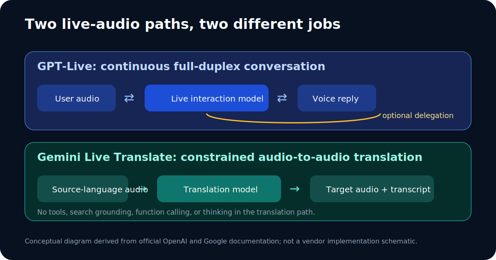

# Live Audio and Translation Models

Checked: 2026-07-11



This is a source-derived conceptual diagram, not an implementation schematic.

## GPT-Live-1

OpenAI launched GPT-Live-1 and GPT-Live-1 mini on 2026-07-08. GPT-Live-1 is
rolling out as the default ChatGPT Voice model for Go, Plus, and Pro users;
mini is the Free-tier default. API access was announced as coming later, so do
not write code that assumes GPT-Live-1 API availability without checking the
current model catalog.

OpenAI describes two architectural changes. These are **VENDOR CLAIMS**:

1. **Continuous full-duplex interaction.** The model continuously processes
   input while producing output, so it can listen, speak, pause, interrupt, or
   invoke a tool many times per second.
2. **Delegation for deeper work.** The live interaction model can hand search
   or reasoning to a frontier model while continuing the conversation. OpenAI
   said GPT-5.5 handled delegated work at launch.

That differs from earlier patterns:

| Pattern | Flow | Main tradeoff |
| --- | --- | --- |
| Cascaded voice | Speech-to-text, language model, then text-to-speech | More latency and information loss across stages. |
| Turn-based native audio | One model, but discrete user/model turns | Smoother than a cascade, but pauses can be mistaken for turn endings. |
| GPT-Live | Continuous audio interaction plus delegated deep work | More natural overlap, but behavior, limits, and delegated-model choice remain product-controlled. |

### Prompting GPT-Live

Voice instructions should be short enough to remain useful during a live
conversation:

```text
Act as a patient bilingual tutor. Let me finish long pauses before responding.
Use short spoken answers. If a question needs current facts, search and tell me
when you are delegating. Ask before changing topics. Summarize action items at
the end.
```

State interruption behavior, desired speaking length, language, when to use
tools, and how to recover from a misheard name or number. Do not overload the
voice prompt with a long written-work rubric.

## Gemini 3.5 Live Translate

Gemini 3.5 Live Translate is a low-latency audio-to-audio translation model.
The API ID is `gemini-3.5-live-translate-preview`. Google says it supports
continuous speech translation across more than 70 languages.

Availability at launch:

- public preview through the Gemini Live API and Google AI Studio;
- private preview in Google Meet;
- rollout through the Google Translate apps on Android and iOS.

### Use it in Google Translate

1. Update the Google Translate app.
2. Optionally connect headphones.
3. Tap **Live translate**.
4. Choose the languages and Listening, Conversation, Text only, or a custom
   output mode.
5. Pause or exit from the controls in the live session.

### Use it in the API

The translation path is not a general-purpose live agent. It accepts audio and
returns translated audio plus optional transcripts. It does not support tools,
search grounding, function calling, or thinking.

Core settings:

```text
model: gemini-3.5-live-translate-preview
input: raw 16-bit PCM, 16 kHz, mono, little-endian
output: raw 16-bit PCM, 24 kHz, mono, little-endian
recommended input chunks: 100 ms
translationConfig.targetLanguageCode: BCP-47 target code
translationConfig.echoTargetLanguage: echo or silence matching-language input
```

For browser or mobile clients, create constrained ephemeral tokens on a server
instead of shipping a long-lived API key to the client.

### Limitations

Google documents possible voice drift, language-detection errors with heavy
accents or similar languages, artifacts from background audio, and audio-only
translation input. “Near real-time” and quality claims are vendor claims, not
independent guarantees for every language pair.

## Watch the official demonstrations

- [OpenAI: Introducing GPT-Live](https://openai.com/index/introducing-gpt-live/)
  contains official, watchable audio demonstrations of continuous interaction.
- [Google: Gemini 3.5 Live Translate](https://blog.google/innovation-and-ai/models-and-research/gemini-models/gemini-live-3-5-translate/)
  contains official videos covering translation, listening mode, and a Google
  Meet preview.
- [Google DeepMind's public X demo](https://x.com/GoogleDeepMind/status/2064366509216928102)
  is linked as an official social artifact. Its screenshot is not copied
  because no clear republication license was found.
- The [Google Gemini Live Translate sample](https://github.com/google-gemini/gemini-live-api-examples/tree/main/gemini-live-translate-livekit)
  provides an implementation-oriented companion to the videos.

## Sources

- [OpenAI: Introducing GPT-Live](https://openai.com/index/introducing-gpt-live/), published 2026-07-08, accessed 2026-07-11.
- [Google: Gemini 3.5 Live Translate](https://blog.google/innovation-and-ai/models-and-research/gemini-models/gemini-live-3-5-translate/), published 2026-06-09, accessed 2026-07-11.
- [Google AI: live translation guide](https://ai.google.dev/gemini-api/docs/live-api/live-translate), accessed 2026-07-11.
- [Google Translate Help: Live translate](https://support.google.com/translate/answer/6142474), accessed 2026-07-11.

## Uncertainties

- GPT-Live API availability was not confirmed on 2026-07-11.
- Product rollouts can lag plan eligibility.
- Translation accuracy, latency, and voice preservation vary by language,
  accent, audio quality, and device.

## Method

Only official OpenAI and Google launch, developer, and help pages support the
product and architecture descriptions in this guide.
