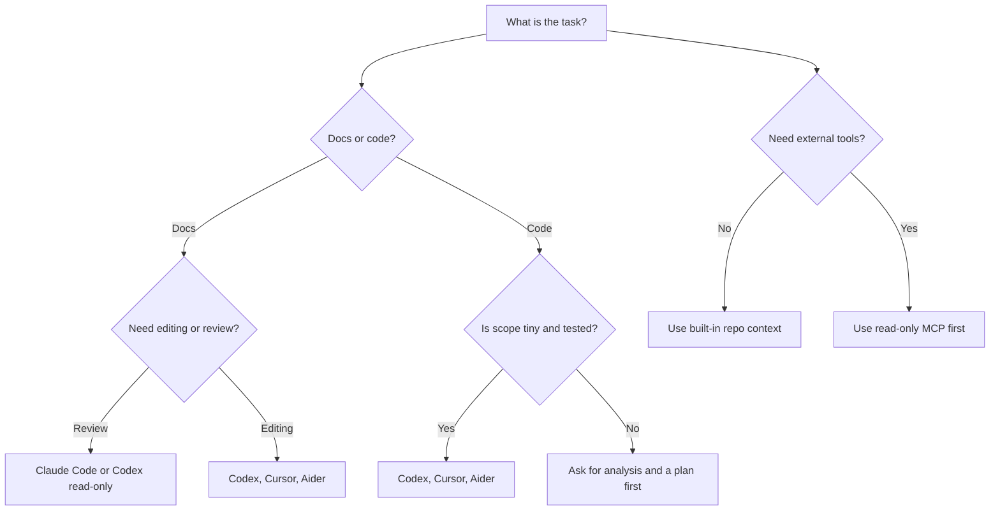

# AI Coding Tool Comparison Matrix

This matrix helps learners choose a safe tool for a specific AI coding workflow. It is not a pricing guide and not a benchmark. Tool capabilities, plan limits, authentication flows, pricing, model access, and platform support change quickly. Verify official documentation before teaching, buying, or publishing exact setup instructions.

## Reading The Rankings

| Term | Meaning |
| --- | --- |
| Beginner fit | How easy it is to use safely for a first small task. |
| Practical fit | How useful it is for real repo work with checks and PR review. |
| Advanced fit | How well it supports complex workflows after safety habits are learned. |
| Cost exposure | How easily a user can create unexpected usage costs. Exact pricing is not stated here. |
| Permission risk | How much the tool can see or change when configured broadly. |
| Verification burden | How much official-doc checking is needed before teaching setup. |

## Overall Quick Comparison

| Tool | Primary use | Beginner fit | Windows fit | Setup style | Cost exposure | Permission risk | Best first task |
| --- | --- | --- | --- | --- | --- | --- | --- |
| [OpenAI Codex](codex.md) | Git-first repo edits, checks, docs, PR prep. | Medium | Good | CLI, IDE, web, cloud/hybrid | Medium | Medium | Improve one README paragraph and run checks. |
| [Claude Code](claude-code.md) | Codebase explanation, docs review, multi-file planning. | Medium | Good; verify setup | CLI, IDE, desktop, web, hybrid | Medium | Medium | Review docs without editing. |
| [Cursor](cursor.md) | IDE planning, visible diffs, chat, rules, MCP. | High | Good | IDE, CLI, hybrid | Medium | Medium | Ask for a plan before edits. |
| [Google Antigravity](antigravity.md) | Agent-first planning and artifacts. | Medium | Verify | IDE, cloud, hybrid | Verify | Medium to high | Create a docs-cleanup plan. |
| [GitHub Copilot](github-copilot.md) | IDE suggestions, GitHub issues, agent PRs. | High for suggestions; medium for PR agents | Good | IDE, cloud, hybrid | Medium | Medium | Draft a tiny docs PR and review CI. |
| [OpenCode](opencode.md) | Open-source agent workflows and provider experiments. | Medium | Verify | CLI, desktop, IDE, hybrid | Medium to high by provider | Medium | Read-only repo overview. |
| [Kilo Code](kilo-code.md) | IDE/CLI agent modes and provider comparison. | Medium | Verify selected path | IDE, CLI, cloud, hybrid | Medium to high by provider | Medium | Plan one small docs issue. |
| [Aider](aider.md) | Terminal pair programming with explicit files. | Medium | Good with Python and Git | CLI, local/hybrid | Medium by provider | Medium | Edit one selected Markdown file. |
| [Windsurf](windsurf.md) | IDE-based AI coding and code explanation. | High | Verify current desktop support | IDE, hybrid | Medium | Medium | Explain one folder before edits. |
| [MCP](mcp.md) | Connect agents to tools, data, prompts, and services. | Low to medium | Good for lightweight local servers | Protocol, local/cloud server, hybrid | Depends on server | High if write-capable | Read-only docs server in a test repo. |

## Best Beginner Choice

| Rank | Choice | Why |
| ---: | --- | --- |
| 1 | Cursor | Editor-first, visible diffs, good fit for learners who know VS Code-style tools. |
| 2 | GitHub Copilot IDE assistance | Small suggestions and explanations are easy to start with. |
| 3 | Windsurf | Editor-first workflow if current product setup is verified. |
| 4 | Codex | Strong once Git, branches, and local checks are understood. |
| 5 | Aider | Simple explicit-file model, but terminal comfort is required. |

Beginner rule: start with docs, one file, one branch, and a human-reviewed diff.

## Best Practical Choice

| Rank | Choice | Why |
| ---: | --- | --- |
| 1 | Codex | Fits this repo's branch, check, PR, and final-report workflow. |
| 2 | Cursor | Strong day-to-day IDE workflow with visible changes. |
| 3 | GitHub Copilot | Useful where GitHub issues, PRs, and Actions are the main workflow. |
| 4 | Claude Code | Strong for review, explanation, and planning. |
| 5 | Aider | Reliable when files are explicitly selected. |

Practical rule: choose the tool that makes review easiest, not the tool that writes the most code.

## Best Advanced Choice

| Rank | Choice | Why |
| ---: | --- | --- |
| 1 | Codex | Can combine repo instructions, goals, config, skills, subagents, and checks when configured carefully. |
| 2 | MCP-enabled workflows | Powerful for connecting controlled tools and docs, but requires permission discipline. |
| 3 | Claude Code | Strong for large codebase understanding and review loops. |
| 4 | Antigravity | Potentially useful for coordinated agent work after current behavior is verified. |
| 5 | OpenCode or Kilo Code | Useful for provider-flexible and open-source agent experiments. |

Advanced rule: every extra tool connection expands the trust boundary.

## Best For A Limited Windows Laptop

| Rank | Choice | Why |
| ---: | --- | --- |
| 1 | GitHub Copilot cloud/IDE workflows | Heavy work can stay in supported GitHub/editor surfaces. |
| 2 | Codex with lightweight local checks | This repo uses standard-library Python and PowerShell. |
| 3 | Cursor | Good desktop workflow if the machine handles the editor comfortably. |
| 4 | Claude Code | Good when current Windows setup works and tasks stay lightweight. |
| 5 | Aider | Lightweight CLI path with Python and Git. |

Avoid by default on limited hardware: Docker-heavy stacks, local model hosting, GPU generation, and dependency-heavy demos.

## Best For Documentation

| Rank | Choice | Why |
| ---: | --- | --- |
| 1 | Claude Code | Strong at critique, structure, and second-opinion review. |
| 2 | Codex | Good at editing docs and running repository checks. |
| 3 | Cursor | Good when reviewing prose in an editor. |
| 4 | GitHub Copilot | Good for small issue-driven docs PRs. |
| 5 | Aider | Good for explicit-file Markdown edits. |

Documentation rule: require audience, scope, examples, safety notes, and claims-to-verify sections.

## Best For Codebase Refactors

| Rank | Choice | Why |
| ---: | --- | --- |
| 1 | Codex | Good when the refactor is broken into small tested goals. |
| 2 | Claude Code | Strong for analysis before implementation. |
| 3 | Cursor | Good for visible multi-file edits in the IDE. |
| 4 | Aider | Good when the exact files are known. |
| 5 | GitHub Copilot | Useful for focused implementation, not broad unsupervised rewrites. |

Refactor rule: ask for analysis first, then tests, then one focused PR.

## Best For PR Review

| Rank | Choice | Why |
| ---: | --- | --- |
| 1 | Claude Code | Strong read-only review and explanation fit. |
| 2 | Codex | Good for local diff review when instructed not to edit. |
| 3 | GitHub Copilot | Useful inside GitHub PR workflows where available. |
| 4 | Cursor | Useful for reviewing diffs in the editor. |
| 5 | MCP with read-only GitHub/docs context | Powerful but only after permissions are understood. |

PR review rule: findings first, severity ordered, file references included, no unrequested edits.

## Tools To Avoid For Now

Avoid or delay these choices until you have stronger safety habits:

| Tool or mode | Why to avoid early | Safer substitute |
| --- | --- | --- |
| Write-capable MCP servers connected to private services | High permission and data exposure risk. | Read-only public docs server. |
| Parallel agent implementations | Hard to review ownership and scope. | One agent, one branch, one PR. |
| Docker-heavy local AI stacks | Too much setup cost for this repo's learning goal. | Cloud/browser/IDE tools. |
| Local model hosting | Hardware and security complexity. | API-backed or hosted tools. |
| Broad autonomous refactors | High regression risk. | Analysis prompt plus small tested PRs. |
| Unverified preview products in a class handout | Setup may break or claims may be stale. | Verified official docs and conservative wording. |

## Cost, Permission, And Risk Categories

| Category | Low | Medium | High |
| --- | --- | --- | --- |
| Cost exposure | Built-in plan use or tiny tasks. | API/provider use with visible limits. | Long autonomous sessions, provider switching, or cloud agents without monitoring. |
| Permission risk | Read-only docs or selected files. | Repo write access and command execution. | Private services, write-capable MCP, secrets, or broad filesystem access. |
| Review burden | One Markdown file. | Multi-file docs or small code change. | Refactor, workflow YAML, dependencies, or automation. |
| Verification burden | Stable repo-local behavior. | Tool install or plan detail. | Fast-changing product, preview feature, pricing, or model claim. |

## Selection Guide

## Safety Defaults

- Start read-only whenever the tool supports it.
- Ask for a plan before edits.
- Limit file scope.
- Keep one branch per task.
- Run local checks before committing.
- Review every generated diff.
- Never paste secrets into prompts.
- Avoid exact pricing and model claims unless freshly verified.
- Do not connect agents to private services through MCP until server permissions are understood.

## Official Docs To Verify

- OpenAI Codex: <https://developers.openai.com/codex/cli>
- Codex `AGENTS.md`: <https://developers.openai.com/codex/guides/agents-md>
- Claude Code: <https://docs.anthropic.com/en/docs/claude-code/overview>
- Cursor: <https://cursor.com/docs>
- Google Antigravity: <https://antigravity.google/docs>
- GitHub Copilot coding agent: <https://docs.github.com/en/copilot/concepts/agents/cloud-agent/about-cloud-agent>
- OpenCode: <https://opencode.ai/docs/>
- Kilo Code: <https://kilo.ai/docs>
- Aider: <https://aider.chat/docs/>
- MCP: <https://modelcontextprotocol.io/docs/getting-started/intro>
- Windsurf / Devin Desktop Cascade: <https://docs.windsurf.com/windsurf/cascade>
