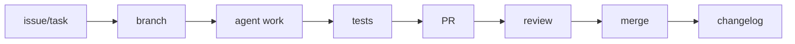

# Agent Task Lifecycle

Use this workflow for Codex, Claude Code, Cursor, Antigravity, GitHub Copilot, OpenCode, Kilo Code, Aider, Windsurf, or any other AI coding agent.

## Lifecycle Diagram



## 1. Issue or Task

Write a small, testable task:

- What should change.
- Which files or folders are in scope.
- Which files are out of scope.
- Which checks must pass.
- What the final response should include.

## 2. Branch

Create a focused branch:

```powershell
git switch -c agent/small-docs-update
```

Use `agent/<short-task-name>` unless a project maintainer asks for a different naming pattern.

## 3. Agent Work

Give the agent a narrow prompt:

- Read `AGENTS.md`.
- Inspect relevant files before editing.
- Keep changes small.
- Do not touch secrets or private files.
- Ask for a plan first when the task is broad.

## 4. Tests

Run the local checks:

```powershell
python scripts/repo_health_check.py
python scripts/safe_autofix.py --check
python -m unittest discover -s tests
```

If a check fails, fix the smallest relevant cause and rerun the focused check.

## 5. Pull Request

The pull request should include:

- What changed.
- Why it changed.
- Commands run.
- Checks run.
- Known limitations.
- Screenshots only if the change affects visuals.

## 6. Review

Review the diff as if it came from a new contributor:

- Does it solve the task?
- Did it change unrelated files?
- Are the tool claims conservative?
- Are public safety rules still true?
- Do CI logs expose anything private?

## 7. Merge

Merge only after:

- Required checks pass.
- The diff is reviewed.
- The branch is focused.
- The PR body documents commands and risks.

Prefer squash merge for small learning tasks.

## 8. Changelog

Update `CHANGELOG.md` when the change is user-visible, workflow-visible, or useful for learners to notice later.
