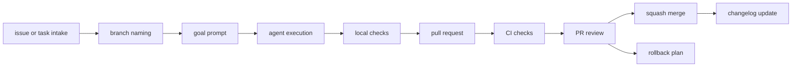

# Agent Task Lifecycle

Use this workflow for Codex, Claude Code, Cursor, Antigravity, GitHub Copilot, OpenCode, Kilo Code, Aider, Windsurf, MCP-enabled agents, or any other AI coding assistant.

The workflow is intentionally simple: one task, one branch, one agent prompt, one reviewable diff, local checks, CI, review, merge, changelog.

## Lifecycle Diagram



## 1. Issue/Task Intake

Start by turning the request into a testable task. A good task has boundaries:

| Field | Good example | Weak example |
| --- | --- | --- |
| Objective | "Expand `docs/tools/codex.md` with setup, risks, and review checklist." | "Improve docs." |
| Included scope | "`docs/tools/codex.md` only." | "Anything that seems related." |
| Excluded scope | "Do not edit workflow YAML or install dependencies." | "Be careful." |
| Success criteria | "Includes prompt template and verification notes; local checks pass." | "Make it better." |
| Verification | "Run the three local checks." | "Looks fine." |

Use [docs/templates/task-spec.md](../templates/task-spec.md) when you need a reusable task format.

### Intake Gate

Do not start agent editing until these questions have answers:

- What is the exact outcome?
- Which files or folders may change?
- Which files, commands, or behaviors are out of scope?
- What checks will prove the result?
- What public-safety risks exist?
- Does this task need a changelog entry?
- Are any external tool claims fast-changing enough to require official-doc verification?

If the answer to "which files may change" is "anything," the task is not ready.

## 2. Branch Naming

Use a short branch name that describes one task:

```powershell
git switch -c agent/expand-codex-guide
```

Recommended pattern:

```text
agent/<short-task-name>
```

Good examples:

```text
agent/add-public-safety-checklist
agent/fix-repo-health-docs
agent/update-codex-prompts
```

Avoid branch names that include private project names, account IDs, internal ticket numbers, or sensitive context.

### Branch Hygiene

Before editing:

```powershell
git status
```

If the working tree is dirty, decide whether the changes are part of the task. Do not mix unrelated local edits into an agent branch. If you are not sure where a change came from, stop and ask a maintainer before overwriting it.

## 3. Goal Prompt Creation

Use a goal-style prompt when work is more than a one-line edit. A strong prompt includes:

- Target tool.
- Objective.
- Context to read first.
- Included scope.
- Excluded scope.
- Safety boundaries.
- Success criteria.
- Verification commands.
- Final report format.

Prompt quality is part of engineering quality. A good prompt makes the eventual diff easier to review.

Template:

```text
Objective:
[One clear task.]

Context:
- Read AGENTS.md.
- Inspect [files] before editing.

Included scope:
- [Files or folders allowed.]

Excluded scope:
- Do not edit workflow YAML.
- Do not add dependencies.
- Do not touch secrets or private files.

Success criteria:
- [Behavior or documentation requirement.]
- No unrelated files changed.
- Local checks pass.

Verification:
- python scripts/repo_health_check.py
- python scripts/safe_autofix.py --check
- python -m unittest discover -s tests

Final report:
- Summary
- Files changed
- Commands run
- Checks run
- Remaining risks
```

### Prompt Review Before Sending

- [ ] The prompt tells the agent what to read first.
- [ ] The prompt lists allowed files or folders.
- [ ] The prompt lists forbidden changes.
- [ ] The prompt includes public-safety boundaries.
- [ ] The prompt names exact validation commands.
- [ ] The prompt requires a final report.
- [ ] The prompt avoids vague words such as "professional" unless it defines what that means.

## 4. Agent Execution

Before editing, the agent should:

- Read `AGENTS.md`.
- Run or inspect `git status`.
- Read the relevant files.
- Identify a minimal plan.
- Confirm risky assumptions instead of guessing.

During editing, the agent should:

- Keep changes inside the requested scope.
- Avoid unrelated cleanup.
- Preserve local conventions.
- Avoid dependency changes unless explicitly approved.
- Avoid exact external-tool claims unless verified.
- Keep public safety constraints in mind.

For broad tasks, ask the agent to produce a plan first and then implement only the approved part.

### Execution Gate

During execution, stop and re-scope if:

- The agent proposes changing workflow YAML for a docs task.
- The agent wants to install dependencies for a Markdown-only task.
- The changed-file list grows beyond the task scope.
- The agent needs private account access that was not part of the task.
- The task requires current product facts that have not been verified.
- A local check failure points to unrelated existing work.

## 5. Local Checks

Run from PowerShell in the repository root:

```powershell
python scripts/repo_health_check.py
python scripts/safe_autofix.py --check
python -m unittest discover -s tests
```

What each check means:

| Command | Purpose | Common failure |
| --- | --- | --- |
| `python scripts/repo_health_check.py` | Required files, final newlines, simple secret patterns, large-file warnings. | Missing final newline or secret-like text. |
| `python scripts/safe_autofix.py --check` | Reports files that would change under deterministic whitespace cleanup. | Trailing spaces or missing final newline. |
| `python -m unittest discover -s tests` | Runs tests for repository scripts. | Script behavior changed without test updates. |

If `safe_autofix.py --check` fails, you may run:

```powershell
python scripts/safe_autofix.py --write
python scripts/safe_autofix.py --check
```

Review the diff after any write command.

### Local Check Interpretation

Passing checks are necessary but not enough. They do not prove that the change is useful, scoped, or complete. They only prove the covered repository rules still pass.

Failing checks should be handled in this order:

1. Read the exact failure.
2. Decide whether it is related to your change.
3. Fix the smallest related cause.
4. Rerun the focused failing command.
5. If unrelated, report it clearly instead of rewriting the project.

## 6. CI Checks

CI repeats the repository validation on GitHub. Read the workflow logs when CI fails instead of guessing.

Current CI checks:

| Workflow | Trigger | What it checks |
| --- | --- | --- |
| `ci.yml` | Push to `main`, pull request, manual dispatch. | Repo health, safe autofix check, unit tests. |
| `autofix.yml` | Manual dispatch. | Applies deterministic cleanup and opens a PR if files changed. |
| `merge-pr.yml` | Manual dispatch. | Checks a PR and merges only after required checks pass. |

Do not edit workflow YAML unless the task is specifically about automation.

### CI Review

When CI fails:

- Open the failing job.
- Identify the exact command and error.
- Compare it with the local command.
- Check whether the failure is from the current diff.
- Fix related failures in the same branch.
- For unrelated failures, document the evidence in the PR.

## 7. Pull Request

A good PR body includes:

- What changed.
- Why it changed.
- Files or areas touched.
- Commands run.
- Checks run.
- Known limitations.
- Claims that still need official-doc verification.
- Screenshots only for visual changes.

Example:

```markdown
## Summary
- Expanded Codex guide with setup, safety risks, and prompt template.

## Commands run
- python scripts/repo_health_check.py
- python scripts/safe_autofix.py --check
- python -m unittest discover -s tests

## Known limitations
- Current Codex platform details should be verified in official docs before workshop use.
```

### PR Evidence Checklist

- [ ] Objective is visible in the PR body.
- [ ] Files changed are summarized.
- [ ] Commands run are listed.
- [ ] Local checks are listed with outcomes.
- [ ] CI status is reviewed.
- [ ] Public-safety risks are addressed.
- [ ] Claims needing verification are named.
- [ ] Remaining limitations are honest.

## 8. PR Review

Review the diff as if it came from a new contributor:

- Does it solve the stated task?
- Is the diff small enough to understand?
- Did it change unrelated files?
- Did it touch workflow YAML or dependencies without approval?
- Are public safety rules still true?
- Are external tool claims conservative?
- Did local checks and CI pass?
- Do CI logs expose anything private?

Use [docs/codex/04-review-checklist.md](../codex/04-review-checklist.md) for a deeper checklist.

### Requesting Changes

Good review comments are specific and actionable:

```markdown
Please narrow this PR to README.md and CHANGELOG.md. The workflow YAML edit is unrelated to the stated docs task and should be a separate PR.
```

Avoid vague review comments such as:

```markdown
Make this safer.
```

## 9. Squash Merge

Prefer squash merge for small learning branches because it keeps `main` readable:

```powershell
gh pr merge <number> --squash --delete-branch
```

Use the controlled merge workflow when maintainers want GitHub Actions to enforce the required checks before merge.

Do not merge when:

- CI is failing.
- The diff is not reviewed.
- The PR contains secrets or private data.
- The PR changes unrelated files.
- The final report claims checks passed but no evidence is provided.

### Merge Notes

Before merging, record:

- The merge method.
- The checks reviewed.
- The reason remaining risks are acceptable.
- The rollback path if the change causes confusion.

Use [docs/templates/merge-report.md](../templates/merge-report.md) for larger or teaching-oriented changes.

## 10. Rollback

If a bad commit reaches `main`, prefer `git revert` over rewriting shared history:

```powershell
git log --oneline
git revert <bad_commit_hash>
git push
```

Rollback checklist:

- Identify the bad commit.
- Confirm whether a revert is safe.
- Run local checks after the revert.
- Open a PR if your branch protection expects PR review.
- Add a changelog or incident note if learners need to understand what happened.

## 11. Public Repo Safety

Before merge or public release:

- Check for secrets and token-like strings.
- Check for private links.
- Check for personal data and private paths.
- Check screenshots if any were added.
- Check GitHub Actions logs.
- Keep product claims conservative.

Use [public-repo-safety.md](public-repo-safety.md) for the full safety guide.

## 12. Secret Scanning

This repo includes a simple secret-pattern check, but maintainers should still review manually:

```powershell
python scripts/repo_health_check.py
```

Manual searches can help:

```powershell
rg -n "\.env|token|secret|password|private key|api key" .
```

Do not paste real secrets into issues, prompts, or examples.

## 13. Changelog Updates

Update [CHANGELOG.md](../../CHANGELOG.md) when a change is:

- User-visible.
- Workflow-visible.
- A new guide, template, or safety rule.
- A change to local checks or GitHub Actions behavior.
- A notable limitation or migration note.

Good changelog entries are factual:

```markdown
- Expanded Codex goal workflow with prompt structure, validation, and failure modes.
```

Avoid vague entries:

```markdown
- Improved stuff.
```

## Common Failure Modes

| Failure | Likely cause | Fix |
| --- | --- | --- |
| Agent changed too many files | Prompt scope was vague. | Re-scope and revert only the unrelated changes after review. |
| CI fails but local passed | Environment difference or missed command. | Read logs and rerun the matching local check. |
| Safe autofix check fails | Whitespace or missing final newline. | Run `safe_autofix.py --write`, review diff, rerun check. |
| Tool claims sound too exact | Product docs were not verified. | Reword as "verify in official docs." |
| PR is hard to review | Task was too broad. | Split into smaller PRs. |
| Agent final report omits risks | Report format was too weak or task was incomplete. | Ask for a revised report tied to the diff and checks. |
| Changelog missing | User-visible change was treated as internal. | Add a factual changelog entry before merge. |

## Definition Of Done

A task is complete only when:

- The requested change is done.
- The diff is focused.
- Local checks were run.
- CI passed or failures are honestly reported.
- Public safety rules are preserved.
- Changelog is updated when appropriate.
- Remaining risks are documented.
