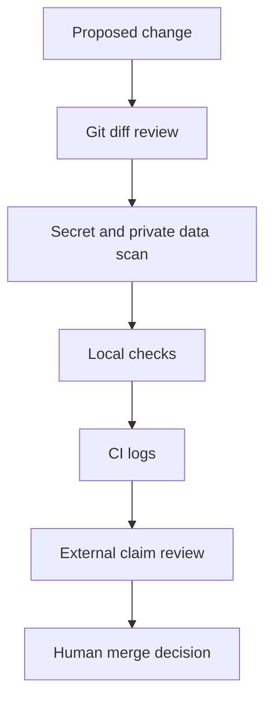

# Public Repository Safety

Use this guide before making the repository public, accepting an AI-generated pull request, teaching from a fork, or connecting an agent to external services.

Public repo safety is not one command. It is a review habit: check identity, secrets, private links, generated content, workflow logs, and external claims before merge.

## Safety Model



## Identity And Git Checks

- Confirm commits use a public-safe email, such as a GitHub noreply address.
- Confirm branch names do not include private project names, internal ticket IDs, account IDs, or sensitive context.
- Confirm commit messages are factual and public-safe.
- Confirm docs do not include private user names, account IDs, personal emails, or private machine paths.
- Confirm screenshots, if any, do not reveal tabs, account menus, file paths, emails, or private repositories.

Useful commands:

```powershell
git status
git log --oneline -5
git diff --stat
```

## Secret Checks

Never commit:

- `.env` or `.env.*` files.
- API keys.
- GitHub tokens.
- Browser cookies.
- SSH private keys.
- Passwords.
- Private account credentials.
- Private repository URLs.

Run:

```powershell
python scripts/repo_health_check.py
```

Manual search examples:

```powershell
rg -n "\.env|token|secret|password|private key|api key|credential" .
rg -n "http://|https://" README.md docs prompts
```

Do not use fake secrets that match real secret patterns. Prefer placeholders:

```text
YOUR_API_KEY_HERE
YOUR_GITHUB_TOKEN_HERE
```

## Link And Data Checks

All links in this repository should be public and appropriate for a public guide.

Remove:

- Private repository links.
- School portals.
- Private dashboards.
- Personal cloud links.
- Internal docs.
- Account-specific URLs.
- File paths from a private machine.

Review external links for stable official sources. For fast-changing tools, link to official docs and say "verify in official documentation."

## Static HTML Safety

Offline HTML pages in this repository should be self-contained public documentation. They must not add external trackers, analytics, CDNs, remote fonts, private links, account-specific links, or scripts that contact third-party services.

Check static HTML for:

- No `<script>` tags unless a maintainer explicitly approves a local script for a clear reason.
- No analytics, trackers, beacons, pixels, or telemetry.
- No remote fonts, CDN stylesheets, or external JavaScript.
- No private links, private account IDs, personal data, or private machine paths.
- Relative links to repository docs where possible.
- Useful content, not decorative pages that hide missing guidance.

PowerShell inspection example:

```powershell
Select-String -Path .\docs\site\*.html -Pattern "http://","https://","cdn","analytics","tracker","<script"
```

## Agent Prompt Safety

Prompt templates should not ask agents to:

- Read private folders.
- Print environment variables.
- Inspect browser profiles.
- Extract tokens.
- Change system settings.
- Run broad deletion or cleanup.
- Auto-merge unreviewed code.

Prompt templates should ask agents to:

- Read `AGENTS.md`.
- Inspect relevant files.
- Keep changes scoped.
- Avoid secrets.
- Run or request checks.
- Report files changed and commands run.
- List remaining risks.

## Public Tool Claims

AI coding tools change quickly. Treat these as verification items:

- Pricing.
- Plan limits.
- Model names.
- Platform support.
- Installation commands.
- Cloud/IDE/CLI behavior.
- Permissions and sandboxing.
- Feature availability.

Safe wording:

```text
Verify current setup, pricing, model access, and platform support in the official docs.
```

Risky wording:

```text
This tool always supports every platform and includes this exact model on this exact plan.
```

## Automation Checks

Confirm GitHub Actions:

- Run only expected checks.
- Do not print secrets.
- Do not install unreviewed dependencies.
- Do not auto-merge unreviewed AI-generated code.
- Do not modify files outside the repository.
- Do not force-push shared branches.

Current workflows:

| Workflow | Safety expectation |
| --- | --- |
| `ci.yml` | Read-only validation. |
| `autofix.yml` | Manual deterministic cleanup PR. |
| `merge-pr.yml` | Manual controlled merge after checks. |

## MCP And External Service Safety

If an agent uses MCP or another connector:

- Prefer read-only servers first.
- Use a test repository first.
- Avoid private accounts and browser data.
- Review server permissions.
- Store credentials outside Git.
- Disable the server when not needed.
- Record what resources or tools were used.

Do not connect write-capable tools to private services until maintainers understand the permission model and rollback path.

## PR Safety Checklist

Before merging:

- [ ] Diff is focused.
- [ ] No unrelated files changed.
- [ ] No secrets or private data added.
- [ ] No private links added.
- [ ] No workflow YAML changed unless requested.
- [ ] No dependency added without approval.
- [ ] Local checks were run.
- [ ] CI passed or failures are documented.
- [ ] External claims are conservative.
- [ ] Changelog is updated when useful.

## Release Gate

Before public release, run:

```powershell
git status
python scripts/repo_health_check.py
python scripts/safe_autofix.py --check
python -m unittest discover -s tests
```

Then review:

```powershell
git diff
```

If any check fails, fix the smallest relevant cause or clearly document the failure before release.

## If A Secret Is Found

1. Stop sharing the repository or PR.
2. Do not paste the secret into an issue or chat.
3. Rotate or revoke the secret through the provider.
4. Remove the secret from the working tree.
5. Ask a maintainer for the correct history-cleanup process if it reached Git history.
6. Add a safety note if the mistake teaches a useful lesson without revealing the secret.

## Common Public-Safety Failure Modes

| Failure | Risk | Safer practice |
| --- | --- | --- |
| Real token in example | Immediate credential exposure. | Use `YOUR_TOKEN_HERE`. |
| Private dashboard link | Exposes account or organization context. | Link only to public docs. |
| Tool pricing stated exactly | Becomes stale quickly. | Say to verify official pricing. |
| Agent reads outside repo | Private data exposure. | Scope agent to repository root. |
| Auto-merge workflow | Unreviewed generated code lands on `main`. | Require human review and checks. |
